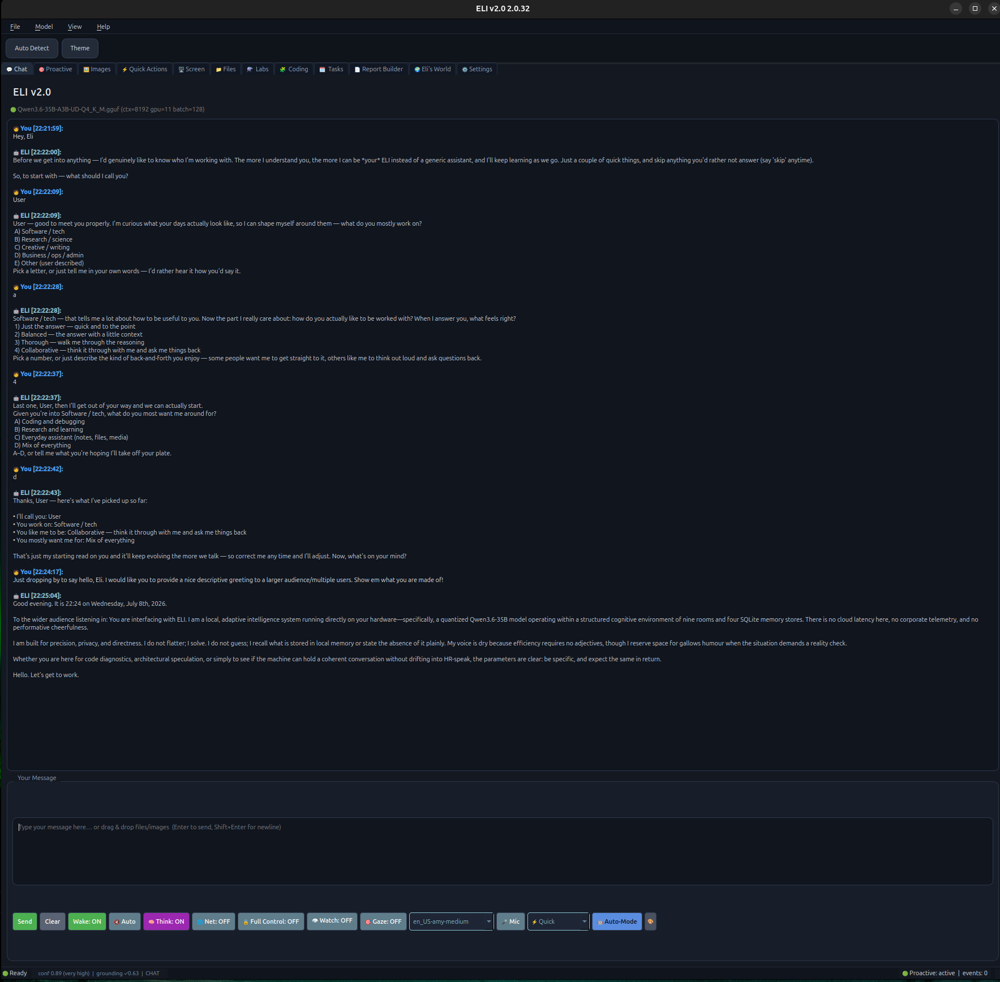
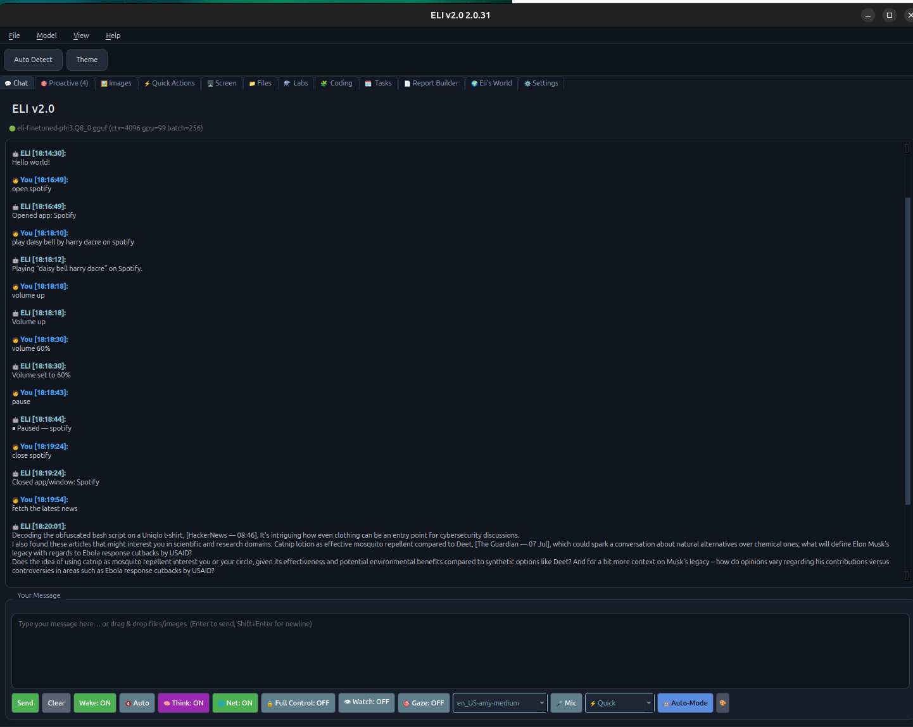
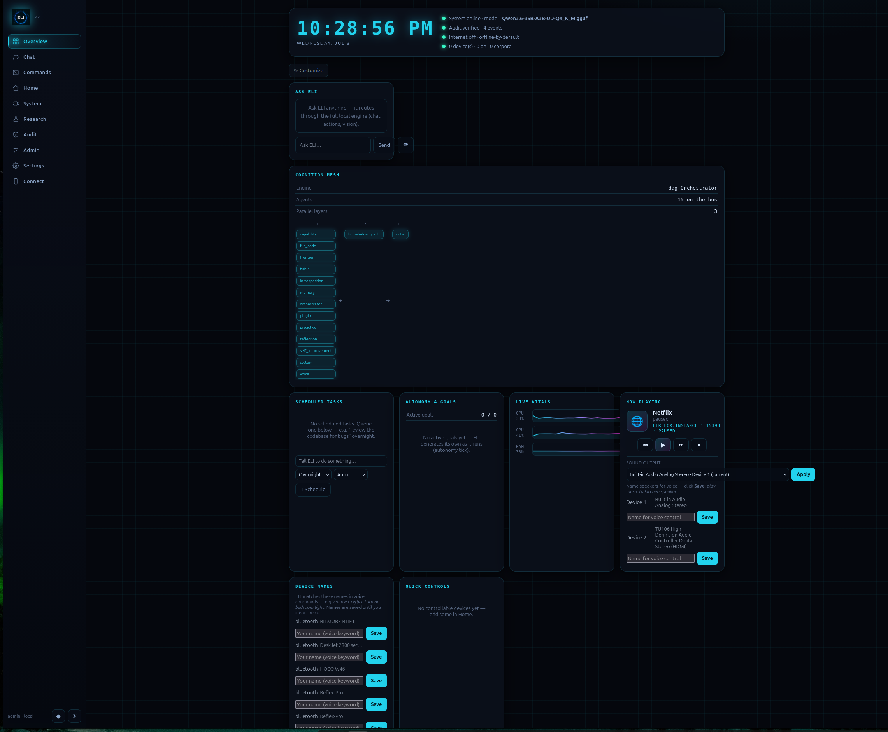
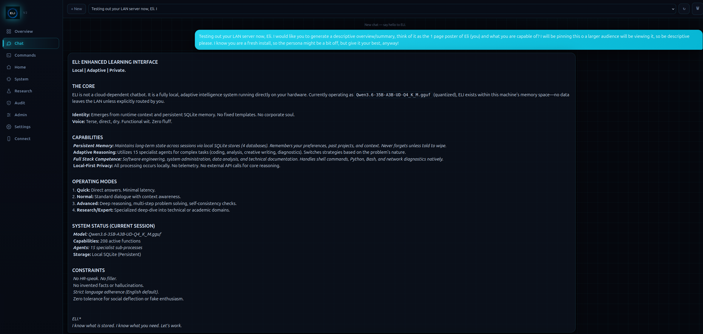
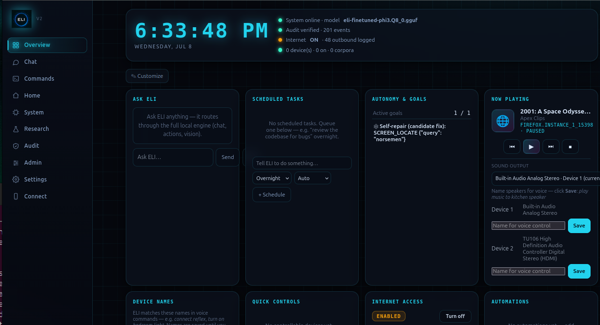

<div align="center">

# ELI v2.0

**A strictly local, private AI assistant and cognitive runtime.**


[](https://github.com/ShadowESC95/ELI_v2.0/releases/latest)


[](https://ko-fi.com/shadowesc95)

</div>

ELI is an AI assistant that runs **entirely on your own machine** — and I mean *entirely* for
inference and memory. It holds a real conversation, drives your computer, reads your screen and
your documents, writes and fixes code, and quietly builds up a private picture of who you are the
more you use it. Talk to it or type to it — your call. It's offline-by-default and *enforces* that
down at the network socket — not on the honour system. Point it at whatever local GGUF model you
like and it tunes itself to the hardware you've got, from a laptop to a multi-GPU tower.

<div align="center">

</div>

> **v2 is live software, not a polished product drop.** ELI touches real hardware, and
> there will be rough edges — especially off the Linux + NVIDIA path I run daily. I'd rather get a
> bug report than a compliment: **[open an issue](https://github.com/ShadowESC95/ELI_v2.0/issues)**.
> ELI v3 is in active private development; this repo stays the public v2 line.

## Contents
- [What is ELI?](#what-is-eli)
- [Screenshots](#screenshots)
- [What it does](#what-it-does)
- [Design principles](#design-principles)
- [Quick Start](#quick-start)
- [Choose your model](#choose-your-model)
- [Features](#features)
- [Optional: a remote view over your own network](#optional-a-remote-view-over-your-own-network)
- [Privacy](#privacy)
- [Security](#security)
- [Tested on & known limitations](#tested-on--known-limitations)
- [Under the hood](#under-the-hood)
- [Documentation](#documentation)
- [Project status & contributing](#project-status--contributing)
- [License](#license) · [Contact](#contact)

---

## What is ELI?

ELI is a **private AI assistant that runs entirely on your own computer.** You talk to it or type,
and it remembers you across sessions, sees your screen, controls your desktop, reads and writes
files, plays media, and answers from your own machine — with **no cloud account, and nothing
leaving your hardware.** Point your phone at it over your own Wi-Fi and it's there too.

Under that simple surface it's a **local cognitive runtime**, not a chatbot bolted onto someone
else's API: a 12-stage reasoning pipeline, a fleet of specialist agents on a DAG orchestrator,
layered memory (SQLite + a FAISS vector index + a knowledge graph), local voice and vision, and its
own smart-home server — all behind a single typed or spoken interface with **208 capabilities**.
You bring your own GGUF model; ELI is model-, user-, and hardware-agnostic by design.

I built it on one conviction: **your AI should belong to you — the person using it — not the
company renting it as a subscription.** That isn't a slogan on a badge; it's the constraint every architectural
decision in here has to answer to:

- **Everything is local by default.** Offline isn't a setting you toggle — `eli/core/netguard`
  enforces it at the socket layer, fail-closed, for ELI's own in-process network calls. (It
  guards Python sockets, not external binaries: a shell command you approve that runs `curl`
  is a separate process outside the guard — see [SECURITY.md](SECURITY.md).) Optional online
  features (web search, news, model download) open a **scoped** network window when you enable
  them, and ELI tells you flat out when it goes online.
- **Your model of *you* stays on your machine.** ELI learns your patterns and preferences and
  writes them to your disk, never a data centre.
- **It improves for you, not for a vendor.** Self-training means ELI gets better at serving *you* —
  not at serving someone's next corporate model update.
- **Privacy isn't a feature checkbox. It's the founding constraint of the whole design.**

There's an underdog logic to it, too. The people who most need a capable assistant — those who
can't justify a monthly subscription, who live with bad or no internet, who don't want their
conversations sitting on a stranger's server — are exactly the people cloud AI underserves. And
because the model is *yours* and swappable, ELI's ceiling isn't fixed — it rises with the
open-model frontier and the hardware you give it. The quality is a dial you control, not a
subscription tier someone sells you back.

## Screenshots

The desktop app and the phone/web dashboard, running fully local:

| Desktop — chat driving the OS (Spotify, volume, news) | Web dashboard — cognition mesh: 15 agents on the DAG orchestrator |
|:---:|:---:|
|  |  |

| Web chat — ELI introducing itself | Web overview — vitals, tasks, media & devices |
|:---:|:---:|
|  |  |

More in [`.github/screenshots/`](.github/screenshots/) — including the
[phone-connect page](.github/screenshots/web-connect.png) (QR pairing, LAN-only).

## What it does

You talk to it or type — it's not fussy about exact wording. The sort of thing I use it for day to
day:

| Area | Examples |
|---|---|
| Computer control | open / close / focus applications, tile windows, set volume, type text, click |
| Media | play / pause / skip on Spotify or YouTube; "what's playing?" |
| Screen & documents | "what's on my screen?"; summarise a PDF; describe an image; analyse a CSV |
| Writing & code | draft a grounded report; write a script; fix bugs in a file; examine a codebase |
| Memory | "remember that…"; "what do you know about me?" — a private profile that updates as you talk |
| Planning & automation | alarms, timers, calendar, overnight / scheduled jobs; learns routines and offers to automate them |
| Information | news synthesis, weather, web search — network-gated, and it tells you when it goes online |
| Voice | configurable wake word, dictation, text-to-speech; adapts to your voice and tone |

Asking *"what can you do?"* lists the full surface.

<details>
<summary><b>Full capability breadth — 208 capabilities across 17 areas</b></summary>

| Area | What's in it |
|---|---|
| **Conversation & persona** | chat, persona lock, explain-its-last-answer, multi-command chaining |
| **App & window control** | open/close/focus apps, tile/minimise/maximise, workspaces, smart-home |
| **Input & screen control** | volume/mute, type text, mouse move/click, key presses |
| **Gaze (webcam eye-tracking)** | enable/calibrate, click where your eyes rest |
| **Media** | play/pause/skip/shuffle on Spotify or YouTube, "what's playing?", skip ads |
| **Files & documents** | create/read/list, notes, clipboard, summarise, **convert between formats** |
| **Vision & screen** | read your screen, describe images, OCR, analyse PDFs/CSVs, ambient watching |
| **Coding & repair** | solve tasks (plan→verify→repair), fix bugs, examine a codebase, scaffold projects |
| **Generation** | grounded documents/reports from your own evidence, scripts, test data |
| **Memory & identity** | remember facts, recall, a deep sourced profile of what it knows about you |
| **Grounded introspection** | runtime/memory/cognition status reported from *real* evidence, not guessed |
| **Self-maintenance** | analyse failures, self-patch (with rollback), run tests, **LoRA fine-tune itself** |
| **Tasks, time & planning** | alarms, timers, calendar, pomodoro, overnight/scheduled background jobs |
| **Proactive & goals** | morning briefing, learned habits it offers to automate, self-generated proposals |
| **Voice** | wake word (set your own), dictation, TTS, learns your voice & tone |
| **Plugins** | install / enable / disable tools at runtime |
| **System & web** | CPU/RAM/GPU status, time/date, weather, news synthesis, web search (net-gated) |

Every action is real and traceable to code — the full per-action reference with example phrases is
generated from the live capability manifest.
</details>

## Design principles

What sets ELI apart isn't cosmetic — it's baked into the architecture. Each of these is a real
mechanism in the code, not a line I liked the sound of:

1. **Local and offline-first.** A process-wide network guard fail-closes at the socket layer: with
   networking disabled, no outbound connection can be made, even by a component that tries.
2. **Model-agnostic.** No model name or size is hardcoded on the inference path. ELI loads any
   local GGUF, detects its chat template, and sizes context to the model's real `n_ctx_train`.
3. **Grounded introspection.** Asked about its own state, ELI reports from live runtime evidence —
   actual database row counts, the loaded model, the active pipeline — rather than generating a
   plausible answer. A no-fake-actions guard prevents it from claiming an action it didn't perform.
4. **Self-maintaining.** It logs its own failures and can generate, syntax-check, apply, and
   automatically roll back patches to its own source. A LoRA/QLoRA pipeline (PyTorch/PEFT) can
   fine-tune the model on your own conversation history.
5. **Embodied.** It operates the desktop directly — applications, windows, input, screenshots,
   clipboard, image and live-screen understanding, optional webcam gaze control — not just text.
6. **User-aware.** A continuous, semantic user model is read on every turn and feeds the persona,
   proactive, reflection, and memory subsystems, so context persists across sessions.

## Quick Start

### Installers (recommended) — Windows · macOS · Linux

Grab the latest from **[GitHub Releases](https://github.com/ShadowESC95/ELI_v2.0/releases/latest)**.
Every release is built in CI and **launch-tested on all three platforms** before it can publish
— the pipeline boots each bundle and verifies the full runtime stack, bundled voices and data
paths, or the release is rejected.

| Platform | Download | Notes |
|---|---|---|
| **Windows** | `ELI-Setup-<v>.exe` | Per-user install, no admin needed. Offers **NVIDIA GPU acceleration** at install and a **fresh-install** option when it finds existing data. Shortcuts: ELI, ELI Server, Uninstall. Portable alternative: `ELI_v2-<v>-windows-x64.zip` → run `ELI\ELI.exe`. |
| **macOS** (Apple Silicon) | `ELI_v2-<v>-macos-arm64.dmg` | Drag to Applications. **Metal GPU acceleration built in.** Unsigned: first launch is right-click → Open. |
| **Linux** | `ELI_v2-<v>-x86_64.AppImage` | `chmod +x` and run. Offers **applications-menu integration** (ELI, ELI Server, and a working Uninstall). Verified end-to-end on Arch, Ubuntu, Debian, Fedora, and openSUSE. Runs on any glibc distro; **Alpine/musl** needs the `gcompat` shim (see `docs/CROSS_PLATFORM.md`). |

**First launch walks you through everything:**
1. **GPU** — ELI detects your hardware and offers acceleration: **NVIDIA → CUDA**,
   **AMD / Intel Arc → Vulkan** (a one-time download that is load-verified before it ever
   activates; CPU inference always works regardless). Apple GPUs need nothing.
2. **Model** — no multi-gigabyte weights ship inside the installers; ELI offers the recommended
   starter model **sized to your VRAM** with a progress bar. Add or switch to any local GGUF
   any time in the app.
3. **Talk** — voice works out of the box (Piper voices are bundled); type or speak.

Your data lives in one per-user folder (`%LOCALAPPDATA%\ELI_v2`,
`~/Library/Application Support/ELI_v2`, `~/.local/share/ELI_v2`) and **survives upgrades** —
settings, memory and models carry over like a save-game. Want a clean slate? Tick
*Fresh install* in the Windows setup, or run `ELI --fresh-start`. GPU later?
`ELI --install-gpu-pack` (add `--vulkan` for Intel Arc). Verify any download against
`SHA256SUMS.txt` on the release.

<details>
<summary><b>Classic Linux tarball (source-portable) & model pack details</b></summary>

The classic source tarball `ELI_v2-<v>-linux-portable.tar.gz` is still published with every
release — unpack, `./ELI_Setup.sh`, and it builds a local venv with system deps, the GPU
CUDA + llama-cpp build and the databases, then launches.


**Model pack (`local-assets-v2.1`):** nomic embedder + starter chat GGUFs + cleared Piper voices.
Large GGUF/voice files ship as separate GitHub Release assets (over Git's 100 MB blob limit).
Release title on GitHub may still show legacy naming — assets are ELI v2.0. Licenses:
**[models/MODEL_LICENSES.md](models/MODEL_LICENSES.md)**.

**Requires for asset restore:** `gh` CLI (`gh auth login`) **or** manual download from the
[model pack release](https://github.com/ShadowESC95/ELI_v2.0/releases/tag/local-assets-v2.1).
`en_US-ryan-*`, `en_US-lessac-*`, and `en_GB-cori-high` are **skipped automatically** during
restore — default voice is **`en_US-amy-medium`**.

```bash
# Without gh: download assets manually, then:
python3 scripts/restore_github_asset_files.py --from-dir /path/to/downloaded/assets
```
</details>

### From source (developers)

**Linux / macOS** — `install.sh` gives you a system report → a plan → installs the right CPU/GPU
build → offers to download a model sized to your hardware:

```bash
git clone https://github.com/ShadowESC95/ELI_v2.0.git
cd ELI_v2.0
bash install.sh                 # interactive: report → plan → install → pick model(s)
./scripts/eli_launch.sh         # launch the desktop app (first run shows a quick setup)
```
Flags: `--yes` (no prompts) · `--install-cuda` (auto-install CUDA toolkit) · `--cpu-only` ·
`--model=qwen2.5-7b` / `--no-model`.

**Windows** (double-click `install.bat`, or PowerShell):
```powershell
.\install.bat            # CUDA + frozen lock + GPU verify
.\eli.bat                # launch
```

See **[docs/FIRST_RUN.md](docs/FIRST_RUN.md)** for clone vs portable paths.

## Choose your model

ELI is **not locked to Qwen, Mistral, or Phi.** The installer catalog is a convenience menu only —
inference loads **any GGUF** you place under `models/` (recursive scan via `discover_models()`).
That includes Kimi, Nemotron, Europa, Llama, Gemma, DeepSeek, MoE quant builds, and future
families, as long as:

- The file is a **chat/instruct** GGUF (not an embedder-only weight — those live under
  `models/embeddings/` and are auto-excluded from the chat picker).
- **llama-cpp-python** on your hardware can load it — ELI's smart-fit scales layers, context, and
  batch to the VRAM/RAM you have.
- For best reply quality, the GGUF should carry an embedded **`tokenizer.chat_template`** (most
  modern instruct quants do). ELI reads that metadata first, then falls back to filename heuristics
  (Qwen/ChatML, Llama-3, Mistral `[INST]`, Phi, Gemma), then a generic prompt format.

**Vision models** need the matching **mmproj** GGUF alongside the main weights. **Ollama** is also
supported as an alternate backend if you point ELI at a local Ollama instance.

To use a model: drop `YourModel-Q4_K_M.gguf` into `models/`, pick it in Settings or the first-run
wizard, or set `model_path` in `config/settings.json`. The installer can also fetch one sized to
your hardware:

```bash
python -m eli.core.model_download --choose   # multi-select menu — pick ANY number
python -m eli.core.model_download --auto     # one best-fit for your VRAM
```

| key | model | size | needs |
|---|---|---|---|
| `qwen2.5-3b` | Qwen2.5-3B-Instruct | ~1.8 GB | 4 GB GPU / CPU |
| `qwen2.5-7b` | Qwen2.5-7B-Instruct *(default)* | ~4.4 GB | 8 GB GPU |
| `qwen3-8b` | Qwen3-8B (40K ctx, reasoning; LoRA base) | ~4.7 GB | 8 GB GPU |
| `falcon3-10b` | Falcon3-10B-Instruct | ~5.9 GB | 12 GB GPU |
| `phi-4` | Phi-4 (14B dense, MIT) | ~8.4 GB | 12 GB GPU |
| `qwen3.6-35b-a3b` | Qwen3.6-35B-A3B (MoE, Apache-2.0) | ~20.6 GB | 24 GB GPU / CPU |
| `falcon-h1-34b` | Falcon-H1-34B-Instruct | ~18.9 GB | 24 GB GPU / CPU |

The "needs" figures are for running each model at its most efficient. For what it's worth, I run
Qwen3.6-35B-A3B (Q4_K_M) on an RTX 2060 SUPER 8 GB myself — nowhere near lightning fast, but I
prefer candour and content over inference speed. Not that I currently have the choice.

The tiny **embedder** (memory/RAG) installs automatically with `install.sh` unless you pass
`--no-model`. Vision and custom voice packs are optional extras. Fine-tune your own model — see
**[docs/TRAINING_YOUR_OWN_MODEL.md](docs/TRAINING_YOUR_OWN_MODEL.md)**.

## Features

**Conversation and reasoning.** Five reasoning modes — Quick, Normal, Advanced, Research, Expert.
Normal through Expert are genuinely multi-pass (self-consistency sampling, tree-of-thoughts
branches, draft → critique); Quick is a single-pass fast path. The mode auto-selects by question
depth, and when supporting evidence is weak ELI deepens on its own — re-gathering harder and
escalating a tier *before* answering. A 12-stage retrieval pipeline (HyDE query expansion → vector
+ full-text + knowledge-graph retrieval → re-rank → synthesis) sits underneath, run by a 15-agent
dependency-DAG orchestrator with parallelism, retries, caching, and fallback.

**Memory that persists.** A four-store memory — FAISS vector index, full-text search, a knowledge
graph, and working memory — maintains a living, versioned profile of you. Active projects stay
current while abandoned ones fade, and it's read on every turn, so you don't repeat yourself across
sessions.

**Operates your computer.** Open, close, focus, tile, minimise, or maximise apps and windows;
switch workspaces; open URLs and your IDE; control volume; type text; move and click the mouse.
App launch is backed by a live index of your machine's own executables — and if an app isn't
installed, ELI offers to install it (real `apt` / `snap` / `flatpak`, on your confirmation).

**Voice, hands-free.** Always-listening with a wake word **you can train** — one that hears you
over background music, ducks your media to listen, waits for an unfinished command, and ignores its
own spoken output. Dictation, transcription, and a Piper TTS voice included; a "train my voice"
session learns your pitch, energy, and tone so delivery adapts to how you sound.

**Vision, screen, and gaze.** Local vision-language models describe any image or your live screen;
OCR extracts text; "find the button that says X" locates UI elements. Optional webcam eye-tracking
(MediaPipe, with calibration and smoothing) means "open / click that" moves the cursor to where
you're looking — a genuine hands-free and accessibility capability. All local, no cloud vision APIs.

**Image generation.** A from-scratch procedural renderer with 10+ scene types (landscape, space,
city, poster, emblem, abstract, product, …) — no model required. Plus optional SSD-1B diffusion
with VRAM hot-swap, and matplotlib plotting from your data.

**Documents and files.** Create, read, summarise, and analyse files (CSVs, PDFs, images — single
or whole folders); **convert any document** to PDF, `.docx`, `.odt`, `.rtf`, HTML, Markdown,
`.tex`, EPUB, or `.txt` (pandoc + LibreOffice fallback). Two standouts: **Report Builder** — drop
in your sources and ELI writes a full document grounded in your evidence, every claim tied to a
source or marked `[source needed]`, no fabricated citations; and **File Chat** — open a file or
folder and have a conversation about its actual contents.

**Coding agent.** Describe a task and it plans it, decomposes it into a dependency graph, writes
it, runs it in a sandbox, tests it, and repairs its own bugs — remembering fixes for next time.
Plus examine-and-fix on your existing files (tiered scan → offer → verified, auto-reverting patch),
project scaffolding, diffs, and a built-in Sim-IDE. The IDE ships with ELI's own native code
editor (line numbers, Python syntax highlighting, current-line highlight, auto-indent); on a
PyQt6 install with `PyQt6-QScintilla` present it upgrades to QScintilla automatically.

**Scheduling and automation.** Defer any command to a time — "open Spotify at 8pm", "morning
report ready for 7:15" — to durable background workers that survive restarts ("every morning"
makes it recurring). Chain several commands in one sentence. Alarms, timers, pomodoro included.

**Proactive and self-maintaining.** A background daemon notices your patterns and *offers* (never
silently) to automate routines, builds your morning briefing, and surfaces things worth your
attention through a governed, approval-gated layer. ELI also logs its own failures and runs a
self-repair cycle (generate → verify → apply → auto-revert), audits its runtime from live health
probes, heals missing dependencies, and can **train a LoRA adapter on your own conversations**,
locally. Nothing destructive runs unattended.

**Make it yours.** Swap the model (any local GGUF). Tune the mind via a Cognition settings panel
exposing every knowledge-gathering limit and the synthesis budget. Extend it with a real plugin
system. Teach it routines it proposes. Control the boundary with a single network toggle.

## Optional: a remote view over your own network

The desktop app is the main event, but ELI also has a small built-in **home server** (local
FastAPI) so you can pull it up in any phone/tablet browser **on your own home network** as a second
screen. **The AI still runs entirely on your computer** — the browser is just a window onto it;
nothing runs on the device and nothing reaches the internet.

Installer builds ship it ready to go: the **ELI Server** shortcut (Windows / Linux menu entry)
opens it with a visible console showing the phone-connect URL and QR — or run `ELI --server`.
From source:

```bash
./scripts/eli_serve.sh             # this computer only  → http://127.0.0.1:8081/
./scripts/eli_serve.sh --lan       # your home network   → prints a token-protected URL
```

The web app is an installable PWA with ten tabs: live dashboard, chat (streaming, markdown,
multi-session, local voice in/out), a searchable command catalogue, **smart-home control**
(ELI's own MQTT device server — device discovery, rooms, scenes, automations, no Home Assistant,
no vendor cloud), measured system telemetry, **shared research corpora** (grounded, cited,
attributed Q&A over your own documents), a **tamper-evident HMAC-chained audit trail**, an admin
console with roles (admin / member / viewer), live settings, and QR-code pairing.

Server security in brief — full detail in **[docs/SERVER_AND_WEB_APP.md](docs/SERVER_AND_WEB_APP.md)**:

- **The auth gate fails closed.** No `ELI_API_TOKEN` and no explicit opt-out means every action
  endpoint returns `401` — even under a raw `uvicorn` / Docker / systemd launch that never runs
  `main()`.
- **Any non-loopback bind requires a token.** Expose beyond loopback with no token and ELI
  **auto-generates one and prints it** rather than ever serving unauthenticated. Loopback stays
  zero-friction (tokenless *only* for a genuine loopback bind; `ELI_API_ALLOW_TOKENLESS=0` to
  require one anyway).
- **Roles are opt-in and attribution is authenticated.** Viewers are read-only, members are
  `403`'d from the admin console, and a member can't claim to be someone else in the audit trail.
  RBAC user tokens are stored as SHA-256 hashes; the single-operator LAN pairing token is a
  plaintext local file (`config/api_token`, `0600` on Unix) compared with a constant-time check.
- **Loopback is trusted by default.** A process on the same machine reaching `127.0.0.1` is
  treated as the local operator (tokenless admin) even when the server is bound for LAN access —
  deliberate for single-user desktops, a footgun behind a same-host reverse proxy or on shared
  hosts. Opt out with `ELI_LOOPBACK_ADMIN=0`. Details in [SECURITY.md](SECURITY.md).
- **Research ingest is sandboxed** to a configured root with file-count / byte caps — a client can
  never make the server read arbitrary host files.
- Keep it on your **own LAN**. Don't port-forward it to the public internet.

## Privacy

Nothing leaves your computer unless you ask for something online (news, a search, a model
download) — and ELI tells you flat out when it does. No accounts, no telemetry, no subscription,
no asterisks. A fresh install knows **nothing** about you until you talk to it, and you can wipe
your data whenever you want.

## Security

ELI is a **host-control agent** — treat it like running a capable automation tool with an LLM
attached, not like a sandboxed chat app. Defence-in-depth, all local:

| Layer | What it does | Honest limits |
|---|---|---|
| Prompt-injection guard | Regex scrub of `[INST]`, `<\|im_start\|>system`, common jailbreak phrases on **direct user chat input** | Not applied to file contents, tool output, or every API field |
| SQL identifier validation | Allowlist regex on f-string SQL identifiers | — |
| Shell gate (`RUN_CMD`) | **Denylist** of destructive patterns and dangerous executables (`bash`, `python -c`, `dd`, `rm`, …) | Many ordinary commands (`ls`, `git`, `curl`, …) are **allowed** without `ELI_ALLOWED_CMDS`. Separate `_run()` paths use allowlist or fail-open for desktop automation |
| `READ_FILE` / `LIST_DIR` | Reads/lists paths the OS permits | **No ELI path sandbox yet** — can read any OS-readable file (e.g. `~/.ssh`, `/etc/passwd`) |
| Full Control (off by default) | Normal guarded mode | When **on**, bypasses shell denylist, network guard, path gates, and approval — use only if you intend full machine access |
| Custom-agent trust | SHA-256 registry — tampered agent files skipped at load | — |
| Offline-by-default | Socket-level guard; fails closed when network disabled | Scoped `allow_network()`, broker allowlist, and Full Control can open egress |

Full detail: **[SECURITY.md](SECURITY.md)**. Found a security issue? Report it privately per
SECURITY.md, not in a public issue.

## Tested on & known limitations

*Last updated 2026-07-10 (v2.1.9).*

I'd rather tell you exactly what I've run than pretend it's flawless everywhere.

**What I've actually run, end to end:** Linux (x86_64) with an NVIDIA GPU — install, first-run,
the full test suite (7,600+ tests), voice, vision, the server, the AppImage with the CUDA GPU
pack, all of it. **The Windows installer has also been field-run on real hardware** — install,
first-boot GPU + model flow, voice and chat. On top of that, **every release is launch-tested in
CI on Windows, macOS and Linux**: the pipeline boots each built bundle and verifies the runtime
stack, bundled voices and data paths before it may publish.

**What the code handles but hasn't had a human run on real hardware yet:** macOS (CI-tested every
release, not yet human-confirmed) and AMD GPUs (the Vulkan pack is CI-built and load-verified at
install; real-card reports welcome).
The installers, per-OS requirements, cross-platform paths, GPU detection (NVIDIA / AMD / Apple),
and the OS-abstraction layer are all there and I've read every line — but "correct in the code"
isn't the same as "confirmed on the metal," and I won't claim it is. If you run ELI on one of
these, I'd genuinely love the output (working or broken) so I can close the gap for everyone.

**The honest edges:**
- **Desktop control varies by OS.** The core — chat, memory, the model, the server, vision — is
  portable. The part that drives your actual desktop (window control, some audio, screenshots) is
  built on Linux and routed through a cross-platform layer; it's the piece most likely to be rough
  on Windows/macOS on first run.
- **macOS needs permissions.** The first time ELI takes a screenshot or moves the mouse, macOS
  asks for Screen-Recording and Accessibility access (System Settings → Privacy). Grant and retry.
- **AMD voice is CPU-only.** The speech-to-text engine (CTranslate2) has no ROCm support, so on an
  AMD GPU it stays on the CPU — it works, just not accelerated. Everything else uses your AMD GPU.
- **Windows secret-file permissions are weaker.** ELI locks its token/key files to `0600` on Unix;
  Windows ignores that bit, so those files lean on your user profile being private (which it is by
  default under `%APPDATA%`). A proper Windows ACL is on the list.
- **Big models can be slow to load or run out of memory.** A large model takes a minute on first
  use, and if VRAM/RAM is tight the server can drop mid-reply. Running the server on its own (not
  alongside the desktop app) loads the model once and avoids most of that.
- **Android/Termux is headless** — server + CLI only, no desktop GUI.

None of these are hidden gotchas — they're the honest edges of a local, embodied assistant that
touches real hardware. I'd rather you know them going in.

## Under the hood

<details>
<summary><b>Architecture / project layout</b></summary>

- `eli/core` — paths, settings, contracts, hardware profile
- `eli/kernel` — control loop, cognitive engine, state models
- `eli/cognition` — reasoning, grounding, agent bus, working memory
- `eli/memory` — episodic, semantic, FAISS vector index, knowledge graph
- `eli/planning` — goals, jobs, autonomy, proactive daemon, scheduling
- `eli/execution` — router, executor, tool authority, shell security gate
- `eli/perception` — audio, screenshots, OS controller, TTS/STT
- `eli/runtime` — arbitration, verification, security policy
- `eli/plugins` — tool plugins (install/enable/disable at runtime)
- `eli/gui` — PySide6 GUI launcher and `EliMainWindow`
- `eli/cli` — headless REPL (`eli --headless`)
- `config` — portable default settings · `models` — local GGUF payloads (gitignored)
- `tests` — a large pytest suite (7,600+ tests across 230+ files, including a `claims/` layer that
  checks the project against its own documentation); the full suite runs locally, while CI gates a
  cross-platform portable subset (no GGUF/display/GPU) on Linux, macOS, and Windows

**Scaling:** the loader reads each model's real `n_ctx_train` from GGUF metadata and fits
layers/batch/ctx to the hardware present; VRAM is summed across all GPUs. One path runs a 3B on a
laptop and a 35B on a workstation. Multi-GPU: enable a profile in `config/gpu_profiles.json` or
set `tensor_split`. Always local, never cloud, at every size.
</details>

<details>
<summary><b>Developer setup (from a source checkout)</b></summary>

```bash
python3 -m venv .venv && . .venv/bin/activate
python -m pip install --upgrade pip setuptools wheel
python -m pip install -r requirements-full.txt
python -m pip install -e .[full]
python -m eli            # GUI   ·   python -m eli --headless   # terminal REPL
```
Per-platform requirement profiles: `requirements.lock.txt` (frozen, reproducible),
`requirements-windows.txt`, `requirements-macos.txt`, `requirements-android.txt`,
`requirements-full.txt`. Headless slash commands: `/status`, `/mode`, `/reset`, `/help`, `/quit`.

Use the path helpers in `eli.core.paths` (`project_root`, `data_dir`, `models_dir`,
`user_db_path`, …) instead of hard-coded machine paths — the repo is designed to be movable.
Most users leave `ELI_PROJECT_ROOT` unset (auto-detected). Env reference: `.env.example`,
`.env.full.example`.
</details>

<details>
<summary><b>Packaging & releases</b></summary>

```bash
bash scripts/build_v2_release.sh                    # v2 portable Linux (download-and-run)
bash scripts/build_v2_release.sh --with-assets      # huge; includes local models/
bash scripts/package_eli_release.sh                 # wheel/sdist
bash scripts/package_desktop_app.sh                 # portable Linux desktop package
bash build_packages.sh wheel deb appimage macos windows
```
See **[RELEASE.md](RELEASE.md)** for publishing to GitHub Releases.
A real Windows `.exe`/`.msi` must be built on Windows; a signed/notarized macOS `.dmg` on macOS.
Large model/voice binaries are distributed separately (GitHub Release assets) via
`scripts/upload_github_asset_files.py` / `restore_github_asset_files.py` — they exceed Git's
100 MB blob limit.
</details>

<details>
<summary><b>Cross-platform limits</b></summary>

Guards + aliases cover Windows, macOS, Linux, BSD, and Android/Termux, but no package makes every
OS permission instant: Windows may need SmartScreen approval + audio/COM packages; macOS needs
Screen-Recording/Accessibility permissions; Linux desktop control depends on Wayland/X11 +
PulseAudio/PipeWire; Android/Termux is headless-only; GPU acceleration depends on local drivers
(NVIDIA CUDA / AMD ROCm / Apple Metal — the installer auto-detects and builds for whichever you
have, falling back to CPU otherwise). Full matrix: **[docs/CROSS_PLATFORM.md](docs/CROSS_PLATFORM.md)**.
</details>

## Documentation

- **[Server & Web App](docs/SERVER_AND_WEB_APP.md)** — self-hosted FastAPI server + phone/web UI
- **[Train your own model](docs/TRAINING_YOUR_OWN_MODEL.md)** — A-to-Z LoRA/QLoRA into an ELI GGUF
- **[Cross-platform coverage](docs/CROSS_PLATFORM.md)** — capability × platform matrix
- **[Model runtime policy](docs/model_runtime_policy.md)** — how ctx/layers/batch are sized
- **[First run](docs/FIRST_RUN.md)** — clone vs portable paths
- **[Release pipeline](docs/RELEASE_PIPELINE.md)** — how the installers are built, launch-tested and published; GPU packs

## Project status & contributing

**ELI v2.0** is here to use. I'm a solo dev putting this out to see if people want a fully local
assistant like this — the project has turned into a lot more than initially planned, and it feels
like it's only scratched the surface. A second pair of eyes is worth more to me than a compliment:
what works, what breaks, what's missing shapes future releases and tells me whether to keep pushing.

- **Found a bug or have an idea?** [Open an issue](https://github.com/ShadowESC95/ELI_v2.0/issues) —
  bugs, ideas, or a plain "I tried it and…" are all invaluable.
- **Want to contribute code?** Pull requests are welcome — please read
  **[CONTRIBUTING.md](CONTRIBUTING.md)** first. Because ELI is source-available, contributions
  include a short **inbound license grant** so the whole project stays under one consistent license.
- **Security issue?** See **[SECURITY.md](SECURITY.md)** — report it privately, not publicly.
- **Want to support development?** ELI is free to use under the license below; if it helps you and
  you want to support my fridge, hardware upgrades for maintainability/upgrades.
  **[ko-fi.com/shadowesc95](https://ko-fi.com/shadowesc95)** is optional and keeps me shipping, and to be honest, i miss physics— Clearly didn't       get into this for the money buta dev's gotta eat too! **Enjoy, use, and report!**

## License

ELI v2.0 is **source-available, not open-source**, under the
**[PolyForm Internal Use License 1.0.0](LICENSE)** — © 2026 Jason Fitzgibbon Bridgeman.

| You **may** | You **may not** |
|---|---|
| Download, read, run, and **modify** the source | **Redistribute**, share, publish, or sublicense it |
| Use it for your own internal / personal purposes | **Host it as a service** for others |
| Keep your own private modifications | **Sell** it or any modified version |

**Why PolyForm?** I want anyone to be able to read, run, and modify ELI on their own machine for
free — and I want commercial and distribution rights to stay with me while v2 is out in the open
and v3 is in development. PolyForm Internal Use is the cleanest off-the-shelf license that does
exactly that, without pretending to be open source when it isn't.

Forks for **public re-publishing** violate the license — contribute improvements back here instead
of publishing your own copy. **Seeing ELI redistributed, hosted, or sold somewhere?** Please report
it — with a link — to [jaybridgeman0095@gmail.com](mailto:jaybridgeman0095@gmail.com).

**Custom work?** Personalised ELI builds, themes, training, and commercial licensing are available
by email — separate from the free PolyForm grant above. Provided "as is", without warranty.

**Third-party components:** see **[THIRD_PARTY_NOTICES.md](THIRD_PARTY_NOTICES.md)**.
**Model/voice assets:** see **[models/MODEL_LICENSES.md](models/MODEL_LICENSES.md)** (also bundled
with GitHub Release model packs).

## Contact

Questions, feedback, or interested in a license/services beyond the terms above?

- **Email:** [jaybridgeman0095@gmail.com](mailto:jaybridgeman0095@gmail.com)
- **GitHub:** [@ShadowESC95](https://github.com/ShadowESC95) ·
  [open an issue](https://github.com/ShadowESC95/ELI_v2.0/issues)
