# ELI — The Complete User Manual

### Plain-English Edition · with flowcharts

*A friendly, no-jargon guide to everything ELI can do and how to make it do it.*

---

This manual assumes **zero** technical background. You talk to ELI in normal English — by
**typing** in the chat box or **speaking** — and it does things on your computer, answers
questions, remembers what matters to you, and learns your routines. Everything runs **on your own
machine**; nothing is sent to the cloud.

> **The one rule worth knowing:** ELI is **offline by default**. It only touches the internet
> when *you* ask for something that needs it (a web search, the news, downloading a model). Your
> conversations, files, and memories never leave your computer.

How to read this manual:
- **Just want to use it?** Read §1–§5 and the cheat sheet (§18). That's enough to be productive.
- **Want the whole picture?** Read straight through — every feature is here, in plain terms.
- **🟢 / 🟡 / 🔴 tags** at the start of some sections mean *anyone / a little technical / advanced*.

---

## Table of contents
1. [What ELI is (in one minute)](#1-what-eli-is-in-one-minute)
2. [How ELI works when you ask it something](#2-how-eli-works-when-you-ask-it-something)
3. [Getting started](#3-getting-started)
4. [Your first hour with ELI](#4-your-first-hour-with-eli)
5. [Talking to ELI](#5-talking-to-eli)
6. [A tour of the window](#6-a-tour-of-the-window)
7. [What ELI can do — by everyday task](#7-what-eli-can-do--by-everyday-task)
8. [ELI remembers you (memory)](#8-eli-remembers-you-memory)
9. [ELI learns your routines (habits)](#9-eli-learns-your-routines-habits)
10. [ELI helps before you ask (proactive)](#10-eli-helps-before-you-ask-proactive)
11. [Voice, wake word, and dictation](#11-voice-wake-word-and-dictation)
12. [Seeing your screen and images (vision)](#12-seeing-your-screen-and-images-vision)
13. [The ELI server & using it from your phone](#13-the-eli-server--using-it-from-your-phone)
14. [Models: picking, switching, and training your own](#14-models-picking-switching-and-training-your-own)
15. [How hard ELI thinks (reasoning modes)](#15-how-hard-eli-thinks-reasoning-modes)
16. [Settings you'll actually touch](#16-settings-youll-actually-touch)
17. [Privacy & staying offline](#17-privacy--staying-offline)
18. [Troubleshooting](#18-troubleshooting)
19. [Quick phrasebook (cheat sheet)](#19-quick-phrasebook-cheat-sheet)
20. [Glossary](#20-glossary)
21. [Appendix A — Under the hood: how ELI thinks (the full pipeline)](#21-appendix-a--under-the-hood-how-eli-thinks-the-full-pipeline)
22. [Appendix B — Under the hood: how ELI remembers (the full memory system)](#22-appendix-b--under-the-hood-how-eli-remembers-the-full-memory-system)
23. [Appendix C — Under the hood: how ELI stays safe and yours (security)](#23-appendix-c--under-the-hood-how-eli-stays-safe-and-yours-security)

---

## 1. What ELI is (in one minute)

ELI is a **personal AI assistant that lives on your computer**. Think of it as a capable helper
that can:

- **Talk with you** like a knowledgeable person — by text or voice.
- **Operate your computer** — open apps, play music, manage windows, type for you.
- **Look at things** — your screen, images, PDFs, spreadsheets — and explain them.
- **Write for you** — documents, notes, code, scripts.
- **Remember** what matters about you, and **learn** your daily routines.
- **Act on its own** when helpful — a morning briefing, a heads-up, a suggestion.

The big difference from cloud assistants: **it's yours**. It runs locally, stays private, has no
subscription, and you can even retrain its "voice" yourself (§14).

Here's the whole thing at a glance:

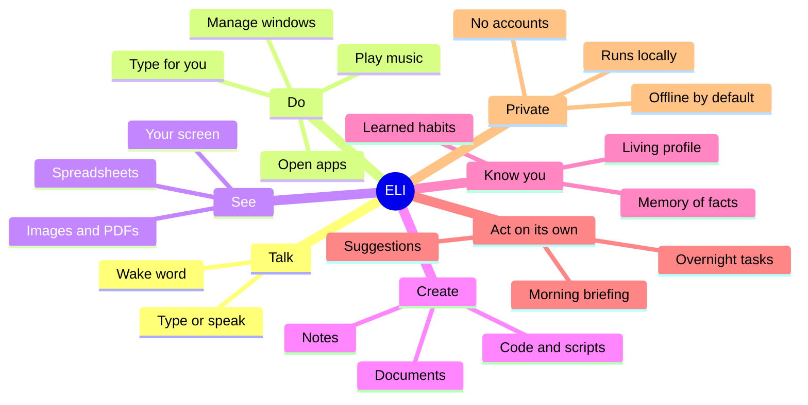

---

## 2. How ELI works when you ask it something

🟢 *Anyone — this is the mental model that makes everything else click.*

When you say or type something, ELI follows the same honest loop every time:

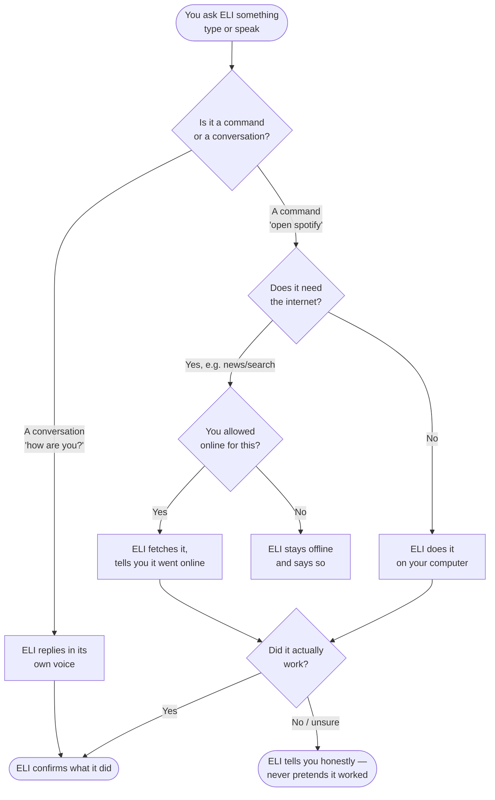

**The promise in that diagram:** ELI **never fakes an action**. If it says it played a song or
fixed a file, it really did — and if it couldn't, it says so plainly instead of bluffing. This is
built into the software, not just good manners.

---

## 3. Getting started

🟡 *A little technical, but only once.*

### Installing
You run a single installer and answer a couple of friendly questions.

- **Windows:** run `install.ps1`
- **Mac & Linux:** run `install.sh`

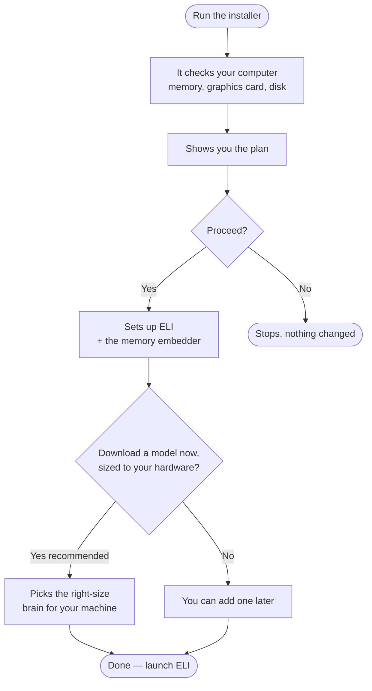

The installer also fetches a tiny **embedder** model automatically (it powers ELI's memory), so
you don't have to think about it. Everything ELI needs ends up in place — no extra steps.

### First launch — the quick interview
The very first time you open ELI, it doesn't know you yet, so it asks **three short questions**
(your name, what you do, how you like to be spoken to). Ten seconds, and you can **skip it**
entirely. From there, ELI builds its understanding of you naturally as you talk.

### Opening ELI
- **Desktop app (full experience):** launch **ELI Pro** from your apps menu, or run
  `scripts/eli_launch.sh` (Mac/Linux) / the desktop shortcut (Windows).
- **From your phone:** see §13.

---

## 4. Your first hour with ELI

🟢 A gentle on-ramp. Try these in order — each builds confidence.

1. **Say hello.** Type `how are you?` — get a feel for ELI's voice.
2. **Ask what it can do.** `what can you do?` lists its capabilities.
3. **Open something.** `open the file manager` or `open firefox`.
4. **Play music.** `play lo-fi on YouTube`, then `pause`, then `skip`.
5. **Look at your screen.** `what's on my screen?`
6. **Tell it a fact.** `remember that my dog's name is Rufus`. Later: `what's my dog's name?`
7. **Set a reminder.** `set a timer for 5 minutes`.
8. **Get a briefing.** `what's the news?` (this one goes online — ELI will say so).
9. **Check on ELI itself.** `what are you running on?` shows its model and hardware.
10. **Go hands-free.** Say the wake word **"computer"**, then a request.

By the end you've touched conversation, control, vision, memory, reminders, the web, voice, and
introspection — the whole surface.

---

## 5. Talking to ELI

There are two ways, freely mixed:

- **Type** in the chat box and press Enter.
- **Speak** — click the microphone, or say the **wake word** (default **"computer"**) then your
  request. Change the wake word to anything (§11).

You don't need special phrasing. Talk normally:

> "open spotify and play some lo-fi"
> "what's on my screen?"
> "remember that my sister's name is Anna"
> "set an alarm for 7am"

**Chaining:** ask for several things at once —
> "close steam and set an alarm for 7am"
> "open spotify then play Juicy by Notorious B.I.G."

**If ELI isn't sure** what you meant, it asks — it won't guess wildly or pretend. And if a request
needs the internet, it tells you before going online.

---

## 6. A tour of the window

🟢 ELI Pro is organised into **tabs**. You'll mostly live in **Chat**; here's the rest in plain
terms:

| Tab | What it's for |
|---|---|
| **Chat** | Talk to ELI, by voice or text. Home base. |
| **Memory** | Browse what ELI remembers about you; add or remove facts. |
| **Habits** | Routines ELI has learned; turn on/off, edit times, add your own. |
| **Proactive** | Controls for ELI's "act on its own" behaviour (suggestions, summaries, insights). |
| **Tasks** | Scheduled & overnight jobs and their status. |
| **Images** | Generate images — procedural (fast) or diffusion (photoreal). |
| **Screen** | Watch/read your screen, take screenshots, OCR. |
| **Coding / IDE** | Write, examine, and fix code; a built-in editor. |
| **Self-Improve** | What ELI is proposing to improve in *itself* — approval-gated. |
| **Report Builder** | Generate longer documents/reports with sources (evidence → outline → draft → revise). |
| **Elis World** | ELI's own world-model view. |
| **Labs** | Power-user workshop — notebook, Jupyter, calculator, physics, file-chat, **projects/workspaces**, sim-IDE, orchestration, test review. |
| **Settings** | Model (incl. the model-switch dropdown), hardware, voice, and privacy options (§16). |

You rarely need the tabs directly — almost everything is reachable by **asking** in Chat:
"show my habits", "what do you remember about me", "show background jobs", "make an image of …",
and ELI opens or reports the right thing.

---

## 7. What ELI can do — by everyday task

🟢 Real things you can say. ELI understands many phrasings — these are examples.

### 🎵 Music & media
- "play lo-fi on YouTube" · "play Juicy by Notorious B.I.G. on Spotify"
- "pause" · "skip" · "next song" · "previous track" · "shuffle" · "repeat this song"
- "what's playing?" · "stop the music" · "skip the ad" (YouTube, when skippable)

### 🪟 Apps & windows
- "open spotify" · "launch firefox" · "open the file manager" · "open github.com"
- "close chrome" · "focus the browser" · "switch to workspace 2"
- "tile windows" · "maximise the window" · "show desktop" · "next window"

### 🔊 Volume, typing, mouse
- "volume up" · "mute" · "set volume to 30"
- "type hello world" · "press enter" · "left click" · "move the mouse up"

### 📄 Files & notes
- "create a file notes.txt" · "make a folder called projects" · "read notes.txt"
- "list the files in ~/Documents" · "write a note saying buy milk" · "search notes for budget"
- "what's in my clipboard?" · "summarise report.docx" · "convert report.md to pdf"

### ✍️ Writing, documents & code
- "write a report on renewable energy" · "generate a document about X"
- "write a bash script to monitor the GPU" · "solve this: implement a function that …"
- "fix the bugs in foo.py" · "examine eli/memory/memory.py for errors" → ELI scans, **offers**
  fixes, and applies them only if you say "yes, fix it". · "show the diff"
- The **Report Builder** tab turns "generate a document on X" into a real report: it gathers
  evidence, plans an outline, drafts each section, then **reviews and revises** it — with
  document-type quality profiles. It's generation-first, not a one-shot dump.

### 📊 Screen, images, PDFs, spreadsheets
- "what's on my screen?" · "find the submit button on screen" · "take a screenshot"
- "describe cat.jpg" · "read the text in image.jpg" (OCR)
- "summarise report.pdf" · "analyse data.csv" · "watch my screen" / "stop watching"

### 🌐 Information
- "what time is it?" · "what's the date?" · "weather in Wexford"
- "what's the news?" / "catch me up" → a **synthesised** briefing, not a raw dump
- "search the web for X" (goes online — ELI tells you) · "gpu status" · "system stats"

### ⏰ Reminders, timers, calendar, scheduling
- "set an alarm for 7am" · "set a timer for 10 minutes"
- "add an event tomorrow at 3pm" · "list my events" · "start a pomodoro"
- "research the best solar inverters overnight" · "build me a script at 2am" → **background jobs**
- "show background jobs" · "check job 5"

### 🔧 Asking ELI about itself (honest introspection)
- "what are you running on?" (model, context, GPU) · "how does your memory work?"
- "what do you know about me?" · "what have you been working on?" · "status"

### 👁️ Eye control (gaze)
- "calibrate gaze", then "enable gaze". With it on, ELI clicks **where you're looking** when you
  say "open" / "left click" / "right click" / "hit enter" — hands-free pointing.
- "gaze status" · "disable gaze"

### 🎨 Making images
- "make an image of a red bike by the sea" · "generate a picture of …"
- Two engines: a fast **procedural** one (always available) and **diffusion** (SSD-1B) for
  photoreal results — ELI briefly frees the model's VRAM to run it. The **Images** tab has the
  controls; results save locally.

### 🧩 Coding & building things
- "solve this: implement a function that …" → ELI plans it, writes it, then **verifies and
  repairs** it.
- "generate a project that does X" (a full multi-file scaffold) · "write a bash script to …"
- "examine eli/memory/memory.py for errors" → a tiered scan; it **offers** fixes and applies them
  only if you say "yes". · "show the diff" · "generate tests for your code" (it writes *and*
  sandbox-verifies them). The **Coding** tab and the built-in **IDE** are home for this.

### 🔧 ELI improving itself
- "improve yourself" → a self-improvement patch cycle — proposed, and **gated by your approval**.
- "show your self-improvement log" · "patch yourself" · "upgrade yourself" (git pull → deps →
  rebuild indexes) · "run your self-tests". The **Self-Improve** tab shows what it's proposing.

### 🔌 Plugins & your own agents
- "list plugins" · "enable the X plugin" · "install the X plugin" · "plugin status"
- You can **build your own agent** just by describing it — ELI runs a short dialog, validates it,
  and registers it live (the create-agent flow).

### 🌙 Overnight & scheduled work
- "research the best solar inverters overnight" · "build me a script at 2am" · "every night,
  regenerate the test report" → durable **background jobs** that survive restarts.
- "show background jobs" · "check job 5". The **Tasks** tab lists them.

### 🎭 Shaping ELI's voice (persona)
ELI's personality is **emergent** — it forms from your profile, your history, and the way you talk
to it, not from a hand-written script. Most of the time you leave it alone and it just *becomes*
itself with you. When you want to steer it, you can, without erasing that:
- "lock your persona to a terse senior engineer" · "what persona are you locked to?" · "clear
  persona lock". A lock **layers on top** of the emergent voice for the session; clearing it hands
  the wheel back to the natural persona.
- "refresh your persona" reloads it from your latest profile (after ELI's learned something new
  about you).

The rule of thumb: **the emergent voice is the default and the truth of who ELI is with you; a
lock is a temporary hat it wears on request.** ELI won't drift into a scripted character on its
own, and a lock never overwrites the underlying personality — it sits on top until you clear it.

---

## 8. ELI remembers you (memory)

🟢 ELI builds a private, evolving understanding of **who you are** and reads it every time you
talk, so you never repeat yourself.

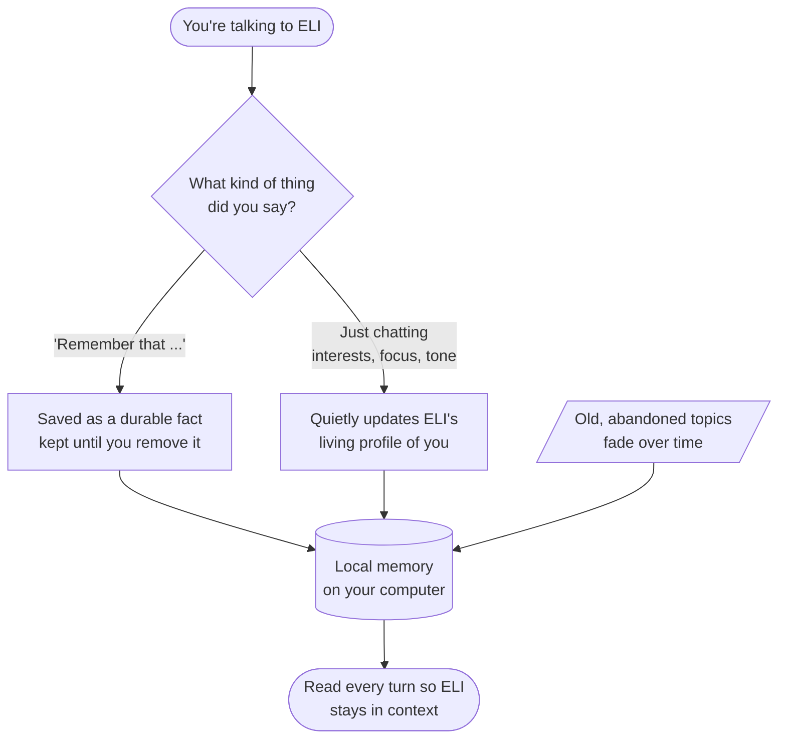

**Tell it something to keep:** "remember that my sister's name is Anna" · "my name is Alex"
**Ask what it knows:** "what do you remember about my car?" · "what do you know about me?" ·
"explain everything you know about me and where it's stored" (a sourced, detailed answer).

Everything is stored **locally** in small private databases. Review and prune it in the **Memory**
tab. A brand-new install is a **blank slate** — ELI knows nothing about you until you talk.

---

## 9. ELI learns your routines (habits)

🟢 If you do the same thing at roughly the same time on **several different days**, ELI notices
and **offers** to automate it. It never activates anything without your "yes".

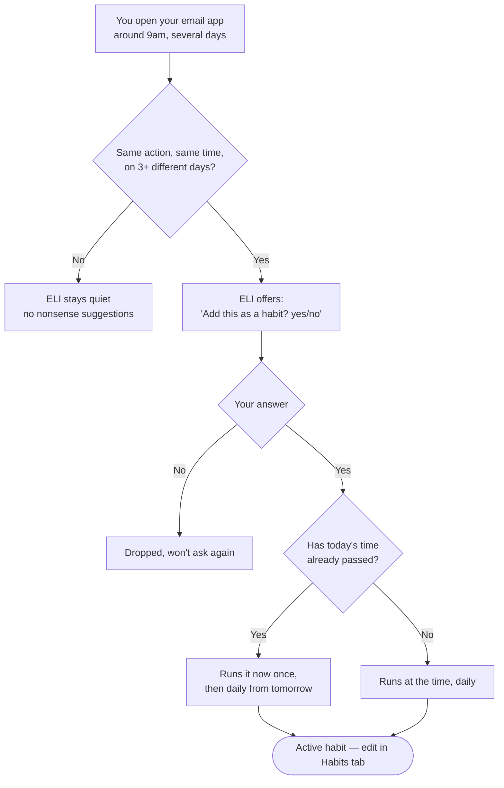

Manage everything in the **Habits** tab (add, edit times, turn off), or say "show my habits".
The key safeguards: it only proposes routines you've **genuinely repeated across days**, and it
**always asks first**.

---

## 10. ELI helps before you ask (proactive)

🟢 With **proactive mode** on, ELI can do helpful things on its own — a **morning briefing**, a
gentle suggestion, or a goal it thinks would help. It's conservative and easy to control:

- "start proactive mode" / "stop proactive mode" · "proactive status"
- "morning report" / "give me my briefing" (news, weather, your agenda)
- "do you have any proposals for me?" / "what's on your agenda?"

Schedule real unattended work too:
> "research X overnight" · "generate tests for your code tonight"

These appear in the **Tasks** tab and survive restarts.

### The autonomy tick — what "on its own" actually means
When you allow it, ELI runs a quiet **autonomy tick** inside the proactive daemon — roughly every
half hour, and only if it's switched on (kill switch: `ELI_AUTONOMY_TICK=0`). One tick does three
things, all **read-only or proposal-only**:

1. **Code monitor** — it glances over its own code health and flags anything that's drifted.
2. **Self-model refresh** — it updates its understanding of itself (what it's running, what it can
   do) so its introspection stays honest.
3. **Goal autogenesis** — it may propose a goal, or a scheduled task, it reckons would help you.

The guardrail that matters: every autogenerated goal is **proposal-only**. It shows up as a
suggestion you accept or dismiss — nothing destructive ever runs unattended, and anything risky
still goes through the **approval gate** (Appendix C). Autonomy makes ELI *thoughtful* on its own,
not *loose*.

---

## 11. Voice, wake word, and dictation

🟢 ELI is fully usable hands-free.

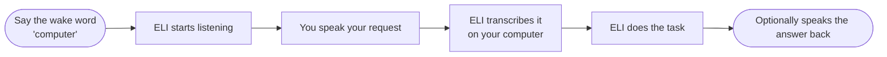

- **Wake word:** say **"computer"** then your request. Change it: "change the wake word to athena".
  ELI trains its listener on the new word automatically — works even over background music.
- **Personalise to your voice:** "enroll my wake word" (records you saying it and adapts).
- **Dictation:** "start dictation" / "stop dictating" — speak and ELI types into the active field.
- **Transcribe a recording:** "transcribe audio.wav"
- **ELI speaking back:** "say good morning"
- **Teach ELI your voice & tone:** "train my voice" — it learns your pitch/energy and even emotion
  cues, then adapts how it speaks to you.
- **If voice misbehaves:** "run voice diagnostics".

---

## 12. Seeing your screen and images (vision)

🟢 ELI can actually **look**:

- **Your screen:** "what's on my screen?" · "what does this error say?" · "find the submit button"
- **Image files:** "describe cat.jpg" · "read the text in this image" (OCR)
- **Documents:** "summarise report.pdf" · "analyse data.csv" · "analyse the pdfs in that folder"
- **Continuous watching:** "watch my screen" (and "stop watching")

The first time you use vision, ELI may fetch a small vision model (you can pre-download it — §14).
With a webcam set up, ELI even supports **eye-tracking control**: "enable gaze control",
"calibrate gaze", then click where your eyes rest.

---

## 13. The ELI server & using it from your phone

🟡 *Slightly technical, but only at setup.*

ELI includes a built-in **server** and **web app**. Start the server on your computer and chat with ELI from your
**phone or tablet's browser** over your home Wi-Fi — while all the actual thinking stays on your
computer.

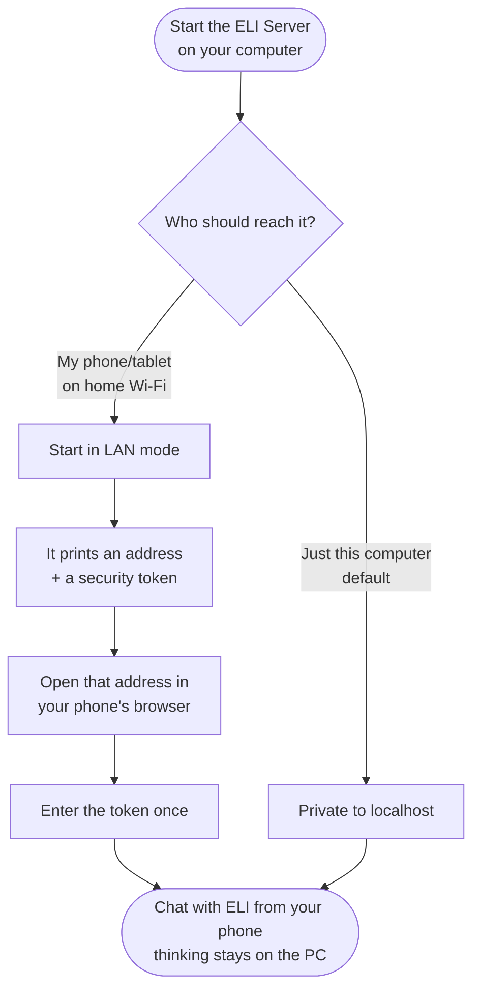

- Start it from the desktop app — **Settings → Web Server** (a "this computer" button and a
  "phone / Wi-Fi" button that shows the exact link to open). Or run `scripts/eli_serve.sh` (Mac/Linux) /
  `scripts/eli_serve.ps1` (Windows). Full details: `docs/SERVER_AND_WEB_APP.md`.
- The web app is **installable** — your phone's "Add to Home Screen" makes it open like an app, and the
  shell works offline. Light/dark themes; you can recolour the chat.

### Starting the server, and what it prints
Start the server and it does two friendly things so you never have to hunt for the address: it
**prints a clickable link** (Ctrl/Cmd-click it right in the terminal), and it **auto-opens your
local browser** to the dashboard. (Set `ELI_API_NO_BROWSER=1` if you'd rather it didn't.)

- **This computer only (default):** the dashboard opens at `http://127.0.0.1:8081/`. No token —
  you're on the machine, so you're trusted automatically.
- **Phone / Wi-Fi (LAN mode):** it prints your computer's LAN address (e.g.
  `http://192.168.1.20:8081/`) with a **one-time token** baked into the link, plus a **QR code**
  in the Connect tab. Scan it or open the link and you're in.

### The token, and the rotate button
The phone's token is **stable** — it's saved (permissions `0600`, under your config dir) and
survives server restarts, so a paired phone stays paired; no re-scanning every reboot. Lost the
phone, or just want a clean slate? Hit **rotate**: it mints a fresh token and instantly cuts off
anything still using the old one.

### Voice from the phone needs HTTPS
Browsers block the microphone on a plain `http://` LAN address, so the phone **mic** needs a
secure page. Start with `--https` (or the HTTPS toggle) and ELI runs a *second* server alongside
on port **8443** with a self-signed certificate — accept the one-time "not private" warning and
the mic works. Plain HTTP stays the primary path (it's what QR scanners open reliably); HTTPS
runs *in addition*, purely for voice.

### Switching the model from the dashboard
**Settings → Model** lists every model installed on your computer, with sizes. Pick one and ELI
**hot-swaps** it live — no restart. Only real, installed files show up, so you can't point it at
something that won't load, and only an **admin** can switch it.

### Two servers, one machine
Worth knowing: "the server" is really **two** local services. The **web/API server** (port 8081)
serves the dashboard, the phone app, and a small API. The **device server** is a separate MQTT
service that talks to your smart-home gear (see the Home tab, below). Both run locally; both are
yours. Everything about who's allowed in — tokens, roles, the loopback trust — is laid out in
**Appendix C (Security)**.

### If a phone can't connect
Nine times out of ten it's the firewall. When it starts in LAN mode ELI prints the **exact**
command to open the port for your OS — run that, and make sure the phone is on the **same
Wi-Fi**. It's all scoped to your local network; nothing is exposed to the internet.

### What's in the web app
It has a sidebar with several sections:
- **Overview** — a live dashboard (clock, GPU/CPU/RAM gauges, status, recent activity).
- **Chat** — streamed replies with markdown/code, saved sessions, stop/regenerate, and voice in/out.
- **Commands** — a searchable list of everything ELI can do.
- **Home** — ELI's own **home-AI** (see below).
- **System** — live, measured GPU/CPU/RAM/model telemetry.
- **Research** — shared document corpora you can build and query **together**, with citations.
- **Audit** — a tamper-evident log of every action.
- **Admin** — (admin only) per-user activity, the risk-gate policy, and user management.

### Roles (optional)
By default the person on the computer is the operator (full admin). If others share it, you can create
accounts with roles — **viewer** (read-only dashboards), **member** (use everything), **admin** (also the
Admin console) — in the Admin tab. Each gets a one-time link; the audit trail then attributes actions to
the right person.

### The Home tab — ELI as your home assistant
ELI controls smart devices **directly over MQTT** (ESPHome / Tasmota / Zigbee2MQTT) — no Home Assistant,
no cloud:
- **Find devices** on your network with one click (mDNS), or add one by its topics.
- **Control** lights/switches, group them into **rooms**, and run room-wide on/off — from the app or by
  voice ("turn on the desk lamp", "turn off the kitchen").
- **Scenes** — save a set of device states as "Movie mode" and activate it (by voice too).
- **Automations** — *when* something happens (a time, **sunrise/sunset**, or a device turning on/off),
  *do* something (control a device or run a scene), optionally *only if* a condition holds.
- ELI **learns** how you use your home and **suggests** automations you can accept with one tap.

---

## 14. Models: picking, switching, and training your own

🟡 The **model** is the "brain" ELI thinks with — a file on your computer. Bigger = smarter but
needs more graphics memory (VRAM). ELI picks a suitable one at install; change it anytime.

### Which model should I get?

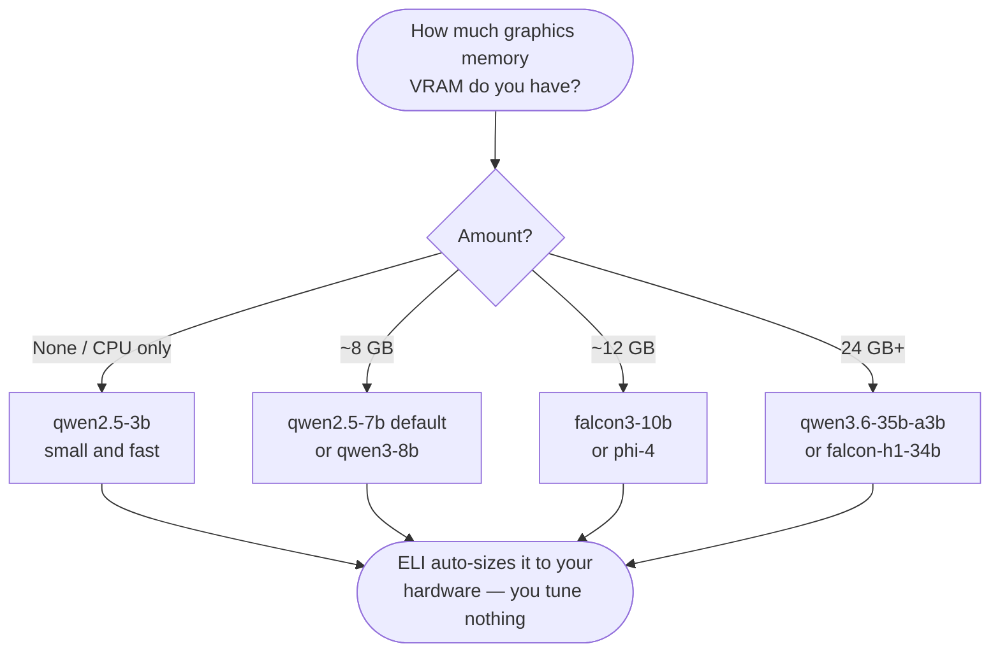

### Downloading
- **Pick from a menu (choose any number of models):** `python -m eli.core.model_download --choose`
  — this is what the installer uses; you tick the ones you want (or `all` / `auto` / `none`).
- Let ELI choose one best-fit for your hardware: `python -m eli.core.model_download --auto`
- See the menu without downloading: `python -m eli.core.model_download --list`
- Grab a specific one: `python -m eli.core.model_download qwen2.5-7b`

You're not limited to one — download several and switch between them anytime (§"Switching models").

| Command name | Model | Roughly needs |
|---|---|---|
| `qwen2.5-3b` | small & fast | 4 GB graphics / or CPU |
| `qwen2.5-7b` *(default)* | great all-rounder | 8 GB graphics |
| `qwen3-8b` | newer, big context, good reasoning | 8 GB graphics |
| `falcon3-10b` | a step up | 12 GB graphics |
| `phi-4` | strong reasoning for its size | 12 GB graphics |
| `qwen3.6-35b-a3b` | very capable (mixture-of-experts) | 24 GB / or slow on CPU |
| `falcon-h1-34b` | largest option | 24 GB / or slow on CPU |

You can also just **drop any `.gguf` file** into the `models/` folder and ELI finds it.

### Switching models
In **Settings → Model** (or "Model menu / Auto Detect"), pick the file. ELI sizes it to your
hardware automatically — you don't tune anything.

### 🔴 Training your own ELI-flavoured model (advanced, optional)
You can fine-tune a model so it speaks in **ELI's voice** out of the box.

➡️ **See `blueprints/finetuning_guide.md`** — a full step-by-step from choosing a base model,
through extracting a voice dataset and training, to producing a ready-to-load `.gguf`. Crucially,
ELI's **personality stays live** (never frozen into the model); training only shapes the *manner*
of speech.

---

## 15. How hard ELI thinks (reasoning modes)

🟢 ELI has five effort levels. Faster modes answer quickly; deeper modes think longer and use more
of ELI's internal helpers for hard problems.

| Mode | Feel | Use it for |
|---|---|---|
| **quick** | snappy | greetings, simple commands, quick facts |
| **normal** | balanced (default) | everyday questions and tasks |
| **advanced** | more thorough | tricky, multi-step asks |
| **research** | digs deep | gathering and synthesising a lot |
| **expert** | maximum effort | the hardest problems |

Ask "what reasoning mode are you in?" or "explain all your reasoning modes". For most people the
default is right — ELI also deepens on its own when a problem clearly needs it.

---

## 16. Settings you'll actually touch

🟡 Most people never need these. The few that matter:

- **Model** — which brain ELI uses (§14).
- **Voice** — wake word, text-to-speech on/off, microphone.
- **Hardware / startup** — ELI auto-tunes; advanced users can nudge how much graphics memory to
  hold back, or how much context to use. Leave alone unless you know why.
- **Privacy** — ELI is offline by default; this is where anything network-related lives.

Two graphics cards? ELI can use both — set in the GPU profile settings; single-card just works.

---

## 17. Privacy & staying offline

🟢

- **Nothing leaves your computer** unless you ask for something online (web search, news, weather,
  downloading a model). ELI tells you when it goes online.
- **Your data is yours** — conversations, memories, files, profile live in local databases. Delete
  anytime.
- **No accounts, no telemetry, no subscription.**
- A fresh install is a **blank slate** — ELI starts knowing nothing about you.

---

## 18. Troubleshooting

🟡 Most issues map to one of these. When in doubt, **ask ELI** — "run a full runtime audit" or
"status" — it reports honestly.

### "ELI is replying very slowly"

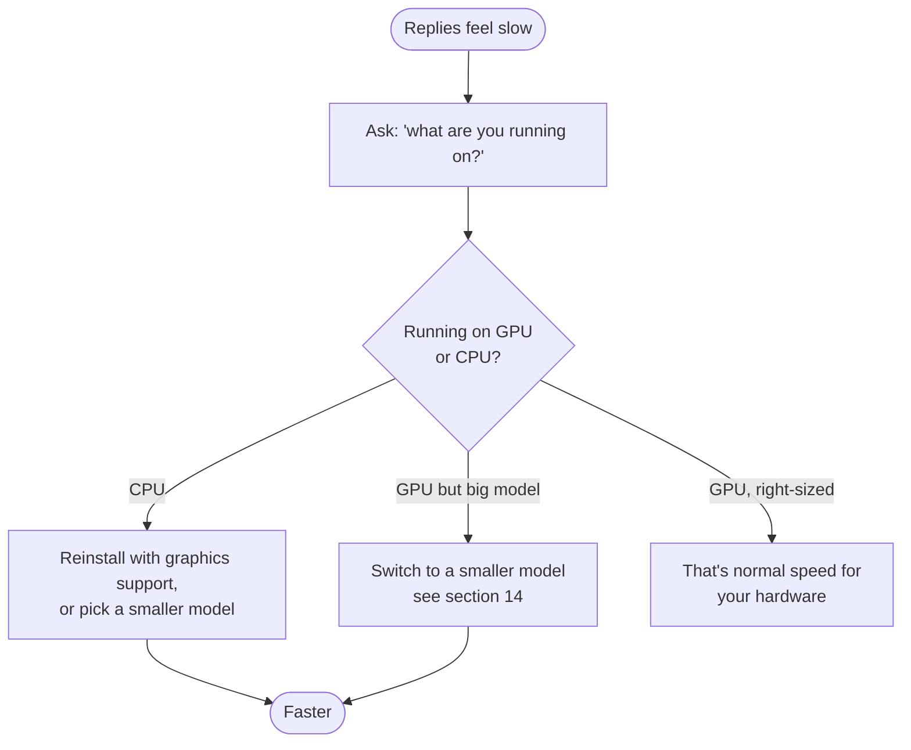

### Everything else

| Problem | Try this |
|---|---|
| **Replies look like gibberish** | A model whose context is too small. Pick a recommended one (§14); ELI sizes context automatically. |
| **"I couldn't find a model"** | `python -m eli.core.model_download --auto` |
| **Memory/recall seems empty** | Normal on a fresh install. Ensure the embedder downloaded: `python -m eli.core.model_download --aux` |
| **Voice/wake word not responding** | "run voice diagnostics"; check the microphone in Settings → Voice. |
| **Won't go online for news/search** | By design (offline-first). The network is allowed per-request; check Settings → Privacy. |
| **A habit didn't run** | Open **Habits** — confirm it's enabled and the time is right; or "show my habits". |
| **Something seems broken** | "run a full runtime audit" or "status". |

---

## 19. Quick phrasebook (cheat sheet)

**Everyday**
- "open spotify and play lo-fi" · "pause" · "skip"
- "what's on my screen?" · "summarise report.pdf"
- "set an alarm for 7am" · "set a timer for 10 minutes"
- "what's the news?" · "weather in Dublin" · "what time is it?"

**Memory & you**
- "remember that …" · "what do you know about me?" · "my name is Alex"

**Habits & proactive**
- "show my habits" · "yes" / "no" (to an offer) · "morning report" · "start proactive mode"

**Writing & code**
- "write a report on X" · "write a script to …" · "fix the bugs in foo.py"

**Voice**
- wake word "computer" + request · "change the wake word to athena" · "start dictation" ·
  "say good morning" · "train my voice"

**Check on ELI**
- "what are you running on?" · "status" · "what have you been working on?"

**Models (in a terminal)**
- `python -m eli.core.model_download --list` · `python -m eli.core.model_download --auto`

---

## 20. Glossary

| Term | Plain meaning |
|---|---|
| **Model / GGUF** | The "brain" file ELI thinks with. `.gguf` is just its file format. |
| **VRAM** | Memory on your graphics card. More VRAM → you can run a bigger, smarter model. |
| **Embedder** | A tiny helper model that powers ELI's memory/recall. Installed automatically. |
| **Context** | How much of the conversation ELI can "hold in mind" at once. ELI sets this for you. |
| **Vision model** | The model that lets ELI understand screens and images. |
| **Wake word** | The phrase that makes ELI start listening (default "computer"). |
| **Proactive mode** | ELI doing helpful things on its own (briefings, suggestions). |
| **Habit** | A routine ELI learned and you approved, run on a schedule. |
| **Fine-tuning** | Optional advanced step to teach a model ELI's voice (§14). |
| **Offline-by-default** | ELI never uses the internet unless you ask for something that needs it. |

---

## 21. Appendix A — Under the hood: how ELI thinks (the full pipeline)

🔴 *For the curious / technical. You never need this to use ELI — but here is the complete,
verified path from your words to ELI's reply.*

Every request runs through one funnel — `CognitiveEngine.process()` — which takes one of three
paths depending on what you asked and the reasoning mode. The diagram is the **real** pipeline
(verified against the running code): a deterministic fast-path for plain commands, a **quick**
path via the Agent Bus (the default), and a **deep** 12-stage Orchestrator for hard work.

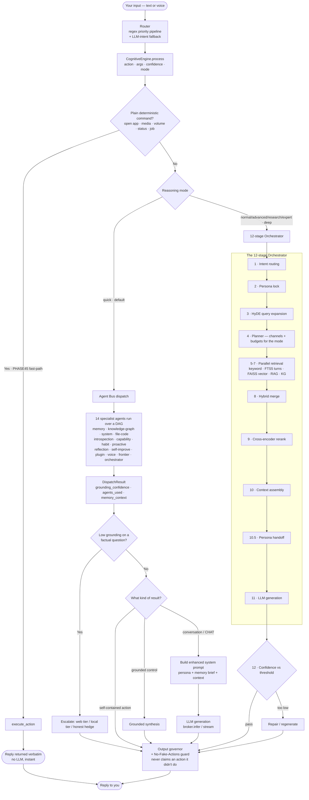

**The retrieval stages (5–7) are where memory plugs in** — that's Appendix B. The two guarantees
baked into the end of every path: the **Output governor** cleans the reply, and the
**No-Fake-Actions guard** ensures ELI never claims it did something it didn't.

### A.1 — The router (before any path is chosen)
Your words first hit the **router**. It runs a **regex-first priority pipeline**: an ordered set
of fast, exact checks (web realtime lookups, media controls, file/PDF, memory, OS control, …),
each carefully shaped so it only fires on a real command — e.g. media controls need a whole word
in command shape, so "metabolise" never triggers a media "tab". If nothing matches, an **LLM
intent classifier** is the fallback. The router emits `{action, args, confidence}` and hands off
to `CognitiveEngine.process()`. The router also remembers the *last used path* so follow-ups
("do it again", "the second one") resolve correctly.

### A.2 — The three paths, and when each is taken
- **Fast-path (PHASE45) — no AI involved.** Plain, deterministic actions (open an app, pause
  music, set volume, report status, check a job) are executed directly and the result is returned
  **verbatim**. There's no model call, so these are instant and can't be "hallucinated". This is
  why "pause" never produces a chatty paragraph.
- **Quick path (the default) — the Agent Bus.** Conversational and lightly-grounded requests go
  to the **Agent Bus**, which runs up to **14 specialist agents** in parallel over a dependency
  graph, each contributing evidence (memory hits, knowledge-graph facts, system readings, code
  search, capability info, …). Their combined result carries a **grounding confidence** — an
  honest "is this actually backed by anything?" score.
- **Deep path — the 12-stage Orchestrator.** When you ask for depth (advanced/research/expert
  modes, or a hard question), ELI runs the full pipeline below: more retrieval, reranking, and a
  confidence check with automatic repair.

### A.3 — The Agent Bus, in full
The bus **selects a relevant subset** of agents for your intent (or fans out broadly when
unsure), runs them concurrently, and **aggregates** their findings into a `DispatchResult`. Key
agents and what they bring:

| Agent | Contributes |
|---|---|
| **Memory** | recalls facts/turns from SQLite + full-text + vector search |
| **Knowledge-Graph** | entities and how they relate (who/what/where) |
| **System** | runs executor actions (web search, audits, status) |
| **File-Code** | searches the actual codebase for grounded answers about ELI itself |
| **Introspection** | live runtime/self state |
| **Capability** | what ELI can do (the capability manifest) |
| **Habit / Proactive / Reflection / Self-Improve** | routines, signals, insights, fixes |
| **Plugin / Voice / Frontier / Orchestrator** | plugin dispatch, speech state, deeper reasoning hooks, planning |

After the bus returns, a **grounding-escalation hook** checks: *is this a factual question that
came back weakly supported?* If so, ELI escalates — a web tier (if you allow online), a local
tier, or an **honest hedge** ("I'm not certain, but…") rather than a confident guess. Then the
result is finalised: a self-contained action returns directly, a grounded control action gets a
short grounded synthesis, and a conversation goes to generation with the full persona + memory
context.

### A.4 — The 12 stages, one by one (the deep path)
1. **Intent routing** — settle exactly what you're asking for.
2. **Persona lock** — fix ELI's identity/voice for this turn so it stays consistent.
3. **HyDE query expansion** — ELI drafts a *hypothetical answer* and searches with **that** too,
   which dramatically improves what memory retrieves (you find better matches by searching with an
   answer-shaped query, not just the bare question). Skipped for very short queries.
4. **Planner** — decide *which* retrieval channels to use and how big the budgets are, tuned to
   the reasoning mode (fast / balanced / deep).
5–7. **Parallel retrieval** — several searches run at once: keyword, **full-text (FTS5)** over your
   conversation history, **FAISS vector** (semantic) search, optional RAG, and the **knowledge
   graph**. (This is the seam where Appendix B's memory system feeds in.)
8. **Hybrid merge** — combine the hits from every channel into one candidate set.
9. **Cross-encoder rerank** — a smarter model re-scores the merged candidates for true relevance
   to your question, and the best rise to the top. (Skipped for non-conversational asks.)
10. **Context assembly** — build the grounded context block that will inform the answer.
10.5. **Persona handoff** — wrap that context with ELI's live persona brief for generation.
11. **LLM generation** — the model writes the reply (streaming or one-shot). For the deepest
   modes this is a two-part private-reasoning-then-condense step.
12. **Confidence check** — score the answer against a threshold; if it's too low, ELI
   **repairs/regenerates** rather than shipping a weak answer.

### A.5 — The two end-of-path guarantees
Every path, no matter which, ends at:
- **Output governor** — normalises and cleans the reply (strips artefacts, enforces formatting).
- **No-Fake-Actions guard** — if ELI's reply *claims* it did something (played a song, fixed a
  file), the system verifies it actually happened; if not, the claim is replaced with the honest
  truth. This is enforced in code, not left to the model's goodwill.

---

## 22. Appendix B — Under the hood: how ELI remembers (the full memory system)

🔴 *For the curious / technical. ELI's memory is a genuine hybrid — relational + full-text +
vector + graph — all local. This is the complete input → storage → recall path (verified against
the code).*

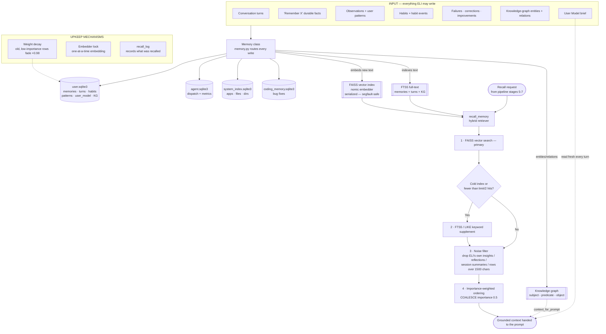

**Why it's trustworthy:** the **noise filter** stops ELI's own past replies and reflections from
resurfacing as if they were *your* facts; the **embedder lock** keeps the vector engine from
crashing under concurrent use; and **weight decay** is the gentle "forgetting" that lets stale
topics fade while active ones stay fresh. Nothing here leaves your computer.

### B.1 — What ELI writes (the inputs)
Everything that flows into memory passes through one **Memory** module, which decides where each
item belongs:
- **Conversation turns** — what you said and what ELI replied, with timestamps.
- **Durable facts** — anything you explicitly ask it to "remember".
- **Observations & user patterns** — quiet signals about your interests, focus, and tone that
  build the living profile.
- **Habits & habit events** — your repeated actions and the routines learned from them.
- **Failures, corrections, improvements** — ELI's own mistakes and fixes, kept for self-learning
  (these are deliberately **excluded** from normal recall — see the noise filter).
- **Knowledge-graph entities & relations** — named things and how they connect.
- **User Model brief** — a compact, pre-rendered summary of who you are, refreshed over time.

### B.2 — Where it's stored (four local databases + three indexes)
Everything is plain local files on your machine — no server, no cloud:
- **`user.sqlite3`** — the main store: memories, conversation turns, habits, patterns, the User
  Model, and the knowledge graph.
- **`agent.sqlite3`** — ELI's internal agent activity and performance metrics.
- **`system_index.sqlite3`** — an index of your apps, executables, files, and folders (so "open
  the file manager" is instant).
- **`coding_memory.sqlite3`** — remembered code bug-fixes.

On top of the relational data sit three search indexes:
- **FAISS vector index** — every stored text is turned into an "embedding" (a list of numbers
  capturing meaning) by a small local **nomic embedder**, so ELI can find things by *meaning*, not
  just exact words. Embedding is done **one-at-a-time** behind a lock (the embedder isn't
  thread-safe; serialising it prevents crashes).
- **FTS5 full-text index** — fast exact/keyword search over memories, conversation turns, and the
  knowledge graph.
- **Knowledge graph** — a subject → predicate → object web (e.g. *you → own → a Tesla*) that ELI
  can walk to answer relational questions.

### B.3 — How recall works (step by step)
When the cognition pipeline (stages 5–7) needs memory, it calls **`recall_memory`**, a genuine
hybrid retriever that runs in this order:
1. **Vector search first (FAISS).** The semantic index is the primary path — it finds things that
   *mean* the same even if worded differently.
2. **Keyword supplement (FTS5/LIKE) — only if needed.** If the vector index is cold/empty or
   returns fewer than half the requested results (e.g. a very short query), a keyword search tops
   it up. (When another part of the system already did the vector search, this step is skipped to
   avoid double-searching.)
3. **Noise filter.** Results are scrubbed of ELI's *own* output — assistant insights, reflections,
   session summaries, the "orchestrator" source, and any over-long blobs (>1500 chars). This is
   the safeguard that stops ELI's past musings from masquerading as *your* facts.
4. **Importance-weighted ordering.** What survives is ranked by an importance score so the most
   significant memories surface first.

Alongside this, the **knowledge graph** contributes a lightweight relational context, and your
**User Model brief** is read **fresh every single turn** — that's why ELI stays in context about
who you are without you repeating yourself.

### B.4 — Upkeep (the mechanisms that keep memory healthy)
- **Weight decay** — old, low-importance memories are gently faded (multiplied down over time), so
  abandoned topics naturally recede while active ones stay prominent. This is ELI's "forgetting".
- **Embedder serialization** — the single lock around the embedder that keeps the vector engine
  stable under concurrent access.
- **Recall log** — a record of what was retrieved, used for tuning and for honestly explaining
  *where* a piece of knowledge came from ("how do you know that?").

### B.5 — Privacy, restated
Every database and index in this appendix is a local file under your user profile. There is no
sync, no upload, no account. Delete the files (or use the **Memory** tab) and that knowledge is
gone. A fresh install starts with the full structure but **zero** personal rows — a true blank
slate.

---

## 23. Appendix C — Under the hood: how ELI stays safe and yours (security)

🔴 *For the curious / technical. ELI is meant to be safe by construction, not by good
intentions — every guard below is enforced in code, not left to a setting you might forget to
flip. All of this is verified against the running codebase.*

### C.1 — Offline by default (the socket failsafe)
ELI doesn't just *prefer* to stay offline — it's physically stopped from reaching the internet
unless you asked for something that needs it. At startup, `netguard` installs a **process-wide
socket guard**: it patches the low-level `connect()` call so that *any* outbound connection to a
non-loopback address raises an `OfflineError` while ELI is offline. Loopback and local sockets
(the phone web server, the local model) always work. So even if some stray bit of code *tried*
to phone home, the operating-system call itself is blocked — belt and braces. When you do turn
networking on for a task, that flip is written to the audit ledger; "internet on" is never
silent.

Ask for something online while offline and you don't get a crash or an invented answer — you get
an honest refusal: *"I can't fetch that right now, I'm offline."*

### C.2 — The fail-closed command gate
ELI can run shell commands and open apps, so that path is gated hard. Before any command runs
it's checked against an **allowlist** by the SecurityManager. The part that matters: if the
security layer can't load for any reason, the check **fails closed** — it returns *denied*, not
*allowed*. A broken guard blocks the action; it never quietly waves one through. Sandboxed runs
are limited to a fixed set of allowed executables.

### C.3 — The approval gate (nothing risky happens behind your back)
Anything ELI proposes on its own — an autonomous action, a self-improvement patch, a scheduled
job — goes through the **approval engine** before it can execute. Each proposal carries an
*action class*, and the engine decides: auto-approve the harmless ones, or hold the riskier ones
until **you** confirm. Who is even allowed to propose what is also gated — a background daemon
can't quietly emit a dangerous action. There's a **Full Control** mode that lifts the
confirmation barrier if you want ELI to just act, but that's your explicit choice, and it's off
by default.

### C.4 — The phone: who's allowed in
The web server (§13) is locked down. On the same machine (loopback) you're trusted
automatically. From the network, every request must carry a **bearer token** — and that token is
never stored in plain text, only its SHA-256 hash. Define one or more users and **RBAC** switches
on: each token maps to a role (admin / member), and admin-only actions — changing settings,
switching the model — reject anyone who isn't admin. With no users defined it's single-operator
mode: just you. The **rotate** button issues a fresh token and kills the old one, so a paired
phone can be cut off in one tap.

### C.5 — The audit ledger
Security-relevant events — settings changes, the network being turned on or off, research
collaborations — are written to a **tamper-evident audit ledger**: a local, append-only trail so
there's always an honest record of what changed and when.

### C.6 — Privacy, restated
Every guard, token, ledger, and database above is a local file under your own user profile. No
account, no sync, no telemetry. ELI's default posture is *closed* — offline, gated, and yours.
You open doors deliberately, one at a time.

---

*That's the whole assistant — inside and out. You don't need any of the last three appendices to
use ELI; just talk to it in plain English, and ask "what can you do?" whenever you're curious.
Everything here happens on your computer, for you, privately.*
