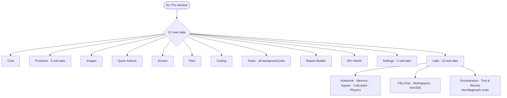

# ELI GUI

`eli/gui/` — 18.3k LOC, 18 files. A full native PySide6/PyQt desktop app (with a
Qt-binding compat shim), plus a first-boot launcher and a large scientific
"Labs" workspace.

## Tab map (current — 12 main tabs)

## Files

| File | LOC | Role |
|---|---|---|
| `eli_pro_audio_gui_MKI.py` | 10.3k | the main window + most app logic (god-file) |
| `labs_tab.py` | 5.1k | scientific workspace tab |
| `app.py` | 742 | launcher / first-boot auto-tune / entry `main()` |
| `panels/startup.py` | 609 | first-boot model setup panel |
| `panels/settings.py` | 591 | settings panel |
| `docks/operator_console_dock.py` | 303 | operator console dock |
| `widgets/ollama_model_selector.py` | 258 | optional Ollama model picker |
| `tabs/experimental_tab.py`, `panels/agent_wizard.py`, `docks/proactive_dock.py`, `tabs/eli_world_tab.py`, `qt_compat.py`, `panels/_qt.py` | small | tabs/docks/widgets + Qt compat |

## Launcher (`app.py`)

The entry path: `_detect_hardware` (queries **free** VRAM — the display server
consumes VRAM before ELI launches, so free ≠ total), `_auto_tune(model_path, hw)`
(picks n_ctx/layers/batch), `_pick_model`, `_confirm_params`, config load/save.
`main()` either shows the startup model picker (first boot) or delegates to
`eli_pro_audio_gui_MKI.main()`. `--setup` forces the wizard.

## Main window (`eli_pro_audio_gui_MKI.py`)

A 10.3k-line module holding the window **and** a stack of embedded classes that
are really application logic, not just UI:
- `CentralMemoryAdapter` — bridges the GUI to the memory subsystem.
- `LocalModelManager` (708) — discover/load/swap local GGUF models.
- `OllamaModelManager` (1142) — optional Ollama integration (legacy/optional;
  ELI's stance is 100% local GGUF, so this is a secondary path).
- `ExecutorBridge` (1246) — routes GUI actions into the executor/engine.
- `_GUIEngineAdapter` — engine façade for the UI.
- UI widgets: `_QABoard` (quick-action card board), `_MiniTelemetryGraph` (live
  telemetry), `_ZoomableSettingsView`, `_ZoomableImagePreview`, `_FlowLayout`,
  `_CapabilityList`.
- `pyqtSignal`/`Slot` aliased through `qt_compat.py` so it runs on PyQt **or**
  PySide.

## Labs workspace (`labs_tab.py`)

A 5.1k-line "scientific workspace" tab with **10 sub-tabs**: Notebook, Memory &
Conversations, Jupyter, Calculator, Physics constants, File Chat, Workspaces,
Sim/IDE, **Orchestration**, **Test & Review**. (Report Builder was promoted out of Labs
to its own main tab; Orchestration + Test & Review were demoted back INTO Labs in the
2026-06-18 advisory as developer/diagnostic tools.) This is the research-bench surface (reflects whatever technical/research work
the active user does, surfaced dynamically from their own data).

## Other surfaces

- `panels/startup.py` — guided first-boot: detect hardware → pick/download a GGUF
  (HuggingFace) → tune params.
- `panels/agent_wizard.py` — author custom agents (writes to the trust-gated
  custom-agents dir; see `security.md`).
- `docks/operator_console_dock.py`, `docks/proactive_dock.py` — operator console
  + proactive-suggestion dock.
- `widgets/ollama_model_selector.py`, `tabs/experimental_tab.py`,
  `tabs/eli_world_tab.py` — optional/experimental surfaces.

## Honest assessment

- **Strong:** this is a genuine, feature-rich desktop product — dockable panels,
  quick-action board, live telemetry graph, zoomable settings/image preview,
  local model management, a first-boot wizard, an agent-authoring wizard, and a
  full scientific workspace. Cross-binding (PyQt/PySide) compat is handled. Most
  local-LLM projects ship a chat box; this is an application.
- **Weak / watch:**
  1. **God-file #3** — `eli_pro_audio_gui_MKI.py` (10.3k) mixes UI with core
     logic (`LocalModelManager`, `ExecutorBridge`, `CentralMemoryAdapter`,
     `_GUIEngineAdapter`). The model/executor/memory bridges should live outside
     the window module so the UI isn't coupled to core internals (and so they're
     testable headless). `labs_tab.py` (5.1k) is a second large file.
  2. **Ollama manager** (1.1k LOC) sits oddly against the "100% local GGUF,
     don't-care-about-Ollama" stance — it's an optional/legacy path carrying
     real weight; candidate for removal or clear quarantine.
  3. UI logic instantiating engine/memory directly makes a clean headless mode
     harder (there *is* `eli --headless`, but the GUI module re-implements
     bridges rather than sharing one service layer).

---

## Update Advisory — 2026-06-01
- NEW tab added this session: `eli/gui/coding_tab.py` (`CodingTab`), wired via `create_coding_tab()` (called next to `create_labs_tab`). It is an EXTERNAL module (good pattern — keeps logic out of the 10k god-file) that drives `CODE_SOLVE` on the background task pool and shows a live jobs list.
- The god-file split for `eli_pro_audio_gui_MKI.py` remains the open item; new tabs should follow the external-module pattern coding_tab uses.

---

## Update Advisory — 2026-06-07
- **New ‘🧠 Cognition’ tab** in Advanced Settings (`panels/settings.py`): auto-rendered from `core/cognition_tunables.py`, exposes every knowledge-gathering limit + the synthesis prompt cap as spinboxes with tooltips, Apply + Reset; changes take effect next message.
- **Folder drag-drop fix:** dropping a directory into chat now inserts the BARE path (so the router can list/analyse it) instead of a `[File: …]` wrapper it then failed to read; files keep inline-content behaviour.

---

## Update Advisory — 2026-06-07 (tabs + convert)
- **14 main tabs** now (was 12): Chat, Proactive, Images, Quick Actions, Screen,
  Files, Labs, Coding, Tasks, **Report Builder**, **Test & Review**,
  **Orchestration**, Eli's World, Settings. Built in
  `eli_pro_audio_gui_MKI.py` init (~L3444). (`create_*_tab` method names over-count:
  Habits/Self-Improve/IDE are folded in; Experimental removed → gaze is a Settings toggle.)
- **Report Builder, Test & Review, Orchestration promoted** from Labs sub-tabs to
  top-level main tabs (`create_report_builder_tab` / `create_test_review_tab` /
  `create_orchestration_tab` instantiate `_ReportTab` / `_TestReviewTab` /
  `_OrchestrationTab` from `labs_tab.py`). Labs stays at **8** sub-tabs.
  - **Test & Review:** runs the suite in the background → ELI summary → backups +
    errors file → result-driven option buttons (examine/propose/generate/eval).
  - **Orchestration:** live agent-DAG layers, dependencies, critical path, last RunReport.
- **Sub-tabs:** Proactive → 6 (Suggestions, Summaries, Insights, Habits, Self-Improve,
  Memory); Labs → 8 (above); Settings → 5 (Agents, Models, Cognition, Plugins, Self-Upgrade).
- **Files tab** gained a **Convert Document** control (`_convert_selected_file`):
  select a file → format (PDF, PDF-LuaLaTeX, .docx, .doc, .odt, .rtf, HTML, .md,
  .tex, EPUB, .txt) → `CONVERT_DOCUMENT` (pandoc + LibreOffice fallback).
- **Tasks tab** (`gui/tabs/tasks_tab.py`) lists scheduled/overnight/background jobs.

---

## Update Advisory — 2026-06-18 (tab declutter for multi-user release)
- **12 main tabs** now (was 14): **Orchestration** and **Test & Review** were **demoted back
  into Labs** as developer/diagnostic tools (they were too dev-facing to be prominent top-level
  tabs in a consumer product). Their top-level builders (`create_orchestration_tab` /
  `create_test_review_tab`) were removed; the widgets (`_OrchestrationTab` / `_TestReviewTab`)
  are now added inside `LabsTab._build_ui`. **Report Builder stays top-level.**
- **Labs → 10 sub-tabs** now (was 8): the eight above + **Orchestration** + **Test & Review**,
  both **rebuilt** this session:
  - **Orchestration** → a **visual, colour-coded DAG**: agents laid out per execution layer and
    coloured by the last dispatch (green ok / red failed / grey skipped / neutral idle), a
    plain-English last-turn summary, dependencies, and a per-agent trace table. Auto-refreshes.
    It's now an *explainability* view (which agents grounded the answer), not static text.
  - **Test & Review** → a **pass/fail summary bar + failing-test table**; click a row to see the
    failure message + the code-examiner's finding; a **"Fix this with the coding agent"** button
    hands the failing module to ELI. Result-driven option buttons + ELI summary retained.
- **Background Jobs moved Coding → Tasks.** The Coding tab's duplicate job list was removed; the
  **Tasks tab** is the single home for ALL background work (coding jobs *and* scheduled/overnight
  tasks) — not all background work is coding. The Coding tab now shows only the result of the job
  you launch there, with a pointer to Tasks. (Supersedes the 2026-06-01 "live jobs list" note.)
- **De-personalization:** the physics-framework bias (Ξ/χ/φ symbols, framework terms) was removed
  from the runtime classifiers — the Labs "Physics" sub-tab is a generic constants/calculator
  surface, not user-specific.

## Update Advisory — 2026-06-08 (Full Control toggle)
- A red **🔓 Full Control** toggle sits in the top button row next to the Net toggle
  (`_on_full_control_toggled`). Enabling it pops a confirmation spelling out exactly what it
  lifts (network always on; ELI may self-edit code; auto-approves its own autonomous actions;
  ANY shell command incl. normally-blocked destructive ones). It writes the `full_control`
  setting via `eli.core.full_control.set_full_control` (single source of truth — see
  `security.md`). Default OFF.
