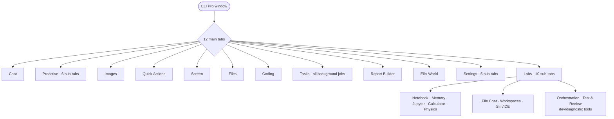

# ELI GUI

`eli/gui/` — 18.3k LOC, 18 files. A full native PySide6/PyQt desktop app (with a
Qt-binding compat shim), plus a first-boot launcher and a large scientific
"Labs" workspace.

## Tab map (current — 12 main tabs)

## Files

| File | LOC | Role |
|---|---|---|
| `eli_pro_audio_gui_MKI.py` | 11.0k | the main window + most app logic (god-file) |
| `labs_tab.py` | 5.7k | scientific workspace tab |
| `app.py` | 742 | launcher / first-boot auto-tune / entry `main()` |
| `panels/startup.py` | 737 |
| `panels/settings.py` | 672 |
| `docks/operator_console_dock.py` | 303 | operator console dock |
| `widgets/ollama_model_selector.py` | 258 | optional Ollama model picker |
| `tabs/experimental_tab.py`, `panels/agent_wizard.py`, `docks/proactive_dock.py`, `tabs/eli_world_tab.py`, `qt_compat.py`, `panels/_qt.py` | small | tabs/docks/widgets + Qt compat |

## Launcher (`app.py`)

The entry path: `_detect_hardware` (queries **free** VRAM — the display server
consumes VRAM before ELI launches, so free ≠ total), `_auto_tune(model_path, hw)`
(picks n_ctx/layers/batch), `_pick_model`, `_confirm_params`, config load/save.
`main()` either shows the startup model picker (first boot) or delegates to
`eli_pro_audio_gui_MKI.main()`. `--setup` forces the wizard.

## Main window (`eli_pro_audio_gui_MKI.py`)

A 11.0k-line module holding the window **and** a stack of embedded classes that
are really application logic, not just UI:
- `CentralMemoryAdapter` — bridges the GUI to the memory subsystem.
- `LocalModelManager` (708) — discover/load/swap local GGUF models.
- `OllamaModelManager` (1142) — optional Ollama integration (legacy/optional;
  ELI's stance is 100% local GGUF, so this is a secondary path).
- `ExecutorBridge` (1246) — routes GUI actions into the executor/engine.
- `_GUIEngineAdapter` — engine façade for the UI.
- UI widgets: `_QABoard` (quick-action card board), `_MiniTelemetryGraph` (live
  telemetry), `_ZoomableSettingsView`, `_ZoomableImagePreview`, `_FlowLayout`,
  `_CapabilityList`.
- `pyqtSignal`/`Slot` aliased through `qt_compat.py` so it runs on PyQt **or**
  PySide.

## Labs workspace (`labs_tab.py`)

A 5.7k-line "scientific workspace" tab with **10 sub-tabs**: Notebook, Memory &
Conversations, Jupyter, Calculator, Physics constants, File Chat, Workspaces,
Sim/IDE, **Orchestration**, **Test & Review**. (Report Builder was promoted out of Labs
to its own main tab; Orchestration + Test & Review were demoted back INTO Labs in the
2026-06-18 advisory as developer/diagnostic tools.) This is the research-bench surface (reflects whatever technical/research work
the active user does, surfaced dynamically from their own data).

## Other surfaces

- `panels/startup.py` — guided first-boot: detect hardware → pick/download a GGUF
  (HuggingFace) → tune params.
- `panels/agent_wizard.py` — author custom agents (writes to the trust-gated
  custom-agents dir; see `security.md`).
- `docks/operator_console_dock.py`, `docks/proactive_dock.py` — operator console
  + proactive-suggestion dock.
- `widgets/ollama_model_selector.py`, `tabs/experimental_tab.py`,
  `tabs/eli_world_tab.py` — optional/experimental surfaces.

## Honest assessment

- **Strong:** this is a genuine, feature-rich desktop product — dockable panels,
  quick-action board, live telemetry graph, zoomable settings/image preview,
  local model management, a first-boot wizard, an agent-authoring wizard, and a
  full scientific workspace. Cross-binding (PyQt/PySide) compat is handled. Most
  local-LLM projects ship a chat box; this is an application.
- **Weak / watch:**
  1. **God-file #3** — `eli_pro_audio_gui_MKI.py` (11.0k) mixes UI with core
     logic (`LocalModelManager`, `ExecutorBridge`, `CentralMemoryAdapter`,
     `_GUIEngineAdapter`). The model/executor/memory bridges should live outside
     the window module so the UI isn't coupled to core internals (and so they're
     testable headless). `labs_tab.py` (5.7k) is a second large file.
  2. **Ollama manager** (1.1k LOC) sits oddly against the "100% local GGUF,
     don't-care-about-Ollama" stance — it's an optional/legacy path carrying
     real weight; candidate for removal or clear quarantine.
  3. UI logic instantiating engine/memory directly makes a clean headless mode
     harder (there *is* `eli --headless`, but the GUI module re-implements
     bridges rather than sharing one service layer).
