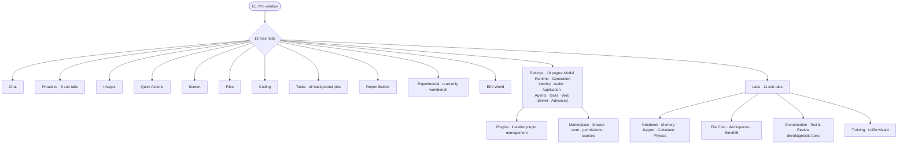

# ELI GUI

> **Updated for v2.3.72.** Ollama model selector fixed on packaged builds
> (`QDialogButtonBox` exported via `eli/gui/qt_compat.py`).

`eli/gui/` — 25.4k LOC, 22 modules (8 top-level + panels/tabs/docks/widgets). A full native PySide6/PyQt desktop app (with a
Qt-binding compat shim), plus a first-boot launcher and a large scientific
"Labs" workspace.

## Tab map (current — 13 main tabs)

```mermaid
flowchart TD
    W([ELI Pro window]) --> T{13 main tabs}
    T --> Chat[Chat]
    T --> Pro[Proactive · 6 sub-tabs]
    T --> Img[Images]
    T --> QA[Quick Actions]
    T --> Scr[Screen]
    T --> Fil[Files]
    T --> Cod[Coding]
    T --> Tsk[Tasks · all background jobs]
    T --> Rep[Report Builder]
    T --> Exp[Experimental · read-only workbench]
    T --> Wld[Eli's World]
    T --> Set[Settings · 10 pages: Model · Runtime · Generation ·<br/>Identity · Audio · Application ·<br/>Agents · Gaze · Web Server · Advanced]
    T --> Labs[Labs · 11 sub-tabs]
    Labs --> L1[Notebook · Memory · Jupyter · Calculator · Physics]
    Labs --> L2[File Chat · Workspaces · Sim/IDE]
    Labs --> L3[Orchestration · Test & Review<br/>dev/diagnostic tools]
    Labs --> L4[Training · LoRA wizard]
    Set --> S1[Plugins · installed plugin management]
    Set --> S2[Marketplace · browse · scan · permissions · sources]
```

### New in 2.3.7

| Surface | Where | What it is |
|---|---|---|
| 🎓 **Training** | Labs sub-tab | four-step LoRA wizard: Hardware → Target → Data → Train |
| 🛒 **Marketplace** | Settings sub-tab | community plugins: browse, verify, scan, install, permissions, sources |
| **Permission dialog** | anywhere | Android-style consent: Allow once · Always allow · Not now · Never allow |
| 🎯 **Eval board** / ⚖️ **Eval + judge** | Labs ▸ Test & Review | behaviour regression board, run in-process |

## Files

| File | LOC | Role |
|---|---|---|
| `eli_pro_audio_gui_v2_0.py` | 12.1k | the main window + most app logic (god-file) |
| `labs_tab.py` | 5.7k | scientific workspace tab |
| `app.py` | 817 | launcher / first-boot auto-tune / entry `main()` |
| `panels/startup.py` | 1305 |
| `panels/settings.py` | 733 | settings dialog incl. Plugins + Marketplace sub-tabs |
| `tabs/training_tab.py` | 841 | Labs ▸ Training — the LoRA wizard |
| `tabs/marketplace_tab.py` | 707 | Settings ▸ Marketplace — browse/installed/permissions/sources |
| `panels/permission_dialog.py` | 223 | plugin consent dialog + thread-marshalling bridge |
| `docks/operator_console_dock.py` | 303 | operator console dock |
| `widgets/ollama_model_selector.py` | 294 | optional Ollama model picker |
| `tabs/experimental_tab.py`, `panels/agent_wizard.py`, `docks/proactive_dock.py`, `tabs/eli_world_tab.py`, `qt_compat.py`, `panels/_qt.py` | small | tabs/docks/widgets + Qt compat |

## Launcher (`app.py`)

The entry path: `_detect_hardware` (queries **free** VRAM — the display server
consumes VRAM before ELI launches, so free ≠ total), `_auto_tune(model_path, hw)`
(picks n_ctx/layers/batch), `_pick_model`, `_confirm_params`, config load/save.
`main()` either shows the startup model picker (first boot) or delegates to
`eli_pro_audio_gui_v2_0.main()`. `--setup` forces the wizard.

## Main window (`eli_pro_audio_gui_v2_0.py`)

A 12.6k-line module holding the window **and** a stack of embedded classes that
are really application logic, not just UI:
- `CentralMemoryAdapter` — bridges the GUI to the memory subsystem.
- `LocalModelManager` (708) — discover/load/swap local GGUF models.
- `OllamaModelManager` (1142) — optional Ollama integration (legacy/optional;
  ELI's stance is 100% local GGUF, so this is a secondary path).
- `ExecutorBridge` (1246) — routes GUI actions into the executor/engine.
- `_GUIEngineAdapter` — engine façade for the UI.
- UI widgets: `_QABoard` (quick-action card board), `_MiniTelemetryGraph` (live
  telemetry), `_ZoomableSettingsView`, `_ZoomableImagePreview`, `_FlowLayout`,
  `_CapabilityList`.
- `pyqtSignal`/`Slot` aliased through `qt_compat.py` so it runs on PyQt **or**
  PySide.

## Labs workspace (`labs_tab.py`)

A 5.7k-line "scientific workspace" tab with **11 sub-tabs**: Notebook, Memory &
Conversations, Jupyter, Calculator, Physics constants, File Chat, Workspaces,
Sim/IDE, **Orchestration**, **Test & Review**, **Training**. (Report Builder was promoted out of Labs
to its own main tab; Orchestration + Test & Review were demoted back INTO Labs in the
2026-06-18 advisory as developer/diagnostic tools.) This is the research-bench surface (reflects whatever technical/research work
the active user does, surfaced dynamically from their own data).

### Labs ▸ 🎓 Training (`tabs/training_tab.py`)

The GUI half of the LoRA pipeline, which `lora_pipeline.py` had always claimed was
driven by "the GUI / scheduled task" — the GUI half was never built, so the human
review gate the trainer requires had no interface at all.

Four steps, each reporting what it *found* rather than what it assumes, because the
operator is not necessarily on the machine this was written on:

1. **Hardware** — accelerator and vendor, free VRAM, whether 4-bit is available,
   which Python packages are missing, and which trainable base models exist. States
   plainly when the machine cannot train rather than starting a job that never ends.
2. **Target** — declare a target against any local HF base (family auto-detected),
   or delete one. Built-ins are listed and cannot be removed.
3. **Data** — the review queue. Filter by needs-review / flagged / clean, read each
   exchange, approve/reject/edit, bulk-approve the clean set, then save. Offers to
   mine candidates from stored conversations when the pool is empty, instead of
   showing an empty table that reads as "you have no conversations".
4. **Train** — three recipes (Light / Standard / Deep) with the raw parameters
   behind an *Advanced* disclosure, a readiness check that runs every gate as a
   dry-run, then the real run on a **QThread** with live step/loss and a cancel.

Threading: training reaches the GUI through **signals only** — a queued signal is
the one marshalling primitive that works from a worker, since `QTimer.singleShot`
called off the GUI thread never fires.

### Settings ▸ 🛒 Marketplace (`tabs/marketplace_tab.py`)

Four panes matching the four decisions an operator makes: **Browse**, **Installed**,
**Permissions**, **Sources**. See `security.md` for the verification and scanning
model — the short version is that the install path is deliberately slow, nothing is
written to disk before the operator has seen a scan result, and what is written
arrives switched off with no permissions granted.

### The consent dialog (`panels/permission_dialog.py`)

Modelled on the Android runtime-permission prompt: asked at the point of use, phrased
as what the plugin can do *to you* rather than which API it calls, and answerable
with **Allow once · Always allow · Not now · Never allow**. The two refusals are
distinct on purpose — without a permanent "Never", a plugin can nag until the
operator clicks the wrong button out of fatigue.

`ConsentBridge` marshals requests from worker threads onto the GUI thread and waits,
with a bounded timeout that **denies** if the GUI never answers, keeping the
fail-closed rule true even when the UI is what failed.

## Other surfaces

- `panels/startup.py` — guided first-boot: detect hardware → pick/download a GGUF
  (HuggingFace) → tune params.
- `panels/agent_wizard.py` — edit an existing agent's metadata and persona.
  Authoring a *new* agent now goes through the `AgentSpec` model (objective, system
  prompt, triggers, success criteria) rather than a free-text persona — see
  `orchestration_and_agents.md`.
- `docks/operator_console_dock.py`, `docks/proactive_dock.py` — operator console
  + proactive-suggestion dock.
- `widgets/ollama_model_selector.py`, `tabs/experimental_tab.py`,
  `tabs/eli_world_tab.py` — optional/experimental surfaces.

## Honest assessment

- **Strong:** this is a genuine, feature-rich desktop product — dockable panels,
  quick-action board, live telemetry graph, zoomable settings/image preview,
  local model management, a first-boot wizard, an agent-authoring wizard, and a
  full scientific workspace. Cross-binding (PyQt/PySide) compat is handled. Most
  local-LLM projects ship a chat box; this is an application.
- **Weak / watch:**
  1. **God-file #3** — `eli_pro_audio_gui_v2_0.py` (12.6k) mixes UI with core
     logic (`LocalModelManager`, `ExecutorBridge`, `CentralMemoryAdapter`,
     `_GUIEngineAdapter`). The model/executor/memory bridges should live outside
     the window module so the UI isn't coupled to core internals (and so they're
     testable headless). `labs_tab.py` (5.7k) is a second large file.
  2. **Ollama manager** (1.1k LOC) sits oddly against the "100% local GGUF,
     don't-care-about-Ollama" stance — it's an optional/legacy path carrying
     real weight; candidate for removal or clear quarantine.
  3. UI logic instantiating engine/memory directly makes a clean headless mode
     harder (there *is* `eli --headless`, but the GUI module re-implements
     bridges rather than sharing one service layer).

### Marketplace panes and the one-click path

Five panes: **Browse**, **Installed**, **Permissions**, **MCP servers**, **Sources**.

Browse carries two buttons on purpose. **⬇ Install** is the one-click path — it
downloads to memory, checks the checksum and signature, runs every scanner, and then
either installs (when nothing needs deciding) or opens the full review dialog with
the reasons named. **🔍 Check this plugin** is the same work with the dialog always
shown, for someone who wants to read the findings first. Neither writes to disk
before the operator has an answer.

**MCP servers** is its own pane because they install differently: there is no source
for ELI to scan, only a command. What is checked is that the runtime exists and that
the server answers a real `initialize` + `tools/list` handshake, and the pane states
plainly that ELI's offline switch cannot contain a separate process. Re-check runs
`mcp.doctor()` and reports each server's exact fault.
