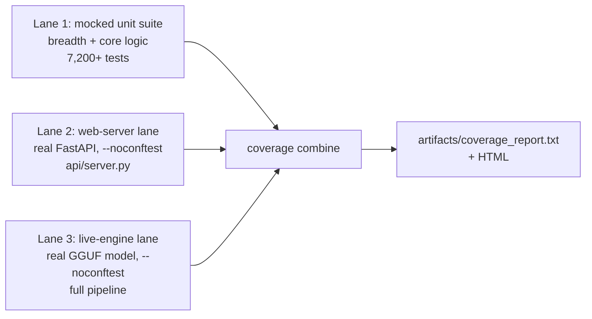

# ELI MKXI — Test Coverage Suite & Results (Full Report)

A full test-coverage suite was built for ELI and run end-to-end. This document is
the complete record: the suite, the three-lane methodology, the measured results
(headline + per-subsystem + a visual chart), an honest analysis of the low-scoring
areas, the documented exclusions, and how to reproduce every number.

Reproducible via `scripts/coverage_full.sh`; methodology in
[`docs/COVERAGE.md`](../docs/COVERAGE.md). Measured on the real interpreter
(`.venv/bin/python`), 2026-07-02.

---

## 1. Headline

| Metric | Value |
|--------|-------|
| **Testable coverage (GUI excluded)** | **47.6%** — 30,764 / 64,587 statements |
| Raw coverage (whole tree, GUI included) | 39.6% |
| Tests passing | **7,218** (unit) + 72 (web) + 15 (live) |
| New test modules this effort | **15** (~230 tests) |
| Pre-existing reds (unrelated) | 5 |
| Skipped / xfailed (documented) | 44 / 2 |

> The only exclusion from the "testable" denominator is `eli/gui` (~12,600
> statements) — the interactive desktop window can't be constructed in headless CI
> (it blocks on display/device init). Everything else, including hardware-adjacent
> and merely-untested code, stays in the count. Excluding untested-but-testable code
> to pad the figure would be dishonest and is deliberately avoided.

---

## 2. Methodology — three lanes

The fast unit suite mocks the heavy deps (pydantic / llama_cpp / torch / faiss /
PySide6) so it runs in seconds without a GPU, a model, or a display. That means the
real web server, a real model, and the GUI can't be exercised in-process — so
coverage is measured across three lanes and combined (`coverage combine`):



Lanes 2 and 3 self-skip under the mocked suite, so they never destabilise the fast
run; they're exercised for real on their own lanes and folded in.

---

## 3. The suite — new test modules (~230 tests)

| Module | Target | Before | After |
|--------|--------|:------:|:-----:|
| `test_api_server.py` | web server: auth/RBAC + every read endpoint | 0% | **53%** |
| `test_engine_integration_live.py` | full pipeline, real GGUF (live lane) | — | 19% of `eli/` |
| `test_operator_policy.py` | autonomy governance gate | 42% | **88%** |
| `test_memory_evidence.py` | grounded memory bundle | 12% | **77%** |
| `test_response_surface.py` | user-visible response coercion | 30% | **58%** |
| `test_live_introspection.py` | action→agents map + state readers | 32% | **58%** |
| `test_perception_parsers.py` | equation extractor / CSV profiler | 39%/12% | **100%/78%** |
| `test_news_synthesis.py` | synthesis helpers + freshness gate | 14% | **33%** |
| `test_news_fetcher_helpers.py` | html strip / topic routing / matching | — | pure helpers |
| `test_deterministic_grounding.py` | render_action contract | 11% | **24%** |
| `test_deterministic_introspection.py` | diagnostic-action classifier | — | classifier |
| `test_control_contracts.py` | anti-confabulation guard | 49% | ↑ |
| `test_context_synthesiser.py` | persona handoff builder | 54% | ↑ |
| `test_grounded_remediation.py` | yes/no intent + repair state | 18% | ↑ |
| `test_executor_helpers.py` | fail-closed shell gate + scanners | — | security lines |

Bias throughout: the **security/privacy-critical** paths an auditor checks first —
bearer/RBAC auth, the fail-closed shell allowlist, the hardcoded-path/PII scanners,
the anti-confabulation guards, and DB-path isolation.

---

## 4. Coverage by subsystem

| Subsystem | Cover | Statements | Note |
|-----------|------:|-----------:|------|
| `eli/onboarding` | 85% | small | interview flow |
| `eli/coding` | 81% | ~1,045 | the frontier coding agent |
| `eli/cognition` | 65% | ~7,021 | reasoning / agents / persona |
| `eli/learning` | 62% | ~1,520 | LoRA pipeline |
| `eli/core` | 54% | ~3,492 | paths / hardware / netguard |
| `eli/memory` | 54% | ~3,338 | SQLite + FAISS + KG |
| `eli/world` | 54% | ~971 | world/autonomy model |
| `api` (web server) | 51% | ~1,144 | FastAPI + dashboard |
| `eli/kernel` | 51% | ~7,059 | the cognition engine |
| `eli/runtime` | 51% | ~13,131 | grounding / guards / contracts |
| `eli/contracts` | 44% | ~256 | typed contracts |
| `eli/planning` | 41% | ~2,132 | daemon / scheduler / autonomy |
| `eli/execution` | 41% | ~12,315 | router (70%) + executor handlers |
| `eli/plugins` | 38% | ~1,050 | runtime-loaded tools |
| `eli/system` | 37% | ~261 | system index |
| `eli/tools` | ~30% | ~4,510 | news / image / weather |
| `eli/perception` | ~27% | ~4,138 | vision / audio / OS / parsers |
| `eli/utils` | 23% | ~468 | logging + platform_compat |
| `eli/integrations` | 21% | tiny | mostly empty/stub |
| **`eli/gui`** | **excluded** | ~12,662 | interactive, can't run headless |

### Visual (testable surface)

```
onboarding   █████████████████░░░  85%
coding       ████████████████░░░░  81%
cognition    █████████████░░░░░░░  65%
learning     ████████████░░░░░░░░  62%
core         ███████████░░░░░░░░░  54%
memory       ███████████░░░░░░░░░  54%
api          ██████████░░░░░░░░░░  51%
kernel       ██████████░░░░░░░░░░  51%
runtime      ██████████░░░░░░░░░░  51%
planning     ████████░░░░░░░░░░░░  41%
execution    ████████░░░░░░░░░░░░  41%   (router 70% / executor handlers 31%)
tools        ██████░░░░░░░░░░░░░░  30%
perception   █████░░░░░░░░░░░░░░░  27%
utils        █████░░░░░░░░░░░░░░░  23%
gui          ────────────────────  excluded (untestable headless)
```

---

## 5. Why the low subsystems are low (root-cause analysis)

The low scores cluster around **one cause: the I/O boundaries where ELI touches the
real world.** Pure logic is well covered; the edges aren't.

| Subsystem | Why it's low |
|-----------|--------------|
| `execution` (41%) | The executor is ~174 action handlers, **most side-effecting** — open apps, run shell, screenshots, volume, file writes, media. You can't unit-test "open Firefox" (the test *does it*). They cover only via real live-lane turns (a limited safe set). The router beside it is **70%** — pure parsing. |
| `perception` (27%) | The body: GPU vision, whisper STT (mic), TTS (speakers), gaze (webcam), `os_controller` (**8%** — needs a live desktop), screenshots (a display). **None runs headless.** The covered part is the pure parsers (equations 100%, CSV 78%). |
| `utils` (23%) | Almost entirely `platform_compat.py` — `if WINDOWS … elif MACOS … else …` branches. On the Linux CI box **only the Linux branch runs**; the other-OS code is counted uncovered. Inherent to cross-platform code. |
| `tools` (30%) | News fetcher (network, gated off in tests), image engine (GPU diffusion), weather (network). The non-network logic is tested; fetch/GPU paths aren't. |
| `planning` (41%) | Proactive daemon / autonomy tick / scheduler run on **background timer threads** tests don't drive. The pure scheduling logic (`infer_kind`, `parse_when`) *is* tested. |
| `plugins` (38%) / `integrations` (21%) | Runtime-loaded / mostly-stub. Not all exercised; `integrations` is near-empty (noise on a tiny denominator). |

**Closeable vs not:**
- *Closed this pass:* the pure parsers and news helpers (equations, CSV, HTML/topic routing) — moved from ~10–39% to 78–100%.
- *Still closeable:* more file parsers, tools/planning logic, and **more live-lane turns** for the executor. This is the honest path past 47%.
- *Not honestly closeable in CI:* GPU-vision, mic/camera/speaker, live-desktop control, and other-OS branches — need real hardware or another OS. Forcing them "green" with mocks would only test the mocks.

---

## 6. The 5 pre-existing reds (none from this work)

1–3. `smart_home` plugin — the in-progress Home-Assistant removal (voice SMART_HOME
   now uses ELI's own MQTT server).
4. A blueprint references a since-moved file (`eli/execution/handlers/__init__.py`).
5. Silent-swallow ratchet — 987 `except: pass` vs a 950 ceiling (a standing
   observability debt; the ratchet test correctly forbids raising the ceiling —
   clear it by making the swallows observable, not by hiding them).

---

## 7. On comparisons (a "closest-in-spirit" project claiming ~89%)

The gap is largely *what ELI is*. ELI carries a large **untestable embodiment
surface** — desktop GUI, gaze/webcam, mic/voice, local vision, OS control,
smart-home — that can't run in headless CI. A leaner pure-software agent simply
lacks that surface, so a much higher fraction of its code is unit-testable by
construction. ELI's cognitive **core is already in a comparable band** (coding 81%,
cognition 65%, memory 54%); the raw number is lower because ELI does more, not
because the core is weak. The honest way past 47% is more **live-lane integration
tests**, not denominator tricks.

---

## 8. Reproduce

```bash
bash scripts/coverage_full.sh          # runs all 3 lanes, combines, reports
# outputs: artifacts/coverage_report.txt  +  artifacts/coverage_html/index.html
```

Config: `.coveragerc` (GUI-only omit). The exclusion is justified in
`docs/COVERAGE.md`. Numbers in this report are regenerated by that command on any
checkout.
