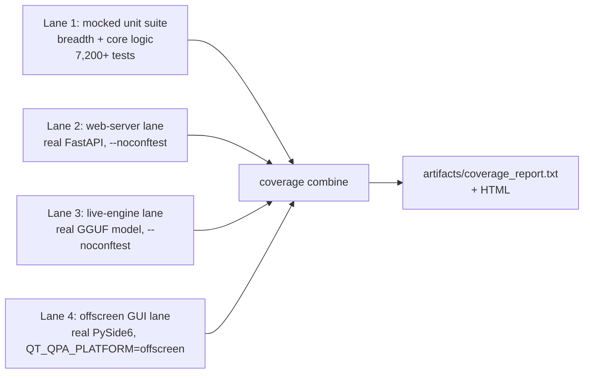

# ELI MKXI — Test Coverage Suite & Results (Full Report)

A full test-coverage suite was built for ELI and run end-to-end across **four lanes**.
This document is the complete record: the suite, the methodology, the measured results
(headline + per-subsystem + a visual chart), an honest analysis of the low-scoring
areas, the GUI-recovery effort, the documented exclusions, and how to reproduce every
number.

Reproducible via `scripts/coverage_full.sh`; methodology in
[`docs/COVERAGE.md`](../docs/COVERAGE.md). Measured on the real interpreter
(`.venv/bin/python`), 2026-07-02.

---

## 1. Headline

| Metric | Value |
|--------|-------|
| **Testable coverage** | **45.9%** — 32,174 / 70,086 statements |
| **GUI recovered** (was 0.6%) | **25%** — 1,385 / 5,439 statements |
| Tests passing | **7,338** (7,229 unit + 72 web + 23 live + 14 GUI) |
| New test modules this effort | **19** (~260 tests) |
| Pre-existing reds (unrelated) | 5 |
| Skipped / xfailed (documented) | 45 / 2 |

> **Sole exclusion:** `eli/gui/eli_pro_audio_gui_MKI.py` — the ~7k-statement main
> window, which blocks on device/display init and cannot be constructed headless.
> *Everything else is in the denominator*, including the GUI tab widgets (now tested
> offscreen), hardware-adjacent code, and merely-untested code. The number went
> **down** from an earlier GUI-excluded 47.6% precisely because the full GUI is now
> honestly counted — that's the correct trade: a complete denominator over a flattering
> one.

---

## 2. Methodology — four lanes

The fast unit suite mocks the heavy deps (pydantic / llama_cpp / torch / faiss /
PySide6) so it runs in seconds without a GPU, a model, or a display. That means the
real web server, a real model, and real Qt widgets can't be exercised in-process — so
coverage is measured across four lanes and combined (`coverage combine`):



Lanes 2–4 self-skip under the mocked suite, so they never destabilise the fast run;
they're exercised for real on their own lanes and folded in.

---

## 3. The suite — new test modules (~260 tests)

| Module | Target | Before | After |
|--------|--------|:------:|:-----:|
| `test_api_server.py` | web server: auth/RBAC + every read endpoint | 0% | **53%** |
| `test_engine_integration_live.py` | full pipeline, real GGUF + safe handlers | — | live lane |
| `test_gui_offscreen.py` | construct the tab widgets headless | 0.6% | **labs 40% / coding 49%** |
| `test_gui_app_helpers.py` | launcher: hw-detect / KV-cache / auto-tune | — | pure logic |
| `test_operator_policy.py` | autonomy governance gate | 42% | **88%** |
| `test_memory_evidence.py` | grounded memory bundle | 12% | **77%** |
| `test_response_surface.py` | user-visible response coercion | 30% | **58%** |
| `test_live_introspection.py` | action→agents map + state readers | 32% | **58%** |
| `test_perception_parsers.py` | equation extractor / CSV profiler | 39%/12% | **100%/78%** |
| `test_news_synthesis.py` | synthesis helpers + freshness gate | 14% | **33%** |
| `test_news_fetcher_helpers.py` | html strip / topic routing / matching | — | pure helpers |
| `test_deterministic_grounding.py` | render_action contract | 11% | **24%** |
| `test_deterministic_introspection.py` | diagnostic-action classifier | — | classifier |
| `test_control_contracts.py` | anti-confabulation guard | 49% | ↑ |
| `test_context_synthesiser.py` | persona handoff builder | 54% | ↑ |
| `test_grounded_remediation.py` | yes/no intent + repair state | 18% | ↑ |
| `test_executor_helpers.py` | fail-closed shell gate + scanners | — | security lines |

Bias throughout: the **security/privacy-critical** paths an auditor checks first —
bearer/RBAC auth, the fail-closed shell allowlist, the hardcoded-path/PII scanners,
the anti-confabulation guards, and DB-path isolation.

---

## 4. Coverage by subsystem

| Subsystem | Cover | Stmts | | Subsystem | Cover | Stmts |
|-----------|------:|------:|-|-----------|------:|------:|
| `eli/onboarding` | 85% | 159 | | `eli/planning` | 41% | 2,132 |
| `eli/coding` | 81% | 1,045 | | `eli/execution` | 41% | 12,309 |
| `eli/cognition` | 65% | 7,021 | | `eli/plugins` | 38% | 1,050 |
| `eli/learning` | 62% | 1,520 | | `eli/system` | 37% | 261 |
| `eli/core` | 54% | 3,492 | | `eli/tools` | 30% | 4,508 |
| `eli/memory` | 54% | 3,338 | | `eli/perception` | 27% | 4,138 |
| `eli/world` | 54% | 971 | | `eli/gui` | 25% | 5,439 |
| `eli/kernel` | 52% | 7,059 | | `eli/utils` | 25% | 468 |
| `eli/runtime` | 51% | 13,131 | | `eli/integrations` | 21% | 507 |
| `api` (web) | 49% | 1,204 | | *(gui main window)* | *excl.* | ~7k |

### Visual (testable surface)

```
onboarding   █████████████████░░░  85%
coding       ████████████████░░░░  81%
cognition    █████████████░░░░░░░  65%
learning     ████████████░░░░░░░░  62%
core         ███████████░░░░░░░░░  54%
memory       ███████████░░░░░░░░░  54%
kernel       ██████████░░░░░░░░░░  52%
runtime      ██████████░░░░░░░░░░  51%
api          ██████████░░░░░░░░░░  49%
planning     ████████░░░░░░░░░░░░  41%
execution    ████████░░░░░░░░░░░░  41%   (router 70% / handlers 31% via live turns)
tools        ██████░░░░░░░░░░░░░░  30%
perception   █████░░░░░░░░░░░░░░░  27%
gui          █████░░░░░░░░░░░░░░░  25%   (was 0.6% — labs 40%, coding 49%; main window excl.)
utils        █████░░░░░░░░░░░░░░░  25%
```

---

## 5. GUI recovery (the offscreen-Qt effort)

The GUI was 0.6%. The **main window** (`eli_pro_audio_gui_MKI.py`, ~7k stmts) blocks on
device/display init and can't be built in CI — that stays excluded. But under
`QT_QPA_PLATFORM=offscreen` the **tab widgets construct standalone**, so lane 4 builds
them for real:

- `labs_tab.py` — **40%** (1,222 stmts): `LabsTab` builds its full 400+-widget tree,
  and all 10 sub-tabs (Notebook, Jupyter, Calculator, Physics, Report, FileChat,
  Workspaces, SimIDE, Orchestration, TestReview) construct.
- `coding_tab.py` — **49%**; `app.py` launcher logic **12%**; `qt_compat` shim **16%**.

**Still recoverable (next pass):** `panels/settings.py` (504), `panels/startup.py`
(533), `tabs/tasks_tab.py` (219), `tabs/experimental_tab.py` (103),
`docks/operator_console_dock.py` (229), `widgets/ollama_model_selector.py` (138) — all
sit at ~0–9% because lane 4 doesn't construct them yet. They're candidates for the same
offscreen treatment, which would lift both the GUI and the overall number.

---

## 6. Why the low subsystems are low (root-cause analysis)

The low scores cluster around **one cause: the I/O boundaries where ELI touches the
real world.** Pure logic is well covered; the edges aren't.

| Subsystem | Why it's low |
|-----------|--------------|
| `execution` (41%) | ~174 action handlers, **most side-effecting** (open apps, shell, screenshots, media). Can't unit-test "open Firefox" — the test *does it*. Covered only via real live-lane turns (safe read-only handlers). The router beside it is **70%** (pure parsing). |
| `perception` (27%) | The body: GPU vision, whisper STT (mic), TTS (speakers), gaze (webcam), `os_controller` (needs a live desktop), screenshots. **None runs headless.** Covered part = the pure parsers (equations 100%, CSV 78%). |
| `gui` (25%) | Recovered from 0.6% via offscreen Qt (labs 40%, coding 49%); the main window can't be built headless, and several panels/tabs aren't constructed yet (§5). |
| `utils` (25%) | Mostly `platform_compat.py` — `if WINDOWS … elif MACOS …` branches; on Linux CI only the Linux branch runs. Inherent to cross-platform code. |
| `tools` (30%) | News fetcher (network, gated off), image engine (GPU diffusion), weather (network). Non-network logic is tested; fetch/GPU paths aren't. |
| `planning` (41%) | Proactive daemon / autonomy tick / scheduler run on **background timer threads** tests don't drive. Pure scheduling logic *is* tested. |

---

## 7. The 5 pre-existing reds (none from this work)

1–3. `smart_home` plugin — the in-progress Home-Assistant removal (voice SMART_HOME
   now uses ELI's own MQTT server).
4. A blueprint references a since-moved file (`eli/execution/handlers/__init__.py`).
5. Silent-swallow ratchet — 987 `except: pass` vs a 950 ceiling (a standing
   observability debt; the ratchet test correctly forbids raising the ceiling).

---

## 8. On comparisons (a "closest-in-spirit" project claiming ~89%)

The gap is largely *what ELI is*: a large **embodiment surface** — desktop GUI,
gaze/webcam, mic/voice, local vision, OS control, smart-home — that can't fully run in
headless CI. A leaner pure-software agent lacks that surface, so a higher fraction of
its code is unit-testable by construction. ELI's cognitive **core is already in a
comparable band** (coding 81%, cognition 65%, kernel 52%, memory 54%); the aggregate is
lower because ELI does more, and because this report **honestly counts the whole
surface** rather than hiding the parts that are hard to test.

---

## 9. Reproduce

```bash
bash scripts/coverage_full.sh          # runs all 4 lanes, combines, reports
# outputs: artifacts/coverage_report.txt  +  artifacts/coverage_html/index.html
```

Config: `.coveragerc` omits only the headless-untestable main window. Every number in
this report regenerates from that command on any checkout.
