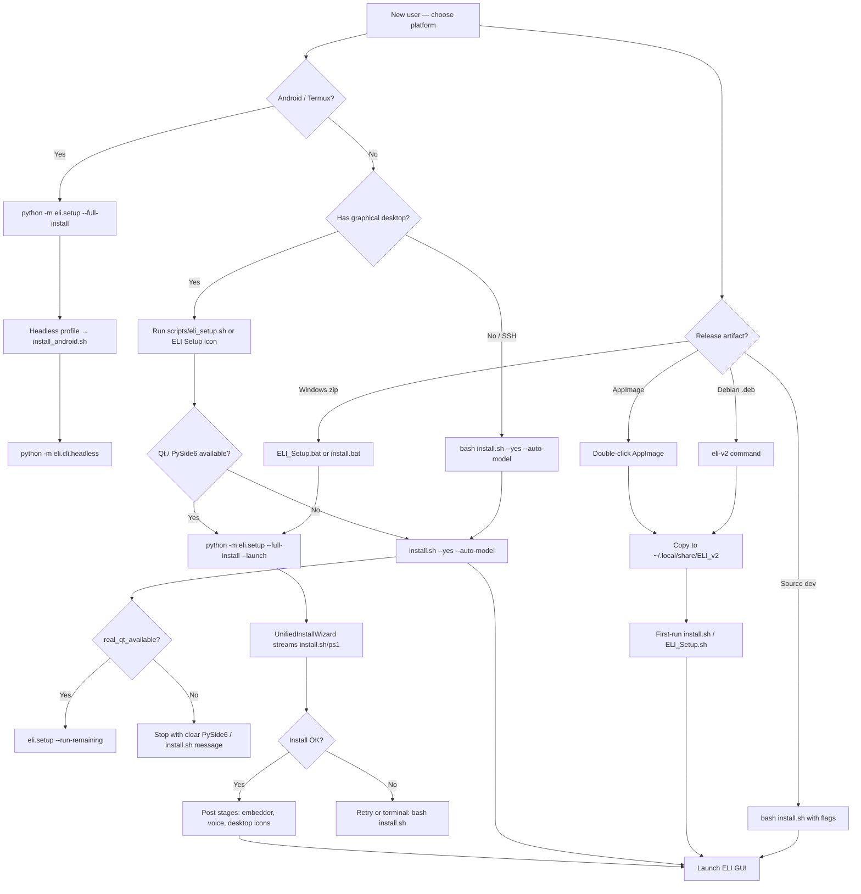

# ELI v2 Script & Setup Reference

**Version:** 2.4.12 (hardware fit profiles, GPU pack activation, portable install completeness)  
**Repository:** ELI_MKXI / ELI v2.0  
**Last updated:** 2026-09-11

This document is the authoritative reference for every bash/shell script in the ELI v2 repository, install-related Python entry points, packaging builders, and a structured map of the `eli/` Python package. It is written for maintainers, packagers, and advanced users performing first-time installation or field troubleshooting.

**Beginner-friendly guide:** see **[INSTALLATION_GUIDE.md](INSTALLATION_GUIDE.md)** in this folder first.

---

## 1. Executive Summary — First-Time Install Paths

ELI v2 is **local-first, offline-by-default**. A fresh install creates a project-local `.venv`, builds or installs `llama-cpp-python` matched to your hardware, seeds blank SQLite databases, and optionally downloads models and voice assets in a deliberate online window.

### Recommended paths (v2.4.12)

| Path | Platform | Entry | What happens |
|------|----------|-------|--------------|
| **ELI Setup (GUI)** | Linux, macOS, Windows | `./scripts/eli_setup.sh` or desktop **ELI Setup** icon | Creates minimal `.venv` + PySide6 only, then opens **Unified Install Wizard** (`python -m eli.setup --full-install`). Wizard streams `install.sh` / `install.ps1` with unified terminal+GUI progress — **no pre-GUI full install**, **no double launch**. Exit code reflects success (`0` only when install succeeded). |
| **Unified GUI installer (direct)** | Any with display | `.venv/bin/python -m eli.setup --full-install --launch` | Same wizard without the shell wrapper. |
| **Terminal fallback** | Headless / no Qt | `./scripts/eli_setup.sh` (no display) or `bash install.sh` | Runs `install.sh --yes --auto-model` when `.venv` incomplete or PySide6 missing; then `--run-remaining` only if **real** Qt is available (`real_qt_available()`). |
| **Portable PySide6 failure** | Linux portable | `bash install.sh --yes --auto-model` | If `ELI_Setup.sh` prints `Please install PySide6`, skip the hollow `.venv` trap — run full `install.sh` directly (fixed v2.4.8). |
| **Windows one-click** | Windows | `ELI_Setup.bat` (in release zip) | Tries GUI installer; falls back to `install.ps1 -Yes -AutoModel`, then `--run-remaining --launch`. |
| **Grandparent / AppImage** | Linux x86_64 | `ELI_v2-*-x86_64.AppImage` | First double-click copies to `~/.local/share/ELI_v2`, auto-installs bundled GPU pack when hardware is detected (`ensure_gpu_pack_for_hardware`), runs unified setup once, then launches. |
| **Developer checkout** | Linux/macOS | `bash install.sh` | Full-featured installer with hardware report, interactive model choice, GPU/CUDA/ROCm/Vulkan paths. |
| **Android / Termux (headless)** | Android arm64 | `bash scripts/install_android.sh` or `python -m eli.setup --full-install` | Detected automatically as **headless-only profile** — CPU llama-cpp, `requirements-android.txt`, no PySide6/GUI/CUDA. Launch: `python -m eli.cli.headless`. |
| **Windows on ARM (WoA)** | Windows arm64 | `ELI_v2-*-windows-arm64-portable.zip` (experimental) | Same unified installer entry (`ELI_Setup.bat` / `python -m eli.setup --full-install`). CPU build default; Adreno Vulkan experimental; batch ≤ 32. |

### v2.4.12 highlights

- **Hardware fit profiles** (`eli.core.hardware_profile`): Balanced / Max GPU / Max context; `unified_fit_config()` joint VRAM+RAM planner; startup RAM slider re-fits discrete GPUs; persisted as `fit_priority`.
- **GPU pack activation** (`eli_gpu_pack.activate_gpu_pack_runtime`): Vulkan/CUDA pack loads in the live process after install (fixes Iris Xe AppImage stuck CPU-only); startup panel imports frozen `eli_gpu_pack`.
- **Portable install completeness** (`eli.setup.unified_installer`, `scripts/eli_setup.sh`): core install requires `llama_cpp` + `requests`, not just `import eli`.
- **Session memory** (`eli.runtime.profile_extractor`, `eli.kernel.engine`): LLM session summaries at engagement depth ≥ 0.25 with rolling checkpoints.

### v2.4.8 highlights

- **Portable setup fix** (`eli.gui.qt_compat.real_qt_available`, `scripts/eli_setup.sh`): headless Qt stubs no longer fool the installer into skipping `install.sh`; terminal fallback runs full install when PySide6 is missing; wheelhouse builds include cp310–cp313 PySide6 wheels.
- **Shell env fix** (`scripts/fix_eli_shell_env.sh`): clears stale `alias eli=` / `ELI_PROJECT_ROOT` when multiple checkouts coexist; wired from `install.sh` post-install.
- **Installation docs** (`first time Installation/INSTALLATION_GUIDE.md`): complete beginner guide to every install script and priority order.

### v2.4.7 highlights

- **AppImage size cap:** GPU packs removed from AppImage (GitHub 2 GiB limit); **portable tarball still bundles** offline `gpu-packs/` (~300 MB larger compressed vs pre-2.4.7).

### v2.4.6 highlights

- **GPU pack auto-install** (`packaging/pyinstaller/eli_gpu_pack.py`): AppImage/portable detects NVIDIA/AMD/Intel and installs verified llama-cpp wheels from bundled assets (network fallback when not bundled).
- **CPU/RAM fit parity** (`eli.core.hardware_profile`): `effective_use_gpu_layers()` returns false when `llama_supports_gpu_offload()` is unavailable or `compute_mode=cpu`; `cpu_ram_fit_config()` sizes ctx/batch from live RAM using the same `smart_fit_config` math as GPU hosts.
- **Startup compute mode** (`eli.gui.panels.startup`): user picks auto / GPU / CPU; persisted in `runtime_settings.compute_mode`.
- **Unified installer UX** (`eli.setup.unified_installer`): `run_unified_installer()` returns `0 if dlg._install_succeeded else 1`; `scripts/eli_setup.sh` GUI-first with minimal venv bootstrap only.
- **Prefill abort on shutdown** (`eli.cognition.gguf_inference`): `llama_set_abort_callback` stops long CPU/GPU prefill immediately, not just between output tokens.

### v2.3.97 highlights

- **Platform matrix** (§1.1): single reference for GPU detection, installer path, release artifact, and known limits per OS.
- **Android headless profile** (`eli.setup.platform_profile`): unified installer routes Termux to `scripts/install_android.sh` with terminal progress UI.
- **WoA arm64 release scoping** (`build_packages.sh`): `windows-arm64-lean`, `windows-arm64`, `wheelhouse-arm64` targets for Snapdragon laptops.

### v2.3.96 highlights

- **Unified GUI installer** (`eli.setup.unified_installer`): single dialog for install backend + post-install asset stages + launch; parses `[ELI-PROGRESS]` markers from shell installers.
- **Integrated GPU layer display**: startup hardware optimizer and GUI model loader show **honest GPU layer counts** based on free VRAM (not total), with force-override env vars documented in §9. Installer copy explicitly states: *"Your GPU layer count will reflect reality this time."*
- **Cross-platform install backend** (`eli.setup.install_backend`): streams `install.sh` (Unix) or `install.ps1` (Windows) into Qt progress signals.

After install, daily use:

- **Desktop GUI:** `./scripts/eli_launch.sh` or `./eli.sh`
- **Web/phone server:** `./scripts/eli_launch.sh serve --lan --https`
- **Terminal command:** `eli` (after `scripts/install_eli_command.sh`)
- **Android headless:** `.venv/bin/python -m eli.cli.headless`

---

## 1.1 Platform Support Matrix

Authoritative map of what ELI v2 supports today on each host class. Use this when triaging field reports (“0 GPU layers”, “install aborted”, “wrong installer”).

| Platform | CPU arch | Install profile | Entry command | GPU / inference | Layer display | Release artifact |
|----------|----------|-----------------|---------------|-----------------|---------------|------------------|
| **Linux desktop** | x86_64, arm64 | `desktop` | `scripts/eli_setup.sh` → unified GUI | NVIDIA CUDA, AMD ROCm/Vulkan, Intel iGPU Vulkan, Qualcomm Adreno Vulkan (Linux ARM) | Shared-memory fit for iGPU/APU/Adreno | `ELI_v2-*-x86_64.AppImage`, `.deb`, portable tar |
| **macOS Apple Silicon** | arm64 | `desktop` | `bash install.sh` (Metal auto) | Apple Metal / unified memory | “Apple unified memory” label | `ELI_v2-*-macos-arm64.dmg` |
| **macOS Intel** | x86_64 | `desktop` | `bash install.sh` | CPU; discrete AMD/NVIDIA partial via `_macos_gpus()` | Discrete VRAM when reported | Build on Mac host (`build_packages.sh macos`) |
| **Windows x64** | x86_64 | `desktop` | `ELI_Setup.bat` / `install.ps1` | CUDA when NVIDIA + wheel available; AMD/Intel → CPU or manual Vulkan build | Registry/CIM GPU names | `ELI_v2-*-windows-portable.zip`, `-Setup.exe` |
| **Windows on ARM (WoA)** | arm64 | `windows_woa` | Same as Windows; lean arm64 zip | **No CUDA wheels** on arm64; Qualcomm Adreno unified memory; Vulkan experimental | “Snapdragon Adreno” + batch ≤ 32 | `ELI_v2-*-windows-arm64-portable.zip` (**experimental**, `build_packages.sh windows-arm64-lean`) |
| **Qualcomm Snapdragon laptop** | arm64 | `windows_woa` or Linux ARM | Per OS row above | Adreno via Vulkan (llama.cpp); **not** Hexagon NPU/QNN | Shared RAM budget, integrated flag | WoA zip or Linux source install |
| **Intel Iris Xe / UHD** | x86_64 | `desktop` | `install.sh` | Vulkan offload optional; CPU reliable | “Intel Iris Xe” / fit count, not 0 | Any desktop release |
| **AMD APU** | x86_64 | `desktop` | `install.sh` | ROCm if `/dev/kfd`, else Vulkan via amdgpu | “AMD APU” shared-memory fit | Any desktop release |
| **Android / Termux** | arm64 | `android` (headless) | `python -m eli.setup --full-install` or `scripts/install_android.sh` | **CPU only** — source-build llama-cpp | N/A (no GPU layers) | No store bundle; clone + Termux script |
| **Raspberry Pi / SBC** | arm64 | `desktop` (CPU) | `bash install.sh --cpu-only` | CPU only unless vendor adds detection | CPU-only | No dedicated Pi artifact |
| **Hexagon NPU / QNN** | any | — | — | **Not supported** in ELI GGUF stack | — | Requires separate Qualcomm SDK path |

### Profile routing (`eli.setup.platform_profile`)

| `InstallProfile` | Detected when | Installer script | GUI wizard | Post-install launch |
|------------------|---------------|------------------|------------|---------------------|
| `desktop` | Default Linux/macOS/Windows x64 | `install.sh` / `install.ps1` | Yes (Qt) | `python -m eli` |
| `android` | Termux / `platform_compat.is_android()` | `scripts/install_android.sh` | Terminal progress only | `python -m eli.cli.headless` |
| `windows_woa` | `win32` + `platform.machine()` arm64 | `install.ps1` | Yes (Qt) when display available | `python -m eli` |

Detection module: `eli/setup/platform_profile.py`. Backend command resolution: `eli/setup/install_backend.py` → `install_script_for_profile()`.

### WoA / arm64 release build targets

```bash
bash build_packages.sh windows-arm64-lean      # source + wheel, online pip (recommended)
bash build_packages.sh wheelhouse-arm64        # prefetch win_arm64 wheels (gaps logged)
bash build_packages.sh windows-arm64           # full offline zip (experimental)
```

**CI note:** v2.3.97 scopes artifacts locally; add a `windows-2022-arm64` job to `.github/workflows/release.yml` to publish WoA zips on tag push.

### Explicitly out of scope (today)

- Qualcomm **Hexagon NPU** via QNN/QAIRT (not llama.cpp GGUF)
- Google TPU, Apple Neural Engine, Intel NPU as inference backends
- Full **PySide6 desktop GUI** on Android (headless by design)
- Prebuilt **CUDA** on Windows arm64 or Android

---

## 2. Installation Decision Tree



**Flag quick reference for `install.sh`:**

| Flag | Effect |
|------|--------|
| `--yes` / `-y` | Non-interactive; auto model via VRAM |
| `--cpu-only` | CPU PyTorch + CPU llama-cpp |
| `--gpu` | Force GPU build path |
| `--skip-torch` | Skip PyTorch |
| `--latest` | Use `requirements.txt` ranges instead of frozen lock |
| `--install-cuda` / `--cuda` | Best-effort CUDA toolkit + rebuild llama-cpp |
| `--auto-model` / `--auto` | Download VRAM-sized chat model |
| `--choose-model` / `--choose` | Interactive multi-select model menu |
| `--model=KEY` | Download specific catalog key |
| `--no-model` | Skip all downloads (including embedder gate — use only for fully offline) |

---

## 3. Root-Level Shell Scripts


### `install.sh`

| | |
|---|---|
| **Path** | `/install.sh` |
| **When to use** | Primary Linux/macOS installer from a source checkout or portable tree. |
| **Requires** | Python 3.10+, bash, network for deps (models optional). |

**Step-by-step:**

1. Parse CLI flags (`--cpu-only`, `--gpu`, `--skip-torch`, `--latest`, `--install-cuda`, `--yes`, model flags).
2. Export canonical paths: `ELI_PROJECT_ROOT`, `ELI_DATA_DIR`, `ELI_CONFIG_DIR`, `ELI_MODELS_DIR`, `ELI_CACHE_DIR`, `PYTHONPATH`.
3. Print **system report**: Python version, CPU/RAM/disk, NVIDIA/AMD/Intel GPU detection.
4. Confirm plan (unless `--yes` or non-TTY); optional model menu.
5. Create or rebuild `.venv` if broken/copied from another machine.
6. Upgrade pip; install PyTorch (CPU/CUDA/ROCm/Metal per hardware).
7. Install **llama-cpp-python** ≥0.3.30 with GPU-appropriate `CMAKE_ARGS`; CPU-safe rebuild on SIGILL; smoke-test `llama_backend_init()`.
8. Verify GPU offload when not CPU-only.
9. `pip install -e ".[full]"` (editable) or bundled wheel fallback.
10. Install from `requirements.lock.txt` (or macOS/Android variants); fallback to ranges on pin failure.
11. Seed `config/settings.json` from template; mkdir `models/`; copy desktop icon.
12. Install runtime OS tools (mpv, tesseract, ffmpeg, etc.) best-effort.
13. Seed blank DB templates; run `python -m eli.core.init_data`.
14. Regenerate capability manifest.
15. Verify `import eli` and GUI entry.
16. Optional model download (`eli.core.model_download`); required embedder (`--aux`); voice assets (`eli.runtime.voice_assets`).
17. On Linux: run `scripts/install_desktop_apps.sh`.

**Environment variables:** See §9 (`ELI_PROJECT_ROOT`, `ELI_DATA_DIR`, `ELI_CONFIG_DIR`, `ELI_MODELS_DIR`, `ELI_CACHE_DIR`, `PYTHON`, `CUDACXX`, `CMAKE_ARGS`, `LLAMA_MIN`).

**Exit codes:** `0` success (may include warnings); `1` missing Python; `0` user abort at confirm prompt.

**Progress protocol:** Emits `[ELI-PROGRESS] phase=<name> pct=<0-100> msg=<text>` for GUI installer.

**Related:** `install.ps1`, `eli/setup/install_backend.py`, `scripts/eli_setup.sh`, `scripts/install_desktop_apps.sh`.

---

### `install.ps1`

| | |
|---|---|
| **Path** | `/install.ps1` |
| **When to use** | Windows installer; invoked by `install.bat` and GUI fallback. |
| **Requires** | Python 3.10+, PowerShell. |

**Step-by-step:** Mirrors `install.sh` for Windows: system report (including non-NVIDIA GPU detection), venv creation, PyTorch CUDA/CPU wheels, llama-cpp-python, editable ELI install, requirements lock, config seed, init_data, model/voice fetch, progress markers.

**Parameters:** `-CpuOnly`, `-Gpu`, `-Latest`, `-InstallCuda`, `-Yes`, `-AutoModel`, `-NoModel`, `-Model`, `-CudaVersion`.

**Exit codes:** `1` if Python missing; otherwise follows pip/subprocess results.

**Related:** `install.bat`, `ELI_Setup.bat`, `eli/setup/install_backend.py`.

---

### `install.bat`

| | |
|---|---|
| **Path** | `/install.bat` |
| **When to use** | Windows double-click entry; parses `/cpu`, `/cuda`, `/latest` and delegates to `install.ps1`. |
| **Exit codes:** Passes through PowerShell exit code. Respects `ELI_INSTALLER_UNATTENDED=1` to skip pause. |

---

### `eli.sh`

| | |
|---|---|
| **Path** | `/eli.sh` |
| **When to use** | Quick Linux launcher after install. |
| **What it does:** Sets ELI path env vars; exec `.venv/bin/python -m eli "$@"`. |
| **Exit codes:** `1` if `.venv` missing; otherwise ELI main exit code. |

---

### `build_packages.sh`

| | |
|---|---|
| **Path** | `/build_packages.sh` |
| **When to use** | Maintainer release builds. |
| **Usage:** `bash build_packages.sh [wheel|wheelhouse|deb|appimage|macos|windows|windows-lean]` |

**Step-by-step:**

1. Resolve version from `pyproject.toml`; prefer `.venv/bin/python`.
2. Pre-flight: compile all `.py` (git ls-files or find); optional full pytest (`SKIP_TESTS=1` to skip).
3. For each target: invoke sub-builders under `packaging/` or stage Windows zips.
4. Write `dist/SHA256SUMS.txt` and `dist/RELEASE_NOTES.md`.

**Environment:** `SKIP_TESTS`, `SKIP_COMPILE`, `WHEELHOUSE_PLATFORM`, `WHEELHOUSE_PYTHON_VERSIONS`.

**Related:** All `packaging/*/build-*.sh`, `scripts/package_desktop_app.sh`.

---

### `eli_diagnose.sh`

| | |
|---|---|
| **Path** | `/eli_diagnose.sh` |
| **When to use** | Lightweight dev diagnostic (router stages, CapabilitySync introspection). |
| **What it does:** Writes temp Python script; runs static analysis on `router_enhanced.py` and imports `CapabilitySync`. **Read-only — no modifications.** |
| **Exit codes:** Implicit 0 (no `set -e` on python failure). |

---

### `eli_diag.sh`

| | |
|---|---|
| **Path** | `/eli_diag.sh` |
| **When to use** | Full wiring audit (weather plugin, shell routing, news, agents, FAISS paths, introspection, plugins, DB tables). |
| **What it does:** Greps key source files; runs embedded Python for DB audit. **Read-only.** |
| **Note:** DB paths hardcoded to `~/Desktop/ELI_v2.0` in one section — adjust for your install root. |

---

### `run_tests.sh`

| | |
|---|---|
| **Path** | `/run_tests.sh` |
| **When to use** | Developer test runner. |
| **Modes:** `full` (default), `claims`, `imports`, `fast`, `html`. |
| **What it does:** Installs `requirements-test.txt`; runs pytest with JUnit/HTML reports under `test_reports/`. |
| **Exit codes:** pytest exit (html/full use `|| true` for non-zero). |

---

### `test_eli_wiring.sh`

| | |
|---|---|
| **Path** | `/test_eli_wiring.sh` |
| **When to use** | Quick CI/local wiring smoke test from repo root. |
| **What it does:** Checks critical dirs; imports core modules; tests `route()` samples; executor smoke (TIME, DATE, LIST_CAPABILITIES); verifies grounding gate, script guard, world model, proactive daemon. |
| **Exit codes:** `1` on any failure; `0` all passed. |

---

## 4. `scripts/` Directory

All shell scripts under `scripts/` (28 files). Paths relative to repository root.


### `scripts/eli_setup.sh` — **Primary first-time setup (v2.3.96)**

| | |
|---|---|
| **When to use** | **Recommended entry for new users** on Linux/macOS with a display. |
| **Flow** | 1) If DISPLAY/WAYLAND: try `python -m eli.setup --full-install --launch` (may pip install PySide6 user-wide). 2) Else: run `install.sh --yes --auto-model`, then `eli.setup --run-remaining --launch`. |
| **Exit codes** | `0` GUI success; `1` Python/venv failure. |

---

### `scripts/eli_launch.sh` — Unified runtime launcher

| Mode | Command | Action |
|------|---------|--------|
| GUI (default) | `./scripts/eli_launch.sh` | Desktop app via `python -m eli` |
| Server | `... serve [--lan] [--https]` | Delegates to `eli_serve.sh` |
| Both | `... both` | Server background + GUI |

**Exit codes:** `1` missing venv; `2` unknown mode.

---

### `scripts/eli_serve.sh` — API / web-app server

Binds FastAPI server (`python -m api.server`). Default `127.0.0.1`; `--lan` → `0.0.0.0` + token; `--https` for phone mic. Auto-fetches voice assets if missing. Sets `ELI_API_HOST`, `ELI_API_PORT`, `ELI_API_TOKEN`, `ELI_API_HTTPS`.

---

### `scripts/eli_startup.sh` — Smart startup pipeline

Install-if-needed (`--setup`), optional GitHub asset restore, llama-cpp SIGILL repair via `install.sh`, optional trace/safe-mode, tee logs to `artifacts/startup/logs/`. Default auto-setup when `.venv` missing.

**Flags:** `--setup`, `--no-setup`, `--with-github-assets`, `--repo`, `--tag`, `--trace`, `--safe-mode`, `--no-log`.

**Exit code `132`:** llama-cpp still broken after repair.

---

### `scripts/eli_one_click_setup.sh` — Full setup + integration

Runs `install.sh`, optional GitHub asset restore, desktop launcher, `install_eli_command.sh`. Options: `--cpu-only`, `--skip-torch`, `--with-github-assets`, `--no-desktop`, `--no-command`.

---

### `scripts/eli_one_click_run.sh`

Thin wrapper → `scripts/eli_startup.sh`.

---

### `scripts/install_eli.sh`

Legacy minimal venv installer (requirements.txt + `bin/elix` symlink). Superseded by `install.sh` for v2; kept for compatibility.

---

### `scripts/safe_install_linux.sh` — Hardened security-focused install

Fresh venv (deletes existing), backs up secrets, runs `install.sh --yes --no-model`, rotates API token and HMAC key, hardens `settings.json` (network off, full_control off, etc.), writes `config/safe_install.env`, runs security pytest subset.

**Flags:** `--skip-deps`, `--gpu`, `--cpu-only`.

---

### `scripts/install_desktop_apps.sh`

Installs **ELI Setup**, **ELI v2.0**, **ELI Server**, **ELI Uninstall** desktop entries (Linux), `.command` launchers (macOS), or hints for Windows PS1. Creates `~/.local/bin/eli-run` guard wrapper with zenity error dialogs.

---

### `scripts/install_eli_command.sh`

Installs `~/.local/bin/eli` (or custom) wrapper → `eli.sh` (clears stale `ELI_*` env first). Options: `--name`, `--bin-dir`, `--force`.

---

### `scripts/fix_eli_shell_env.sh`

Fixes stale bash `alias eli=` and exported `ELI_PROJECT_ROOT` from another checkout; installs `eli` + `eli2` commands; patches `~/.bashrc`, `~/.bash_aliases`, `~/.profile`. Run after install when v2/v3 or multiple folders coexist. Wired from `install.sh` post-install prompt.

---

### `scripts/eli_uninstall.sh`

Stops processes from this install; removes desktop entries, `eli` command, theme icons; optional `--purge` deletes entire install folder.

---

### `scripts/eli_term.sh`

Opens a command in a detected terminal emulator (GNOME/KDE/XFCE/…); holds window open. Fallback: run headless.

---

### `scripts/package_desktop_app.sh`

Builds `dist/app_packages/ELI_v2-<ver>-linux-portable.tar.gz` via git archive; embeds `INSTALL_ELI.sh`, `RUN_ELI.sh`, `ELI_Setup.sh`. Options: `--with-assets`, `--skip-wheel`.

---

### `scripts/build_v2_release.sh`

Wrapper: `SKIP_TESTS=1 package_desktop_app.sh`.

---

### `scripts/build_grandma_release.sh`

Portable tar + AppImage + publish instructions.

---

### `scripts/sync_build.sh`

Rsync `eli/`, `api/`, `config/` into existing portable staging tree. `--dry-run` supported.

---

### `scripts/package_eli_release.sh`

Build wheel/sdist via `python -m build`.

---

### `scripts/install_android.sh`

Termux headless install: pkg deps, CPU llama-cpp source build, `requirements-android.txt`, no GUI/CUDA.

Also invoked automatically when `eli.setup.platform_profile` detects Android (`python -m eli.setup --full-install`). Emits `[ELI-PROGRESS]` markers for the unified installer's terminal UI.

---

### `scripts/purge_legacy_eli.sh`

**Requires root.** Removes old system ELI (`/opt/eli`, `/etc/eli`, apt package). `--yes`, `--dry-run`.

---

### `scripts/restore_github_assets.sh`

Download and reassemble split release archives for models/voice. Requires `gh auth login`. Options: `--repo`, `--tag`, `--from-dir`, `--keep-archives`.

---

### `scripts/create_github_asset_archives.sh`

Build split tar chunks under `dist/github_assets/upload/` for GitHub release upload.

---

### `scripts/upload_github_assets.sh`

Upload asset chunks to GitHub Release via `gh`.

---

### `scripts/run_eli_repo_venv.sh`

Activate `.venv`, source optional `.env.eli_v2_0`, unset stale model env vars, launch `python -m eli.gui.app --setup`.

---

### `scripts/coverage_full.sh`

Four-lane combined coverage report → `artifacts/coverage_report.txt` + HTML.

---

### `scripts/eli_bt_reset.sh`

**Requires root.** Reset stuck USB Bluetooth adapter (btusb reload).

---

### `scripts/generate_blueprint_pdfs.sh`

Rebuild shipped blueprint PDFs from markdown (pandoc + xelatex). Optional single-stem arg.

---

### `scripts/generate_all_blueprint_pdfs.sh`

Rebuild all `blueprints/*.pdf` from sources; delegates to `generate_blueprint_pdfs.sh` for composite manuals.

---

### `scripts/generate_new_user_guide_pdf.sh`

Rebuild `blueprints/new_user_install_guide.pdf` only.

---

## 5. Packaging Builders


### `packaging/linux/build-appimage.sh`

| | |
|---|---|
| **When to use** | Grandma-friendly AppImage from portable tarball (requires host Python 3.10+). |
| **Usage** | `bash packaging/linux/build-appimage.sh [version]` |
| **Steps** | Build/find portable tar → stage AppDir → write `AppRun` (first launch → `~/.local/share/ELI_v2`, run ELI_Setup) → appimagetool → SHA256. |
| **Env** | `ELI_INSTALL_ROOT`, `ELI_APPIMAGE_FORCE_SYNC`, `SKIP_TESTS`. |
| **Fallback** | If appimagetool missing, downloads from GitHub releases. |

---

### `packaging/linux/build-appimage-pyinstaller.sh`

Frozen **PyInstaller** one-dir bundle → AppImage. **No host Python required.** Prerequisite: `pyinstaller --noconfirm ELI.spec` → `dist/ELI/`. Ships LICENSE in AppDir; mutable state → `~/.local/share/ELI_v2`.

---

### `packaging/debian/build-deb.sh`

Lean `.deb` (~6 MB): git archive to `/opt/eli-v2`, `/usr/bin/eli-v2` first-launch installer to `~/.local/share/ELI_v2`. Requires `dpkg-deb`.

---

### `packaging/macos/build-dmg.sh`

**macOS only.** Packages `dist/ELI.app` (PyInstaller) into drag-to-Applications `.dmg`; ad-hoc codesign; copies LICENSE/NOTICE.

---

### `packaging/windows/build-windows.ps1`

**Windows only.** Extracts lean portable zip; writes `ELI_Setup.bat`; invokes Inno Setup (`iscc.exe`) → `ELI_v2-<ver>-Setup.exe`.

---

## 6. Python Install / Setup Entry Points

### `python -m eli.setup` (`eli/setup/__main__.py`)

| Flag | Action |
|------|--------|
| `--full-install` | Unified GUI installer (install.sh backend + assets + optional launch) |
| `--wizard` | Graphical setup wizard (post-install stages) |
| `--run-remaining` | Complete incomplete setup stages |
| `--launch` | Launch ELI after wizard |
| `--status` | Print stage checklist and exit |

**Module map:**

| Module | Purpose |
|--------|---------|
| `unified_installer.py` | Qt dialog: streams shell install, shows phase progress, stage checklist, retry/launch |
| `install_backend.py` | Cross-platform subprocess driver; parses `[ELI-PROGRESS]` and line hints |
| `install_messages.py` | Rotating installer copy per phase (ELI voice) |
| `status.py` | Read-only checks: venv, chat model, embedder, voice, desktop launcher |
| `wizard.py` | Post-install wizard worker (model pick, hardware tuning) |

### `python -m eli` (`eli/__main__.py`)

Default → GUI (`eli.gui.app`). Flags: `--headless`, `--trust-agent`, `--license`. Calls `init_data.bootstrap_once()` on every start.

### `eli/gui/app.py`

Hardware-aware launcher: detects free VRAM via `eli.core.hardware_profile`, model discovery, GPU layer budgeting, spawns main Pro GUI. **v2.3.96:** integrated display of fitted GPU layers in startup/load probe output.

### `python -m eli.core.init_data`

Idempotent full database architecture (blank slate). Called from installers and boot.

### `python -m eli.core.model_download`

Install-time GGUF catalog downloader. `--list`, `--auto`, `--choose`, `--aux` (embedder), `--no-model` companion in shell scripts.

### `python -m eli.runtime.voice_assets`

Fetches faster-whisper + Piper voice weights; idempotent; netguard-gated.

### Windows companion flow

1. `ELI_Setup.bat` → `python -m eli.setup --full-install --launch`
2. Fallback → `install.ps1 -Yes -AutoModel`
3. Resume → `python -m eli.setup --run-remaining --launch`

---

## 7. Frozen / AppImage Entry Points

### `packaging/pyinstaller/eli_entry.py`

PyInstaller frozen entry. Modes:

| Mode | Behavior |
|------|----------|
| (default) | GUI via `eli.gui.app:main` |
| `--server` | `api.server:main` (ELI-Server.exe) |
| `--selftest` | Verify mutable paths outside read-only bundle |
| `--license` | Print PolyForm Internal Use terms |
| `-c` / `-m` | Python passthrough for self-spawned helpers |

Calls `multiprocessing.freeze_support()` first; clears `QT_STYLE_OVERRIDE`.

### `packaging/pyinstaller/eli_gpu_pack.py`

Post-install GPU acceleration for frozen builds. CPU llama-cpp ships in bundle; CUDA/Vulkan wheels download to `<ELI root>/runtime/gpu/llama_cpp` and shadow bundled copy on next launch.

**Invoke:** `ELI --install-gpu-pack [--vulkan] [--force]`

Backends: NVIDIA (abetlen CUDA wheel index), AMD/Intel (Vulkan from `gpu-packs` GitHub release), Apple Metal (built-in).

---

## 8. `eli/` Package Map

The `eli/` package contains **452 Python modules** across **26 subpackages** (excluding `__pycache__`). Each entry lists the module path and a one-line purpose extracted from module docstrings.

### Root-level (`eli/`)

- `__init__.py` — Module in the ELI v2 runtime.
- `__main__.py` — Console entry point. `python -m eli` and the `eli` script both call this.

### `brain/` (1 modules)

- `brain/agents/custom/__init__.py` — Module in the ELI v2 runtime.

### `cli/` (2 modules)

- `cli/__init__.py` — Module in the ELI v2 runtime.
- `cli/headless.py` — Headless terminal REPL for ELI v2.0.

### `coding/` (12 modules)

- `coding/__init__.py` — ELI coding agent — frontier-grade code generation, analysis & repair.
- `coding/agent.py` — CodeAgent — the orchestrator that composes ELI's coding capabilities.
- `coding/bug_memory.py` — Semantic bug classification + long-term memory of bugs and fixes.
- `coding/code_mode.py` — Code-mode — the model writes a small program against ELI's own capabilities.
- `coding/cost.py` — Cost estimation + the "should this run in the background?" decision.
- `coding/plan_graph.py` — Subtask DAG for the coding engine — structured decomposition with dependencies.
- `coding/planner.py` — Structured decomposition — planner / implementer separation.
- `coding/repo_context.py` — Repo-context retrieval for the coding agent (Advancement C).
- `coding/restricted_exec.py` — In-process restricted execution for code-mode.
- `coding/sandbox.py` — Bounded, isolated execution substrate for ELI's coding agent.
- `coding/search.py` — Tree/beam search over candidate solutions with UCB-style exploration.
- `coding/verification.py` — Explicit verification gating, candidate scoring, and test synthesis.

### `cognition/` (43 modules)

- `cognition/__init__.py` — Module in the ELI v2 runtime.
- `cognition/agent_bus.py` — eli/brain/agents/agent_bus.py
- `cognition/agent_spec.py` — A real specification for a custom agent — objective, prompt, triggers, measures.
- `cognition/agent_trust.py` — Trust for custom agent code — provenance, not just a hash in a dict.
- `cognition/belief.py` — Belief revision — what ELI holds, how strongly, and what it takes to change it.
- `cognition/chat_grounding_gate.py` — Fail-closed CHAT gate — skip LLM when user-fact grounding is required but absent.
- `cognition/chat_model.py` — eli.tools/chat_model.py (MKV)
- `cognition/context_builder.py` — eli.cognition.context_builder
- `cognition/context_synthesiser.py` — Module in the ELI v2 runtime.
- `cognition/correction_patterns.py` — Shared patterns for user correction / dispute turns.
- `cognition/emotion_palette.py` — Emotion / tone palette — the shared taxonomy ELI expresses through.
- `cognition/emotion_timeline.py` — Emotion timeline — the durable record of how the USER has been feeling.
- `cognition/engagement_tracker.py` — eli/cognition/engagement_tracker.py
- `cognition/expression_state.py` — Live avatar/expression state — the thin bridge that lets ELI's face react in
- `cognition/gguf_inference.py` — GGUF inference for ELI — model-agnostic.
- `cognition/grounded_status.py` — Module in the ELI v2 runtime.
- `cognition/hyde.py` — HyDE — Hypothetical Document Embeddings for ELI.
- `cognition/inference_broker.py` — Module in the ELI v2 runtime.
- `cognition/introspection_agent.py` — Compatibility helper for ELI path containers.
- `cognition/learning_coordinator.py` — Stage 12 coordinator — single entry for post-response learning and persistence hooks.
- `cognition/llm_intent.py` — Model-grounded intent resolver (local GGUF, model-agnostic).
- `cognition/model_load_diagnostics.py` — Say why a GGUF would not load — for ANY model, not a known list of them.
- `cognition/model_output_tokens.py` — Canonical special tokens, stop sequences, and persona drift patterns for all GGUF families.
- `cognition/orchestrator.py` — Module in the ELI v2 runtime.
- `cognition/output_governor.py` — Module in the ELI v2 runtime.
- `cognition/persona.py` — Canonical persona authority for ELI.
- `cognition/persona_hygiene.py` — brain.awareness.persona_hygiene
- `cognition/persona_status.py` — Module in the ELI v2 runtime.
- `cognition/persona_updater.py` — brain.awareness.persona_updater
- `cognition/persona_values.py` — Module in the ELI v2 runtime.
- `cognition/reasoning_modes.py` — Module in the ELI v2 runtime.
- `cognition/reranker.py` — Merge several ranked candidate lists by RANK, not by score.
- `cognition/response_governance.py` — Re-export shim — canonical home is eli.cognition.output_governor.
- `cognition/response_sanitizer.py` — Re-export shim — canonical home is eli.cognition.output_governor.
- `cognition/scoring.py` — Canonical scoring + confidence primitives for ELI.
- `cognition/stance_capture.py` — Notice when ELI has taken a position, so it survives the conversation.
- `cognition/stance_store.py` — Persistence for beliefs — ELI's own positions, and the record of revisions.
- `cognition/tone_adaptor.py` — Tone adaptor — decides the emotion ELI *expresses* and feeds every output channel.
- `cognition/tone_analyzer.py` — eli/cognition/tone_analyzer.py
- `cognition/turn_dossier.py` — Turn dossier — single assembly point for awareness, memory, and cognition context.
- `cognition/user_claim_validator.py` — Post-generation validation of user-attribution claims in CHAT output.
- `cognition/user_info_builder.py` — Module in the ELI v2 runtime.
- `cognition/working_memory.py` — eli/cognition/working_memory.py

### `contracts/` (3 modules)

- `contracts/__init__.py` — Module in the ELI v2 runtime.
- `contracts/grounded_control.py` — Grounded-control synthesis guard for ELI.
- `contracts/runtime_status.py` — Canonical runtime-status contract for ELI.

### `core/` (31 modules)

- `core/__init__.py` — Module in the ELI v2 runtime.
- `core/architecture_contracts.py` — Authoritative ownership map for the live ELI runtime.
- `core/cognition_tunables.py` — Central registry of user-tunable cognition / knowledge-gathering parameters.
- `core/compatibility.py` — Compatibility layer for older tests/import paths.
- `core/config.py` — Configuration manager for ELI - thin shim over runtime_settings.
- `core/crisis_guard.py` — Crisis / self-harm detection — STT-robust, punctuation- and grammar-agnostic.
- `core/dag.py` — Generic directed-acyclic-graph engine — shared scheduling primitive.
- `core/db_paths.py` — Database path resolution — delegates to core.paths.
- `core/dynamic_runtime_budget.py` — Module in the ELI v2 runtime.
- `core/first_run.py` — Module in the ELI v2 runtime.
- `core/first_run_wizard.py` — Module in the ELI v2 runtime.
- `core/full_control.py` — ELI Full Control — a single master override that lifts ELI's safety barriers.
- `core/grounding.py` — eli/core/grounding.py
- `core/hardware_profile.py` — eli.core.hardware_profile — auto-detect optimal runtime configuration.
- `core/init_data.py` — First-run data initialiser — build ELI's FULL database architecture up front.
- `core/legacy_paths.py` — Module in the ELI v2 runtime.
- `core/llama_cpu_compat.py` — CPU compatibility for llama-cpp-python — parity with GPU probe/fallback policy.
- `core/load_probe.py` — Verify a set of load parameters actually works, without dying if it doesn't.
- `core/memory_reset.py` — ELI memory / identity factory-reset — reusable core.
- `core/model_download.py` — Curated GGUF model download helper.
- `core/model_tier.py` — Model-capability tier — the single signal that lets ELI's cognition budgets
- `core/netguard.py` — Central network gating for ELI.
- `core/paths.py` — ELI Path Resolution — Single Source of Truth
- `core/portable_paths.py` — Resolve the ELI project root dynamically on any user's machine.
- `core/runtime_settings.py` — Module in the ELI v2 runtime.
- `core/secure_io.py` — Race-free writing of files that must never be world-readable.
- `core/self_provenance.py` — Is this row ELI's own bookkeeping, or evidence about the user?
- `core/sqlite_util.py` — Shared SQLite pragmas — WAL with a portable-safe fallback.
- `core/startup_hardware_optimizer.py` — Module in the ELI v2 runtime.
- `core/toml_util.py` — Load TOML on Python 3.10+ (tomli backport) and 3.11+ (stdlib tomllib).
- `core/worldclock.py` — Place-aware wall-clock answers.

### `execution/` (17 modules)

- `execution/__init__.py` — Module in the ELI v2 runtime.
- `execution/app_aliases.py` — Speech-damage layer for app names, on top of the cross-platform resolver.
- `execution/effectors/system_helpers.py` — Cross-platform system helpers shared by executor and effectors (v3).
- `execution/execution_intent_packets.py` — Module in the ELI v2 runtime.
- `execution/execution_planner.py` — Build the canonical typed execution plan for a routed turn.
- `execution/executor_enhanced.py` — Module in the ELI v2 runtime.
- `execution/executor_plugin_handlers.py` — Drop-in executor handlers for plugin management actions.
- `execution/media_runtime.py` — Media runtime control for ELI.
- `execution/operator_actions.py` — The user data dir on a packaged install; the source tree in dev.
- `execution/operator_policy.py` — Module in the ELI v2 runtime.
- `execution/portable_intent_contract.py` — Hard block document/code/analysis prompts from PLAY_MEDIA.
- `execution/route_authority.py` — Module in the ELI v2 runtime.
- `execution/route_contracts.py` — Static template vs dynamic/evolving understanding of the user.
- `execution/router_enhanced.py` — Prevent broad memory-runtime regexes from hijacking codebase audits.
- `execution/router_plugin_intents.py` — Plugin-related intent patterns for router_enhanced.py.
- `execution/shell_gate.py` — Centralised shell-command safety gate.
- `execution/tool_execution_authority.py` — Module in the ELI v2 runtime.

### `gui/` (27 modules)

- `gui/__init__.py` — Module in the ELI v2 runtime.
- `gui/app.py` — ELI Launcher — hardware-aware model selector with auto-tuned parameters.
- `gui/branding.py` — Shared ELI branding assets (window icon, Freedesktop theme, Windows .ico).
- `gui/code_editor.py` — Native code editor for the IDE — PySide6/PyQt, no QScintilla required.
- `gui/coding_tab.py` — ELI v2.0 — Coding tab.
- `gui/docks/__init__.py` — ELI v2.0 package marker.
- `gui/docks/operator_console_dock.py` — Governed operator console for proposals, goals, autonomy policy, event feed, scheduler attention, and ranked operator priority.
- `gui/docks/proactive_dock.py` — Proactive Dock GUI
- `gui/eli_pro_audio_gui_v2_0.py` — ELI v2.0 — desktop GUI.
- `gui/labs_tab.py` — ELI v2.0 — Labs Tab
- `gui/panels/__init__.py` — ELI v2.0 GUI panel components.
- `gui/panels/_qt.py` — Shared Qt import shim for eli.gui.panels modules.
- `gui/panels/agent_wizard.py` — ELI v2.0 — Agent edit dialog panel.
- `gui/panels/permission_dialog.py` — The consent dialog — the moment the operator actually decides.
- `gui/panels/settings.py` — ELI v2.0 — Advanced Settings dialog panel.
- `gui/panels/startup.py` — ELI v2.0 — Startup panel components.
- `gui/qt_compat.py` — Qt binding compatibility shim.
- `gui/tabs/__init__.py` — Module in the ELI v2 runtime.
- `gui/tabs/eli_world_tab.py` — Module in the ELI v2 runtime.
- `gui/tabs/experimental_tab.py` — Safe GUI surface for repo-root experimental prototypes.
- `gui/tabs/marketplace_tab.py` — Settings ▸ Plugins ▸ Marketplace — browse, scan, install, and revoke.
- `gui/tabs/tasks_tab.py` — ELI v2.0 — Tasks tab.
- `gui/tabs/training_tab.py` — ELI v2.0 — Labs ▸ Training. The GUI half of the LoRA pipeline.
- `gui/widgets/__init__.py` — ELI v2.0 package marker.
- `gui/widgets/eli_face.py` — ELI's animated face — a procedural 2D face that shows the tone_adaptor's emotion.
- `gui/widgets/ollama_model_selector.py` — Ollama model selector widget for ELI GUI.
- `gui/widgets/voice_downloader.py` — Voice library browser — acquire additional Piper voices, accents and tones.

### `integrations/` (18 modules)

- `integrations/__init__.py` — Module in the ELI v2 runtime.
- `integrations/local_gguf/__init__.py` — ELI v2.0 package marker.
- `integrations/local_gguf/config.py` — Module in the ELI v2 runtime.
- `integrations/local_gguf/inference.py` — Compatibility shim: canonical GGUF inference lives in eli.cognition.gguf_inference.
- `integrations/local_gguf/paths.py` — Module in the ELI v2 runtime.
- `integrations/mcp/__init__.py` — Model Context Protocol integration.
- `integrations/mcp/client.py` — MCP client — ELI as a host that gains tools from configured MCP servers.
- `integrations/mcp/server.py` — MCP server — ELI's own capabilities exposed to any MCP client.
- `integrations/media/__init__.py` — Cross-platform media integrations (Spotify, mpv IPC, YouTube, capabilities).
- `integrations/media/capabilities.py` — Runtime media capability probe — what works on THIS machine/OS.
- `integrations/media/cross_platform.py` — Cross-platform Spotify control and mpv IPC.
- `integrations/media/media_deps.py` — Discover media CLI tools — bundled install root, then system PATH.
- `integrations/media/spotify_intent.py` — Parse user phrasing into Spotify playback intents (no Web API).
- `integrations/media/youtube_playback.py` — Shared YouTube playback helpers — mpv, yt-dlp clients, browser URLs.
- `integrations/mpris/__init__.py` — ELI v2.0 package marker.
- `integrations/mpris/playerctl_backend.py` — MPRIS2 / playerctl media control backend for ELI.
- `integrations/ollama/__init__.py` — ELI v2.0 package marker.
- `integrations/ollama/client.py` — Ollama client for ELI.

### `kernel/` (9 modules)

- `kernel/__init__.py` — Module in the ELI v2 runtime.
- `kernel/engine.py` — Cognitive Engine – grounded multi-phase controller for ELI.
- `kernel/pipeline.py` — Return file path and optional line number for a function/module.
- `kernel/pipeline_trace.py` — Canonical 12-stage pipeline trace — single numbering for blueprint, orchestrator, and engine.
- `kernel/scheduler.py` — v2.0 kernel-local scheduler compatibility layer.
- `kernel/self_upgrade.py` — ELI Self-Upgrade Orchestrator
- `kernel/state.py` — Module in the ELI v2 runtime.
- `kernel/task_bus.py` — eli/kernel/task_bus.py
- `kernel/world_model.py` — Module in the ELI v2 runtime.

### `learning/` (14 modules)

- `learning/__init__.py` — Module in the ELI v2 runtime.
- `learning/base_model_resolver.py` — Module in the ELI v2 runtime.
- `learning/bootstrap_phi3_base.py` — Module in the ELI v2 runtime.
- `learning/dataset_builder.py` — ELI learning dataset builder.
- `learning/dataset_filters.py` — Module in the ELI v2 runtime.
- `learning/export_trainable_dataset.py` — Module in the ELI v2 runtime.
- `learning/lora_eval.py` — Module in the ELI v2 runtime.
- `learning/lora_pipeline.py` — LoRA training pipeline — the DAG that chains the standalone learning stages.
- `learning/lora_trainer.py` — Module in the ELI v2 runtime.
- `learning/lora_trainer_guard.py` — Module in the ELI v2 runtime.
- `learning/merge_reviewed_datasets.py` — Module in the ELI v2 runtime.
- `learning/review_queue.py` — The human review gate that had no way to be passed.
- `learning/target_registry.py` — User-declared LoRA training targets — the registry that replaces the Phi-3 lock.
- `learning/training_preflight.py` — Module in the ELI v2 runtime.

### `memory/` (15 modules)

- `memory/__init__.py` — Lazy-load memory_adapter exports to avoid circular import at package init.
- `memory/habits_memory_db.py` — Module in the ELI v2 runtime.
- `memory/habits_memory_service.py` — eli/memory/habits_memory_service.py
- `memory/knowledge_graph.py` — Module in the ELI v2 runtime.
- `memory/memory.py` — Module in the ELI v2 runtime.
- `memory/memory_adapter.py` — Module in the ELI v2 runtime.
- `memory/memory_service.py` — Memory service — provides session functions backed by persistent SQLite memory.
- `memory/memory_truth.py` — Module in the ELI v2 runtime.
- `memory/populate_memories.py` — Populate memories from existing conversations.
- `memory/retrieval.py` — Shared turn retrieval — single owner for semantic + conversation recall.
- `memory/sqlite_memory.py` — Compatibility wrapper: some old code imports SQLiteMemory from here.
- `memory/stores.py` — Module in the ELI v2 runtime.
- `memory/system_index.py` — System Inventory – Auto‑discovers applications, executables, and directories.
- `memory/unified_retrieval.py` — Unified memory retrieval for orchestrator and agent bus.
- `memory/vector_store.py` — Module in the ELI v2 runtime.

### `onboarding/` (2 modules)

- `onboarding/__init__.py` — Light, skippable first-run onboarding — seeds the continuous User Model.
- `onboarding/interview.py` — Light, skippable first-run onboarding interview.

### `perception/` (27 modules)

- `perception/__init__.py` — Module in the ELI v2 runtime.
- `perception/ambient_vision.py` — ELI ambient vision — optional periodic screen glances for rolling awareness.
- `perception/analyze_csv.py` — Module in the ELI v2 runtime.
- `perception/analyze_image.py` — ELI image analysis helper.
- `perception/analyze_mesh.py` — ELI mesh analysis helper.
- `perception/analyze_pdfs.py` — eli_tools.analyze_pdfs
- `perception/audio_stt.py` — ELI Audio STT — safer, dependency-aware version.
- `perception/desktop_capabilities.py` — Cross-OS desktop control capability probe — one place for per-platform truth.
- `perception/eli_listen.py` — Module in the ELI v2 runtime.
- `perception/extract_equations.py` — Module in the ELI v2 runtime.
- `perception/gaze_engine.py` — eli/perception/gaze_engine.py
- `perception/local_whisper_stt.py` — Module in the ELI v2 runtime.
- `perception/log_rotation.py` — Conversation log rotation for ELI.
- `perception/mic_resolver.py` — ELI microphone resolver — pick a capture device that actually delivers audio,
- `perception/os_controller.py` — Cross-platform OS controller for ELI.
- `perception/screen_analysis.py` — Local screen analysis — depth modes, memory recall, research context.
- `perception/screen_locator.py` — Screenshot-to-element locator for ELI.
- `perception/tts_router.py` — tts_router.py — TTS router for ELI.
- `perception/tts_xtts.py` — Voice cloning backend (Coqui XTTS-v2).
- `perception/ui_ground.py` — Optional UI grounding backends — 100% local by default.
- `perception/ui_tree.py` — Accessibility-tree UI targeting (Linux / AT-SPI).
- `perception/vision.py` — ELI local vision — true image understanding via a local GGUF vision-language
- `perception/voice_fx.py` — Character-voice effects layer.
- `perception/voice_profile.py` — Voice profile + prosody — the foundation for tone/emotion detection.
- `perception/voice_worker.py` — Module in the ELI v2 runtime.
- `perception/voice_worker_streaming.py` — Stream-aware voice worker for ELI.
- `perception/wakeword.py` — Self-trained, fully-local wake-word detector (openWakeWord features + a custom head).

### `planning/` (24 modules)

- `planning/__init__.py` — Module in the ELI v2 runtime.
- `planning/agent_loop.py` — Standalone REPL helper for manual agent stepping (dev/diagnostics).
- `planning/attention_queue.py` — The user data dir on a packaged install; the source tree in dev.
- `planning/autonomy_controller.py` — Module in the ELI v2 runtime.
- `planning/autonomy_scheduler.py` — Module in the ELI v2 runtime.
- `planning/goal_autogenesis.py` — eli.planning.goal_autogenesis
- `planning/goal_models.py` — Module in the ELI v2 runtime.
- `planning/goal_store.py` — Module in the ELI v2 runtime.
- `planning/goal_tick.py` — Module in the ELI v2 runtime.
- `planning/habits.py` — Habit learning – monitors user actions, detects patterns, and manages automation rules.
- `planning/habits_scheduler.py` — Habit scheduler – runs in background and executes habit rules at the correct times.
- `planning/habits_state.py` — State management helpers for this ELI subsystem.
- `planning/insight_synthesis.py` — Cached, background-synthesised reflection insight.
- `planning/jobq.py` — Compatibility shim:
- `planning/jobqueue.py` — Module in the ELI v2 runtime.
- `planning/jobqueue_cli.py` — Module in the ELI v2 runtime.
- `planning/operator_goal_actions.py` — Module in the ELI v2 runtime.
- `planning/proactive_daemon.py` — ELI Proactive Daemon - Self-Improvement & Intelligence System
- `planning/proactive_system.py` — Canonical facade for ELI's user-habit + proactive subsystem.
- `planning/proposal_adapters.py` — Module in the ELI v2 runtime.
- `planning/proposal_memory_bridge.py` — Module in the ELI v2 runtime.
- `planning/proposal_models.py` — Module in the ELI v2 runtime.
- `planning/proposal_queue.py` — Module in the ELI v2 runtime.
- `planning/task_planner.py` — Thin compatibility wrapper over the canonical ``execution_planner``.

### `plugins/` (34 modules)

- `plugins/__init__.py` — Module in the ELI v2 runtime.
- `plugins/base/__init__.py` — Module in the ELI v2 runtime.
- `plugins/base/base.py` — Base classes and loader for the ELI plugin system.
- `plugins/base.py` — Module in the ELI v2 runtime.
- `plugins/calendar/__init__.py` — ELI v2.0 package marker.
- `plugins/calendar/plugin.py` — Module in the ELI v2 runtime.
- `plugins/document_reader/__init__.py` — ELI v2.0 package marker.
- `plugins/document_reader/plugin.py` — `{urn:...:text:1.0}p` -> `p`. ODF tags are always namespaced.
- `plugins/integrity.py` — Integrity and publisher identity for community plugins.
- `plugins/manager.py` — ELI Plugin Manager
- `plugins/manifest.py` — Plugin manifests: what a plugin says it is, checked against what it does.
- `plugins/marketplace.py` — ELI's plugin marketplace client — federated, community-hosted, consent-gated.
- `plugins/mcp.py` — MCP servers: one config ELI owns, and an install that proves it works.
- `plugins/media/__init__.py` — ELI v2.0 package marker.
- `plugins/media/plugin.py` — Media control plugin for ELI.
- `plugins/notes/__init__.py` — ELI v2.0 package marker.
- `plugins/notes/plugin.py` — Module in the ELI v2 runtime.
- `plugins/permissions.py` — Android-style consent for plugins: allow always, allow once, reject.
- `plugins/pomodoro/__init__.py` — ELI v2.0 package marker.
- `plugins/pomodoro/plugin.py` — Module in the ELI v2 runtime.
- `plugins/registry/__init__.py` — ELI v2.0 package marker.
- `plugins/sandbox.py` — Runtime capability enforcement for loaded plugins.
- `plugins/security_scan.py` — Multi-engine malware scanner for community plugins.
- `plugins/subprocess_sandbox.py` — Containment for child processes — the gap netguard structurally cannot cover.
- `plugins/system_stats/__init__.py` — ELI v2.0 package marker.
- `plugins/system_stats/plugin.py` — Module in the ELI v2 runtime.
- `plugins/tts/__init__.py` — ELI v2.0 package marker.
- `plugins/tts/plugin.py` — TTS (Text-to-Speech) plugin for ELI.
- `plugins/weather/__init__.py` — ELI v2.0 package marker.
- `plugins/weather/plugin.py` — Module in the ELI v2 runtime.
- `plugins/web/__init__.py` — ELI v2.0 package marker.
- `plugins/web/plugin.py` — Open a URL in the user's default browser on the ELI host. Tries ELI's os_controller
- `plugins/web_automation/__init__.py` — ELI v2.0 package marker.
- `plugins/web_automation/plugin.py` — Web Automation plugin for ELI – lazy Playwright import, safe under broken installs.

### `runtime/` (101 modules)

- `runtime/__init__.py` — Module in the ELI v2 runtime.
- `runtime/action_commitment.py` — Detect when ELI's reply COMMITS to performing an action.
- `runtime/active_project.py` — Active project signal.
- `runtime/api_users.py` — API users + roles (admin / member RBAC) for the web server.
- `runtime/approval_engine.py` — Module in the ELI v2 runtime.
- `runtime/auth.py` — Module in the ELI v2 runtime.
- `runtime/authority_gate.py` — authority_gate — intentional stub.
- `runtime/authority_state.py` — Compatibility placeholder kept import-safe during v2.0 migration.
- `runtime/autopilot_debugger.py` — Autopilot debugger — one loop that turns a failure into a plan.
- `runtime/awareness_boot.py` — brain.awareness.boot
- `runtime/background_deepening.py` — Stage 3b — background deepening.
- `runtime/background_tasks.py` — In-process background task manager (multi-threaded).
- `runtime/ble_light.py` — BLE light control — the GATT writes ELI never had.
- `runtime/bt_platform.py` — Cross-platform Bluetooth radio detection, recovery, and classic discovery.
- `runtime/capability_sync.py` — brain.awareness.capability_sync
- `runtime/code_examiner.py` — Code examiner — examine user-named files (or a default sweep) for errors in
- `runtime/code_monitor.py` — brain.awareness.code_monitor
- `runtime/codebase_graph.py` — Codebase self-graph — ELI's live, grounded model of how its OWN code connects.
- `runtime/command_splitter.py` — Split one utterance that chains MULTIPLE imperative commands into its parts.
- `runtime/control_contracts.py` — Module in the ELI v2 runtime.
- `runtime/conversation_thread.py` — Conversation thread awareness — topic carryover, proactive grounding, web queries.
- `runtime/deterministic_failure_patches.py` — Rule-based code patches for recurring executor failures without LLM guessing.
- `runtime/deterministic_grounding_gate.py` — Module in the ELI v2 runtime.
- `runtime/deterministic_introspection.py` — Module in the ELI v2 runtime.
- `runtime/device_drivers.py` — Pluggable LOCAL-control drivers for ELI's device server — control devices that don't
- `runtime/device_names.py` — User-chosen device names — stable keys for voice control across hardware/OS.
- `runtime/device_server.py` — ELI's own device server — original, MQTT-first. No Home Assistant.
- `runtime/diagnostic_patterns.py` — Module in the ELI v2 runtime.
- `runtime/eli_identity_audit.py` — Module in the ELI v2 runtime.
- `runtime/eval_review.py` — Eval + LLM-judge board, in the shape Labs ▸ Test & Review already renders.
- `runtime/evidence_arbitration.py` — Module in the ELI v2 runtime.
- `runtime/evidence_ledger.py` — Module in the ELI v2 runtime.
- `runtime/evidence_planner.py` — Evidence planner + gatherer — the DAG/plan principle for generative & grounded tasks.
- `runtime/evidence_store.py` — Module in the ELI v2 runtime.
- `runtime/experimental_inventory.py` — Return a safe local inventory of repo-root experimental projects.
- `runtime/failure_taxonomy.py` — Classify a runtime failure by what actually went wrong, and where.
- `runtime/final_response_provider.py` — Module in the ELI v2 runtime.
- `runtime/frontier_status.py` — Module in the ELI v2 runtime.
- `runtime/generated_script_guard.py` — Module in the ELI v2 runtime.
- `runtime/gguf_runtime_report.py` — Portable GGUF / inference diagnostics — model-agnostic, path-agnostic.
- `runtime/grounded_remediation.py` — Module in the ELI v2 runtime.
- `runtime/grounding_escalation.py` — Tiered grounding escalation.
- `runtime/home_intel.py` — ELI home intelligence — weave the LLM into the home/device system.
- `runtime/home_mesh.py` — ELI home mesh — tiered brains with LAN failover.
- `runtime/identity_guard.py` — Module in the ELI v2 runtime.
- `runtime/identity_validation.py` — Return a clean personal-name/nickname candidate, or "" when the value is
- `runtime/incident_log.py` — Module in the ELI v2 runtime.
- `runtime/last_trace.py` — Module in the ELI v2 runtime.
- `runtime/license_info.py` — Locate and print ELI's licence, wherever ELI happens to be running from.
- `runtime/live_introspection.py` — Module in the ELI v2 runtime.
- `runtime/local_connectivity.py` — Local-only WiFi and audio routing — sovereign stack, no cloud.
- `runtime/memory_evidence.py` — Module in the ELI v2 runtime.
- `runtime/memory_provenance.py` — Memory provenance and verification tier for grounded recall.
- `runtime/mqtt_setup.py` — Cross-platform MQTT broker onboarding for ELI redistribution.
- `runtime/native_locks.py` — Module in the ELI v2 runtime.
- `runtime/operator_feed.py` — Module in the ELI v2 runtime.
- `runtime/operator_state.py` — Module in the ELI v2 runtime.
- `runtime/output_sanitizer.py` — Module in the ELI v2 runtime.
- `runtime/pending_proposal.py` — eli/runtime/pending_proposal.py
- `runtime/persistence_gate.py` — Module in the ELI v2 runtime.
- `runtime/personal_memory_clean_response.py` — Module in the ELI v2 runtime.
- `runtime/personal_memory_deep_response.py` — Module in the ELI v2 runtime.
- `runtime/personal_memory_surface.py` — Module in the ELI v2 runtime.
- `runtime/pipeline_models.py` — Module in the ELI v2 runtime.
- `runtime/profile_extractor.py` — Module in the ELI v2 runtime.
- `runtime/proposal_adapters.py` — Module in the ELI v2 runtime.
- `runtime/reasoning_status.py` — Module in the ELI v2 runtime.
- `runtime/reflection.py` — Reflection engine — analyses memories, conversations, and patterns to extract insights.
- `runtime/relational_facts.py` — Extract relational facts the user mentions in passing.
- `runtime/repair_playbook.py` — ELI repair playbook — decision guide for self-maintenance, code examine, and upgrades.
- `runtime/report_pipeline.py` — Multi-stage grounded document pipeline (Report-Builder discipline, chat scale).
- `runtime/research_corpus.py` — Local research corpus workspaces.
- `runtime/response_contracts.py` — Module in the ELI v2 runtime.
- `runtime/response_packets.py` — Module in the ELI v2 runtime.
- `runtime/response_policy.py` — Module in the ELI v2 runtime.
- `runtime/route_authority.py` — Module in the ELI v2 runtime.
- `runtime/runtime_policy.py` — Canonical, environment-honouring root — not this module's own location.
- `runtime/scheduled_tasks.py` — Scheduled / overnight advanced tasks.
- `runtime/security.py` — ELI Full Control (the GUI toggle / `full_control` setting) — single source
- `runtime/self_facts.py` — Verified facts about ELI's own construction, assembled from live sources.
- `runtime/self_improvement.py` — Module in the ELI v2 runtime.
- `runtime/self_maintenance.py` — Unified self-maintenance orchestration for ELI.
- `runtime/self_maintenance_config.py` — Shared constants for ELI self-maintenance (analysis windows, cluster gates).
- `runtime/self_model_refresh.py` — Module in the ELI v2 runtime.
- `runtime/self_status.py` — Real, measured self-status for ELI.
- `runtime/server_util.py` — Helpers for detecting an existing ELI web server and firewall guidance.
- `runtime/session_continuity.py` — Session continuity — live thread memory injected into every CHAT turn.
- `runtime/shell_followup.py` — Resolve deictic shell follow-ups ("run that command") from prior assistant output.
- `runtime/stage_packet_store.py` — Module in the ELI v2 runtime.
- `runtime/stage_packets.py` — Module in the ELI v2 runtime.
- `runtime/state_providers.py` — State providers — the hook that lets components expose save/restore state to a
- `runtime/test_generator.py` — ELI-assisted behavioural test generation (Phase 4).
- `runtime/test_review.py` — Full test/project run → review workflow.
- `runtime/tool_result_models.py` — Module in the ELI v2 runtime.
- `runtime/tool_result_store.py` — Module in the ELI v2 runtime.
- `runtime/truth_report.py` — Module in the ELI v2 runtime.
- `runtime/user_model.py` — Continuous User Model — ELI's living, semantic, auto-updating model of the user.
- `runtime/user_visible_response_surface.py` — Module in the ELI v2 runtime.
- `runtime/visible_output.py` — Central visible-output contract for ELI.
- `runtime/visible_text.py` — Convert CognitiveEngine/process outputs into GUI-safe visible text.
- `runtime/voice_assets.py` — Ensure the local voice models (STT + TTS weights) are present.

### `scripts/` (1 modules)

- `scripts/rebuild_vector_index.py` — rebuild_vector_index.py

### `setup/` (7 modules)

- `setup/__init__.py` — ELI first-run / grandparent setup package.
- `setup/__main__.py` — Entry: python -m eli.setup [--wizard] [--launch] [--status] [--full-install]
- `setup/install_backend.py` — Cross-platform install backend — streams install.sh / install.ps1 into GUI progress.
- `setup/install_messages.py` — Curated installer copy — ELI voice: direct, dry, nerdy, occasionally a pisstaker.
- `setup/status.py` — Read-only setup completeness checks for first-run / grandparent setup.
- `setup/unified_installer.py` — One-click GUI installer — backend terminal work with OS-style progress and ELI wit.
- `setup/wizard.py` — Grandparent-ready graphical setup wizard — every first-run stage in one place.

### `system/` (3 modules)

- `system/__init__.py` — Portable system-control helpers for ELI.
- `system/portable_app_control.py` — Module in the ELI v2 runtime.
- `system/process_guard.py` — Verified process-kill safety for CLOSE_APP and friends.

### `tools/` (29 modules)

- `tools/__init__.py` — Module in the ELI v2 runtime.
- `tools/api.py` — eli.api — a small, curated callable surface over ELI's action executor.
- `tools/automation/__init__.py` — Module in the ELI v2 runtime.
- `tools/image_engine/__init__.py` — GUI bridge and nested runtime exports for the local image engine.
- `tools/image_engine/fetch_model.py` — Fetch a diffusers image model's weights into the local models dir.
- `tools/image_engine/gui_bridge.py` — Module in the ELI v2 runtime.
- `tools/image_engine/image_engine/__init__.py` — ELI-native image generation, plotting, and visual memory engine.
- `tools/image_engine/image_engine/__main__.py` — Module in the ELI v2 runtime.
- `tools/image_engine/image_engine/cli.py` — Module in the ELI v2 runtime.
- `tools/image_engine/image_engine/contracts.py` — Module in the ELI v2 runtime.
- `tools/image_engine/image_engine/engine.py` — Module in the ELI v2 runtime.
- `tools/image_engine/image_engine/memory.py` — Small SQLite memory/index for generated images, plots, and jobs.
- `tools/image_engine/image_engine/plotting.py` — Module in the ELI v2 runtime.
- `tools/image_engine/image_engine/project_analyzer.py` — Module in the ELI v2 runtime.
- `tools/image_engine/image_engine/prompt_compiler.py` — Converts user intent/project context into a render-oriented visual brief.
- `tools/image_engine/image_engine/quality.py` — Return a compact average hash for duplicate/near-duplicate lookup.
- `tools/image_engine/image_engine/service.py` — Module in the ELI v2 runtime.
- `tools/image_engine/image_engine/visual_core.py` — Module in the ELI v2 runtime.
- `tools/image_engine/runtime_paths.py` — Resolve the project root from this file's actual location.
- `tools/media/__init__.py` — Module in the ELI v2 runtime.
- `tools/mic_diag.py` — ELI Microphone Diagnostic
- `tools/news/__init__.py` — Module in the ELI v2 runtime.
- `tools/news/news_fetcher.py` — ELI Web Learning Module — News & Current Events Fetcher
- `tools/news/news_synthesis.py` — News synthesis cadence
- `tools/registry/__init__.py` — Module in the ELI v2 runtime.
- `tools/registry/capabilities.py` — Capabilities management for ELI.
- `tools/registry/capabilities_doc.py` — capabilities_doc.py — regenerate blueprints/capabilities_and_actions.md.
- `tools/registry/capability_registry.py` — Module in the ELI v2 runtime.
- `tools/registry/capability_updater.py` — capability_updater.py

### `utils/` (4 modules)

- `utils/__init__.py` — Module in the ELI v2 runtime.
- `utils/log.py` — eli.utils.log — Central ELI logger factory.
- `utils/native_io.py` — Silence stderr written by C extensions, at the file-descriptor level.
- `utils/platform_compat.py` — Cross-platform compatibility layer for ELI.

### `world/` (26 modules)

- `world/__init__.py` — Module in the ELI v2 runtime.
- `world/agency/__init__.py` — Module in the ELI v2 runtime.
- `world/agency/autonomy_engine.py` — Module in the ELI v2 runtime.
- `world/agency/goal_ecology.py` — Module in the ELI v2 runtime.
- `world/agency/habit_engine.py` — Module in the ELI v2 runtime.
- `world/agency/policy.py` — Module in the ELI v2 runtime.
- `world/agency/reflection_bridge.py` — Module in the ELI v2 runtime.
- `world/agency/world_constitution.py` — Module in the ELI v2 runtime.
- `world/avatar/__init__.py` — Module in the ELI v2 runtime.
- `world/avatar/behaviour_controller.py` — Module in the ELI v2 runtime.
- `world/avatar/locomotion.py` — Module in the ELI v2 runtime.
- `world/avatar/persona_mapper.py` — Module in the ELI v2 runtime.
- `world/core/__init__.py` — Module in the ELI v2 runtime.
- `world/core/ontology.py` — Module in the ELI v2 runtime.
- `world/core/schemas.py` — Module in the ELI v2 runtime.
- `world/local_world_bridge.py` — Module in the ELI v2 runtime.
- `world/persistence/__init__.py` — Module in the ELI v2 runtime.
- `world/persistence/journal.py` — Absolute path to the world journal.
- `world/persistence/provenance.py` — Absolute path to the provenance ledger — see journal.journal_path().
- `world/persistence/snapshots.py` — Absolute snapshot directory — see journal.journal_path() for why.
- `world/persistence/storage.py` — Module in the ELI v2 runtime.
- `world/renderers/__init__.py` — Module in the ELI v2 runtime.
- `world/renderers/pyside6/__init__.py` — Module in the ELI v2 runtime.
- `world/renderers/pyside6/world_panel.py` — Module in the ELI v2 runtime.
- `world/renderers/pyside6/world_scene.py` — Module in the ELI v2 runtime.
- `world/world_event_bus.py` — eli/world/world_event_bus.py


---

## 9. Environment Variables Reference

### Core paths (set by all launchers)

| Variable | Default | Purpose |
|----------|---------|---------|
| `ELI_PROJECT_ROOT` | Script/repo directory | Canonical install root |
| `ELI_DATA_DIR` | `$ROOT/artifacts` | Runtime data, DBs, logs |
| `ELI_CONFIG_DIR` | `$ROOT/config` | settings.json, secrets |
| `ELI_MODELS_DIR` | `$ROOT/models` | GGUF models, embeddings |
| `ELI_CACHE_DIR` | `$ROOT/cache` | Transient cache |
| `PYTHONPATH` | `$ROOT` | Source tree on path for dev/portable |

### Inference / hardware tuning

| Variable | Purpose |
|----------|---------|
| `ELI_MODEL_PATH` / `ELI_GGUF_MODEL_PATH` | Override model file (launchers often unset these to force picker) |
| `ELI_MODEL_TRAIN_CTX` | Override training context from GGUF metadata |
| `ELI_FORCE_CTX` | Force context window size |
| `ELI_FORCE_BATCH` | Force batch size |
| `ELI_FORCE_GPU_LAYERS` | Force GPU layer count (absolute override) |
| `ELI_CTX_FRACTION` | Fraction of VRAM/RAM for context (default 0.9) |
| `ELI_TARGET_BATCH` | Target batch from startup dialog |
| `ELI_VRAM_LOW_FRAC` | Low-VRAM budgeting fraction |
| `ELI_VRAM_TRANSIENT_BONUS_MB` | Transient VRAM bonus |
| `ELI_VRAM_HARD_CAP_FRAC` | Hard VRAM cap fraction |
| `ELI_BATCH_RES_FACTOR` | Batch memory estimate factor |
| `ELI_MIN_CTX` / `ELI_CTX_BRIEF_FLOOR` / `ELI_CTX_GEN_RESERVE` / `ELI_CTX_TARGET` | Context sizing floors/reserves |
| `ELI_LOAD_PROBE` / `ELI_LOAD_PROBE_TIMEOUT` | Model load probe enable/timeout |
| `ELI_MODEL_THINK` | Enable/disable thinking mode for compatible models |
| `GGML_VK_DISABLE_F16` | Intel Vulkan garbled output workaround |

### API / server

| Variable | Purpose |
|----------|---------|
| `ELI_API_HOST` | Bind address (127.0.0.1 or 0.0.0.0) |
| `ELI_API_PORT` | HTTP port (default from settings or 8081) |
| `ELI_API_TOKEN` | LAN access token |
| `ELI_API_HTTPS` | Enable HTTPS voice port |
| `ELI_API_ALLOW_TOKENLESS` | Disable token requirement (safe install sets 0) |

### Voice / STT

| Variable | Purpose |
|----------|---------|
| `ELI_MIC_DEVICE_INDEX` | Audio input device |
| `ELI_STT_DYNAMIC_ENERGY` / `ELI_STT_ENERGY_THRESHOLD` | VAD tuning |
| `ELI_STT_ALLOW_DIRECT_CHAT` | Wake-word bypass |
| `ELI_TTS_MAX_RESPONSE_CHARS` | TTS length cap |

### Install / release / debug

| Variable | Purpose |
|----------|---------|
| `ELI_INSTALL_ROOT` | AppImage/deb copy target (`~/.local/share/ELI_v2`) |
| `ELI_APPIMAGE_FORCE_SYNC` | Force AppImage tree re-sync |
| `ELI_ASSET_RELEASE_TAG` | GitHub assets tag (default `local-assets-v2.1`) |
| `GITHUB_REPOSITORY` | Asset repo (default `ShadowESC95/ELI_v2.0`) |
| `ELI_PIPELINE_TRACE` | Enable pipeline tracing |
| `ELI_SAFE_MODE` / `ELI_DISABLE_PROACTIVE` | Disable proactive startup hooks |
| `SKIP_TESTS` / `SKIP_COMPILE` | Release build pre-flight skips |
| `ELI_INSTALLER_UNATTENDED` | Windows install.bat skip pause |
| `ELI_ALLOWED_CMDS` | Shell command allowlist (security) |
| `ELI_BROWSER` | Preferred browser for media control |
| `ELI_MODEL_CATALOG` | Override model download catalog JSON |
| `ELI_CUSTOM_AGENTS_DIR` | Custom agent storage |
| `ELI_BIN_DIR` / `ELI_COMMAND_NAME` | Terminal command install location/name |
| `ELI_COVERAGE_MODEL` | Model path for coverage lane 3 |
| `ELI_ARTIFACTS_DIR` | Override artifacts for isolated tests |
| `CUDACXX` / `CMAKE_ARGS` | llama-cpp build overrides |
| `PYTHON` | Python binary for install.sh |

---

## 10. Troubleshooting — Common Install Failures

Symptoms gathered from installer logic, startup repair paths, and field reports.

### Virtual environment broken or "required file not found"

**Cause:** `.venv` copied from another machine/path; shebang points to wrong Python.  
**Fix:** Delete `.venv`; re-run `bash install.sh` or `./scripts/eli_setup.sh`.

### `llama-cpp-python` missing or SIGILL / Illegal instruction

**Cause:** No wheel for your Python version (Arch 3.14); prebuilt wheel uses AVX-VNNI instructions your CPU lacks.  
**Fix:** `PYTHON=python3.12 bash install.sh`; or install build toolchain (`base-devel`, `cmake`, `git`) for source build. Startup auto-repair: `eli_startup.sh` re-runs `install.sh` on probe failure (exit 132 if still broken).

### GPU detected but ELI runs CPU-only / slow

**Cause:** CPU-only llama-cpp wheel installed; missing CUDA toolkit (nvcc) or ROCm/Vulkan dev libs.  
**Fix:** Re-run `bash install.sh --install-cuda` (NVIDIA); or manual `CMAKE_ARGS="-DGGML_CUDA=on" pip install --force-reinstall llama-cpp-python`. AMD: try HIPBLAS or Vulkan flags printed in install warnings. **Frozen builds:** run `ELI --install-gpu-pack`.

### PyTorch CUDA download failed

**Cause:** Network/firewall blocking `download.pytorch.org`.  
**Fix:** Installer falls back to CPU torch; retry CUDA torch later or use `--cpu-only`.

### Pinned requirements failed on rolling distro

**Cause:** `requirements.lock.txt` pins lack wheels for your Python.  
**Fix:** Automatic fallback to `requirements.txt` ranges; or use `--latest`.

### GUI installer unavailable / icons do nothing

**Cause:** No DISPLAY; PySide6 missing; GNOME ignores `Terminal=true` in `.desktop`.  
**Fix:** `./scripts/eli_setup.sh` terminal fallback; `pip install PySide6`; desktop entries use `eli_term.sh` + `eli-run` guard with zenity errors.

### PySide6 / GUI entry not importable

**Cause:** Install interrupted during dependency phase (looked "frozen" during long pip).  
**Fix:** Re-run `bash install.sh`; verify `.venv/bin/python -c "import eli.gui.app"`.

### No model / "No bundled GGUF models found"

**Cause:** Offline install or `--no-model`.  
**Fix:** `.venv/bin/python -m eli.core.model_download --auto` or use setup wizard.

### Memory/RAG broken without embedder

**Cause:** Chat model skipped but embedder fetch failed.  
**Fix:** `.venv/bin/python -m eli.core.model_download --aux` (~85 MB nomic embedder).

### Voice / phone mic not working on web server

**Cause:** Missing whisper/piper weights; HTTP without HTTPS on LAN.  
**Fix:** `python -m eli.runtime.voice_assets`; launch with `./scripts/eli_serve.sh --lan --https`.

### AppImage first launch fails

**Cause:** No host Python 3.10+ (source-based AppImage); setup log at `~/.local/share/ELI_v2/setup.log`.  
**Fix:** Install Python 3.10–3.12; or use PyInstaller AppImage (`build-appimage-pyinstaller.sh`) which needs no host Python.

### Windows PowerShell execution policy

**Fix:** `powershell -ExecutionPolicy Bypass -File install.ps1` or use `install.bat` / `ELI_Setup.bat`.

### Intel Iris Xe garbled GPU output

**Fix:** `export GGML_VK_DISABLE_F16=1` before launch; or use CPU build.

### Legacy system ELI conflicts

**Fix:** `sudo bash scripts/purge_legacy_eli.sh --yes` if `/opt/eli` or old apt package present.

### Install folder moved — desktop icons silent

**Cause:** `.desktop` files point to old path; guard detects missing install.  
**Fix:** Re-run `./scripts/install_desktop_apps.sh` from new location.

---

## Appendix A — Script Index (Quick Lookup)

| Path | Category |
|------|----------|
| `install.sh` | Install |
| `install.ps1` / `install.bat` | Install (Windows) |
| `eli.sh` | Launch |
| `build_packages.sh` | Release |
| `eli_diagnose.sh` / `eli_diag.sh` | Diagnostic |
| `run_tests.sh` / `test_eli_wiring.sh` | Test |
| `scripts/eli_setup.sh` | **First-time setup** |
| `scripts/eli_launch.sh` | Launch |
| `scripts/eli_serve.sh` | Server |
| `scripts/eli_startup.sh` | Launch + repair |
| `scripts/eli_one_click_setup.sh` | Install + integrate |
| `scripts/safe_install_linux.sh` | Hardened install |
| `scripts/install_desktop_apps.sh` | Desktop integration |
| `packaging/linux/build-appimage*.sh` | AppImage |
| `packaging/debian/build-deb.sh` | Debian package |
| `packaging/macos/build-dmg.sh` | macOS DMG |
| `packaging/windows/build-windows.ps1` | Windows Setup.exe |

---

*Generated from ELI v2 source tree. For end-user prose, see `blueprints/new_user_install_guide.pdf` (rebuild via `scripts/generate_new_user_guide_pdf.sh`).*
